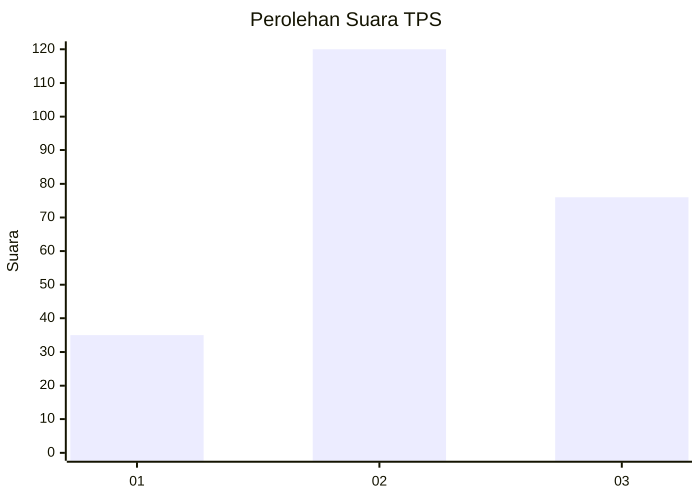
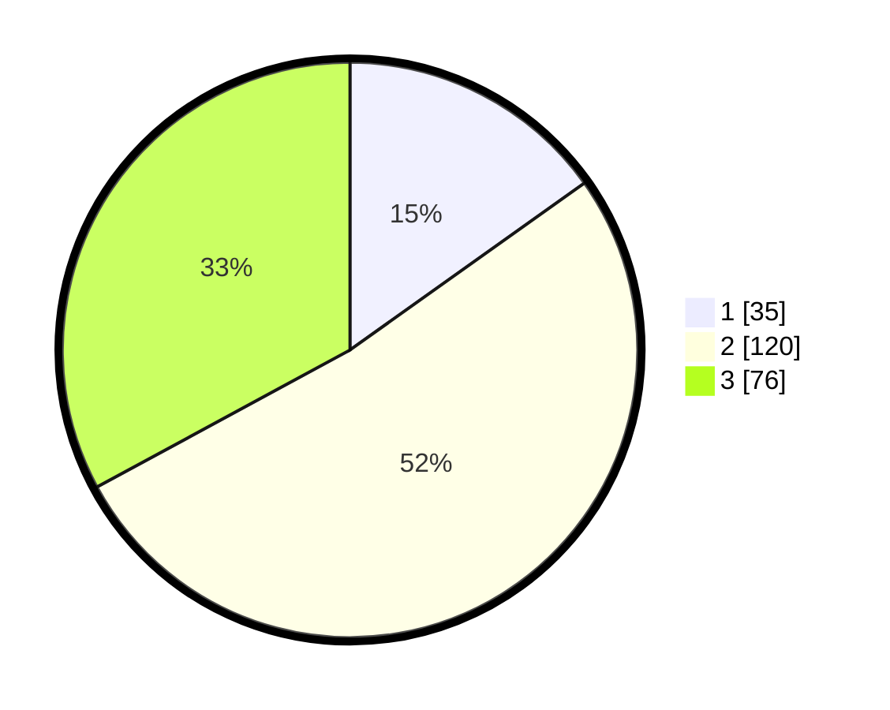

# Hasil

## Grafik

## Tabel

| No. | Nama Paslon    | Suara | Suara (raw) | Persentase |
|:--- |:-------------- | -----:| -----------:| ----------:|
| 1   | ANIES MUHAIMIN | 35    | [35][p-1]   | 15,15      |
| 2   | PRABOWO GIBRAN | 120   | [120][p-2]  | 51,95      |
| 3   | GANJAR MAHFUD  | 76    | [76][p-3]   | 32,90      |

[p-1]: https://github.com/gigit-pemilu/pemilu-2024-34-di-yogyakarta/blob/main/pilpres/hitung-suara/sub/34-di-yogyakarta/sub/71-kota-yogyakarta/sub/03-gondokusuman/sub/1001-demangan/sub/017-tps/sub/paslon-1.txt
[p-2]: https://github.com/gigit-pemilu/pemilu-2024-34-di-yogyakarta/blob/main/pilpres/hitung-suara/sub/34-di-yogyakarta/sub/71-kota-yogyakarta/sub/03-gondokusuman/sub/1001-demangan/sub/017-tps/sub/paslon-2.txt
[p-3]: https://github.com/gigit-pemilu/pemilu-2024-34-di-yogyakarta/blob/main/pilpres/hitung-suara/sub/34-di-yogyakarta/sub/71-kota-yogyakarta/sub/03-gondokusuman/sub/1001-demangan/sub/017-tps/sub/paslon-3.txt

## Foto C Plano

https://sirekap-obj-formc.kpu.go.id/a000/pemilu/ppwp/34/71/03/10/01/3471031001017-20240215-022451--375c627b-9219-447c-b657-4eeb275e177c.jpg

https://sirekap-obj-formc.kpu.go.id/a000/pemilu/ppwp/34/71/03/10/01/3471031001017-20240215-022733--22bf2341-89c1-4acd-bc1d-769e542b4f71.jpg

https://sirekap-obj-formc.kpu.go.id/a000/pemilu/ppwp/34/71/03/10/01/3471031001017-20240215-022937--782ff897-e7a3-4d6b-bd0a-dfccb44ead5f.jpg

## Metadata

| Key        | Value               |
| ---------- | ------------------- |
| Time Stamp | 2024-02-16 12:51:22 |

