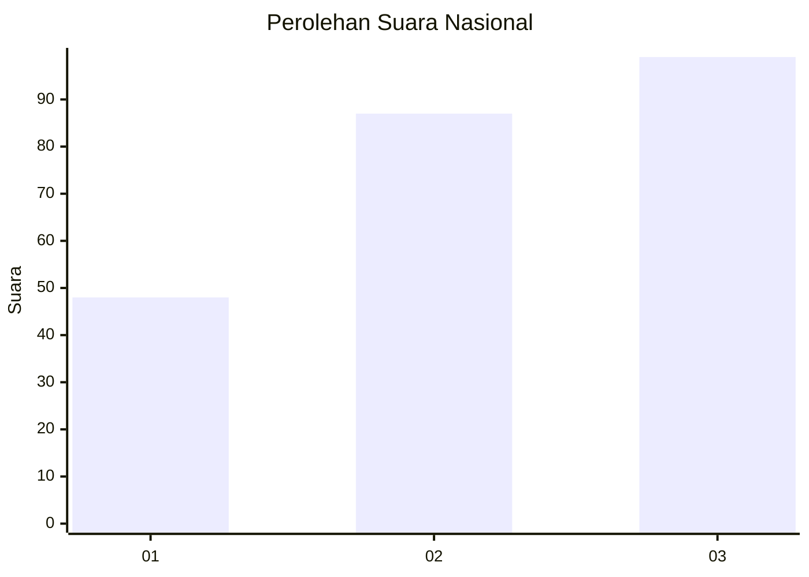
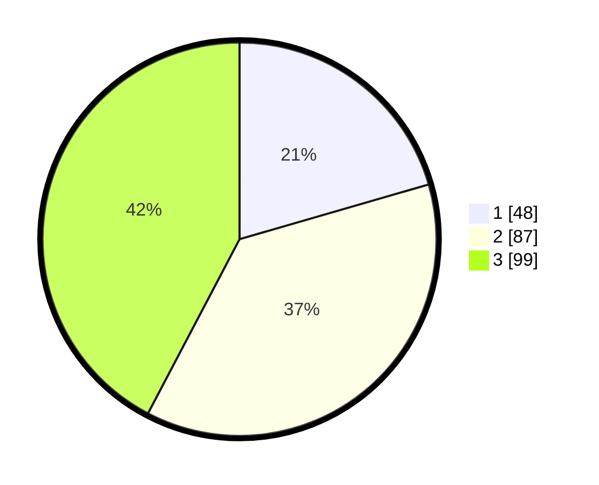

# Hasil

## Grafik

## Tabel

| No. | Nama Paslon    | Suara | Suara (raw) | Persentase |
|:--- |:-------------- | -----:| -----------:| ----------:|
| 1   | ANIES MUHAIMIN | 48    | [48][p-1]   | 20,51      |
| 2   | PRABOWO GIBRAN | 87    | [87][p-2]   | 37,18      |
| 3   | GANJAR MAHFUD  | 99    | [99][p-3]   | 42,31      |

[p-1]: https://github.com/gigit-pemilu/pemilu-2024/blob/main/pilpres/hitung-suara/sub/34-di-yogyakarta/sub/71-kota-yogyakarta/sub/03-gondokusuman/sub/1002-kotabaru/sub/002-tps/sub/paslon-1.txt
[p-2]: https://github.com/gigit-pemilu/pemilu-2024/blob/main/pilpres/hitung-suara/sub/34-di-yogyakarta/sub/71-kota-yogyakarta/sub/03-gondokusuman/sub/1002-kotabaru/sub/002-tps/sub/paslon-2.txt
[p-3]: https://github.com/gigit-pemilu/pemilu-2024/blob/main/pilpres/hitung-suara/sub/34-di-yogyakarta/sub/71-kota-yogyakarta/sub/03-gondokusuman/sub/1002-kotabaru/sub/002-tps/sub/paslon-3.txt

## Foto C Plano

https://sirekap-obj-formc.kpu.go.id/a079/pemilu/ppwp/34/71/03/10/02/3471031002002-20240215-233401--5f010e6a-3230-4f6b-a015-b3a64ca792a4.jpg

https://sirekap-obj-formc.kpu.go.id/a079/pemilu/ppwp/34/71/03/10/02/3471031002002-20240215-233404--01b06db1-f89d-445d-b746-ff048b3fbe5b.jpg

https://sirekap-obj-formc.kpu.go.id/a079/pemilu/ppwp/34/71/03/10/02/3471031002002-20240215-233403--dc2f5c0c-21eb-4ec1-8916-2c15a3530dcb.jpg

## Metadata

| Key        | Value               |
| ---------- | ------------------- |
| Time Stamp | 2024-02-16 00:30:27 |

## DATA PEMILIH TETAP

Jumlah pemilih dalam DPT: **284**.
 * L: **130**.
 * P: **154**.

## DATA PENGGUNA HAK PILIH

Jumlah pengguna hak pilih dalam DPT: **214**.
 * L: **93**.
 * P: **121**.

Jumlah pengguna hak pilih dalam DPTb: **22**.
 * L: **6**.
 * P: **16**.

Jumlah pengguna hak pilih dalam DPK: **3**.
 * L: **0**.
 * P: **3**.

Jumlah pengguna hak pilih: **239**.
 * L: **99**.
 * P: **140**.

## JUMLAH SUARA SAH DAN TIDAK SAH

JUMLAH SELURUH SUARA SAH: **234**.

JUMLAH SUARA TIDAK SAH: **5**.

JUMLAH SELURUH SUARA SAH DAN SUARA TIDAK SAH: **239**.

