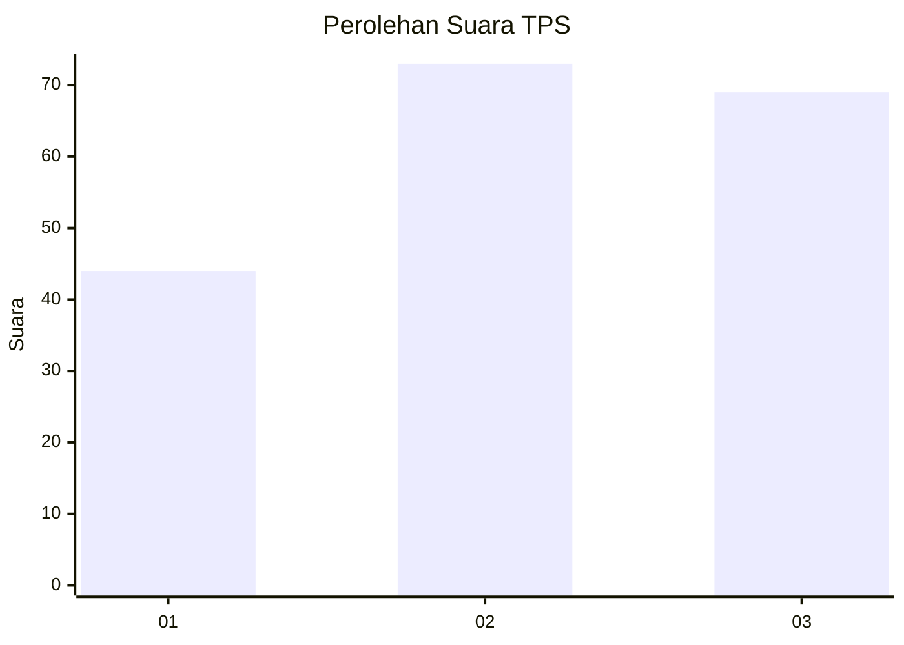
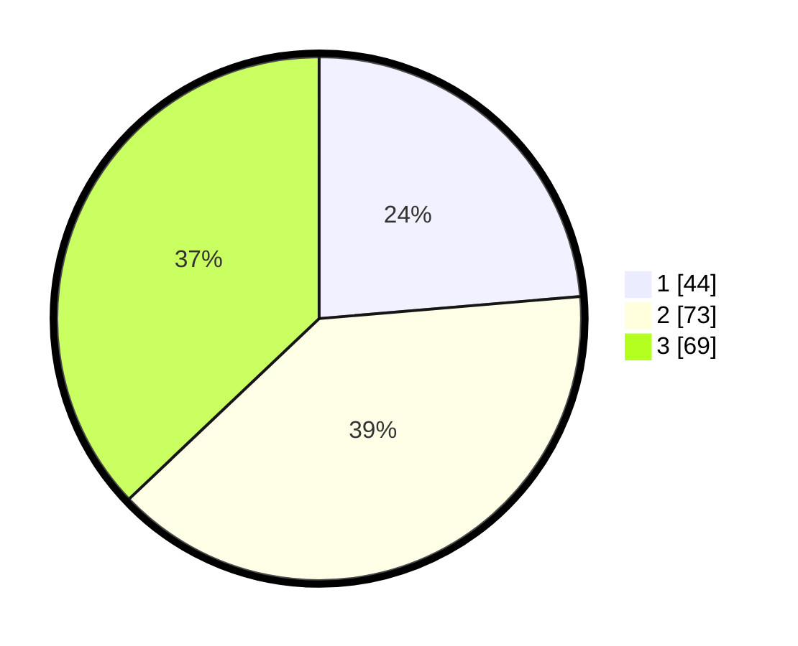

# Hasil

## Grafik

## Tabel

| No. | Nama Paslon    | Suara | Suara (raw) | Persentase |
|:--- |:-------------- | -----:| -----------:| ----------:|
| 1   | ANIES MUHAIMIN | 44    | [44][p-1]   | 23,66      |
| 2   | PRABOWO GIBRAN | 73    | [73][p-2]   | 39,25      |
| 3   | GANJAR MAHFUD  | 69    | [69][p-3]   | 37,10      |

[p-1]: https://github.com/gigit-pemilu/pemilu-2024-34-di-yogyakarta/blob/main/pilpres/hitung-suara/sub/34-di-yogyakarta/sub/71-kota-yogyakarta/sub/03-gondokusuman/sub/1002-kotabaru/sub/003-tps/sub/paslon-1.txt
[p-2]: https://github.com/gigit-pemilu/pemilu-2024-34-di-yogyakarta/blob/main/pilpres/hitung-suara/sub/34-di-yogyakarta/sub/71-kota-yogyakarta/sub/03-gondokusuman/sub/1002-kotabaru/sub/003-tps/sub/paslon-2.txt
[p-3]: https://github.com/gigit-pemilu/pemilu-2024-34-di-yogyakarta/blob/main/pilpres/hitung-suara/sub/34-di-yogyakarta/sub/71-kota-yogyakarta/sub/03-gondokusuman/sub/1002-kotabaru/sub/003-tps/sub/paslon-3.txt

## Foto C Plano

https://sirekap-obj-formc.kpu.go.id/37a9/pemilu/ppwp/34/71/03/10/02/3471031002003-20240216-114531--65eabf26-b625-4bb0-9d27-6351cb05f8cd.jpg

https://sirekap-obj-formc.kpu.go.id/37a9/pemilu/ppwp/34/71/03/10/02/3471031002003-20240216-114533--191512af-c25c-42ad-8eaf-93a7724242e2.jpg

https://sirekap-obj-formc.kpu.go.id/37a9/pemilu/ppwp/34/71/03/10/02/3471031002003-20240216-114532--c2125520-1b08-4ed6-866e-ce816cf54608.jpg

## Metadata

| Key        | Value               |
| ---------- | ------------------- |
| Time Stamp | 2024-02-17 12:00:00 |

## DATA PEMILIH TETAP

Jumlah pemilih dalam DPT: **223**.
 * L: **97**.
 * P: **126**.

## DATA PENGGUNA HAK PILIH

Jumlah pengguna hak pilih dalam DPT: **169**.
 * L: **69**.
 * P: **99**.

Jumlah pengguna hak pilih dalam DPTb: **20**.
 * L: **8**.
 * P: **12**.

Jumlah pengguna hak pilih dalam DPK: **2**.
 * L: **2**.
 * P: **0**.

Jumlah pengguna hak pilih: **190**.
 * L: **79**.
 * P: **111**.

## JUMLAH SUARA SAH DAN TIDAK SAH

JUMLAH SELURUH SUARA SAH: **186**.

JUMLAH SUARA TIDAK SAH: **4**.

JUMLAH SELURUH SUARA SAH DAN SUARA TIDAK SAH: **190**.

