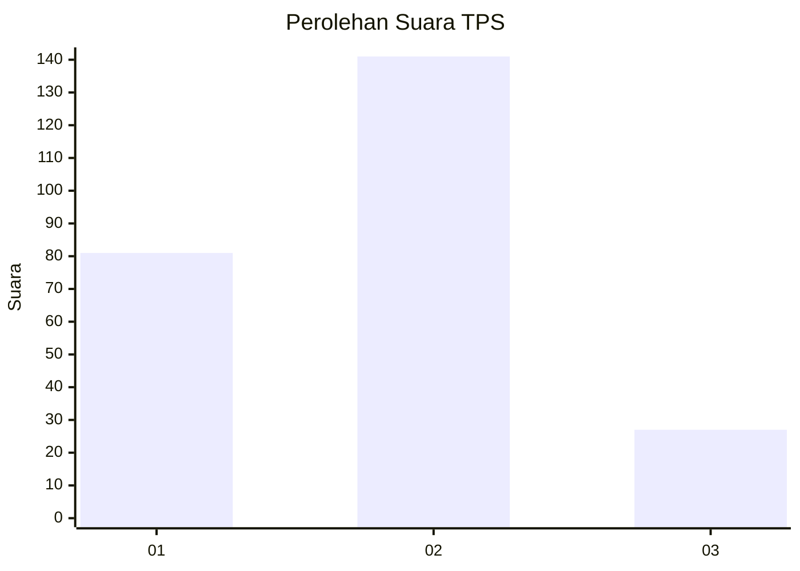
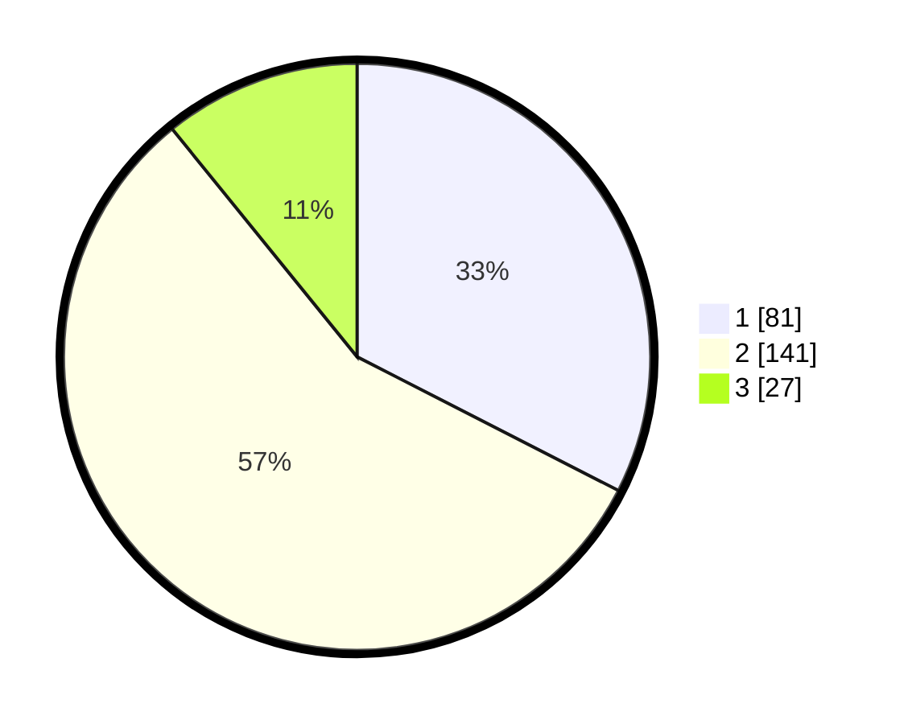

# Hasil

## Grafik

## Tabel

| No. | Nama Paslon    | Suara | Suara (raw) | Persentase |
|:--- |:-------------- | -----:| -----------:| ----------:|
| 1   | ANIES MUHAIMIN | 81    | [81][p-1]   | 32,53      |
| 2   | PRABOWO GIBRAN | 141   | [141][p-2]  | 56,63      |
| 3   | GANJAR MAHFUD  | 27    | [27][p-3]   | 10,84      |

[p-1]: https://github.com/gigit-pemilu/pemilu-2024-34-di-yogyakarta/blob/main/pilpres/hitung-suara/sub/34-di-yogyakarta/sub/71-kota-yogyakarta/sub/03-gondokusuman/sub/1002-kotabaru/sub/004-tps/sub/paslon-1.txt
[p-2]: https://github.com/gigit-pemilu/pemilu-2024-34-di-yogyakarta/blob/main/pilpres/hitung-suara/sub/34-di-yogyakarta/sub/71-kota-yogyakarta/sub/03-gondokusuman/sub/1002-kotabaru/sub/004-tps/sub/paslon-2.txt
[p-3]: https://github.com/gigit-pemilu/pemilu-2024-34-di-yogyakarta/blob/main/pilpres/hitung-suara/sub/34-di-yogyakarta/sub/71-kota-yogyakarta/sub/03-gondokusuman/sub/1002-kotabaru/sub/004-tps/sub/paslon-3.txt

## Foto C Plano

https://sirekap-obj-formc.kpu.go.id/807f/pemilu/ppwp/34/71/03/10/02/3471031002004-20240215-092418--c71ef2aa-90e8-4c4e-81bf-ab4c4e1c3806.jpg

https://sirekap-obj-formc.kpu.go.id/807f/pemilu/ppwp/34/71/03/10/02/3471031002004-20240215-092858--fdbe52d9-77ed-4f45-9d5e-11fc600fe2b0.jpg

https://sirekap-obj-formc.kpu.go.id/807f/pemilu/ppwp/34/71/03/10/02/3471031002004-20240215-093223--a55fcede-d15d-45db-9ac1-0ceb84a24fb8.jpg

## Metadata

| Key        | Value               |
| ---------- | ------------------- |
| Time Stamp | 2024-02-16 05:30:26 |

## DATA PEMILIH TETAP

Jumlah pemilih dalam DPT: **269**.
 * L: **117**.
 * P: **152**.

## DATA PENGGUNA HAK PILIH

Jumlah pengguna hak pilih dalam DPT: **230**.
 * L: **96**.
 * P: **134**.

Jumlah pengguna hak pilih dalam DPTb: **20**.
 * L: **4**.
 * P: **16**.

Jumlah pengguna hak pilih dalam DPK: **2**.
 * L: **0**.
 * P: **2**.

Jumlah pengguna hak pilih: **252**.
 * L: **100**.
 * P: **152**.

## JUMLAH SUARA SAH DAN TIDAK SAH

JUMLAH SELURUH SUARA SAH: **249**.

JUMLAH SUARA TIDAK SAH: **3**.

JUMLAH SELURUH SUARA SAH DAN SUARA TIDAK SAH: **252**.

