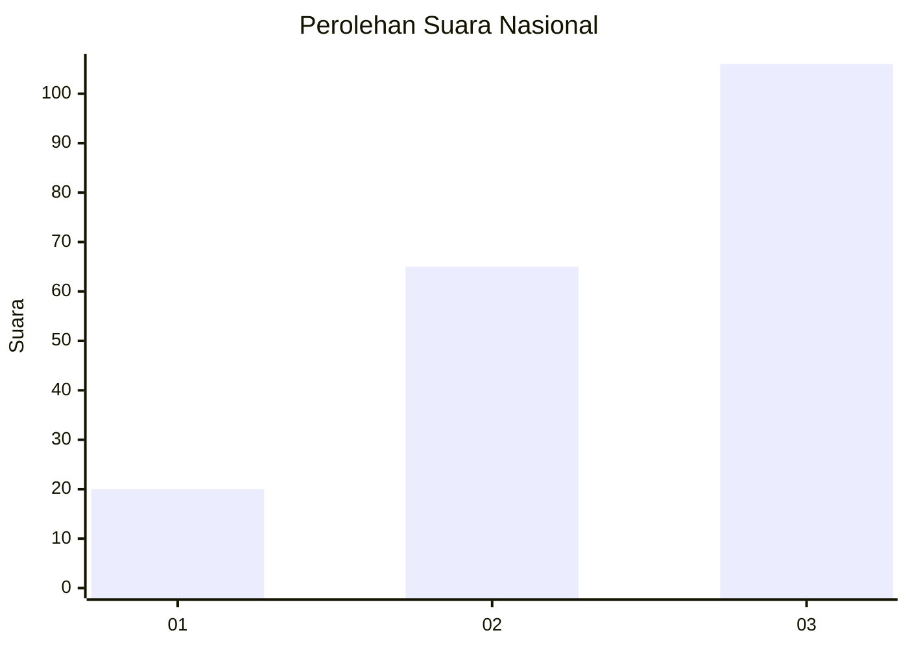
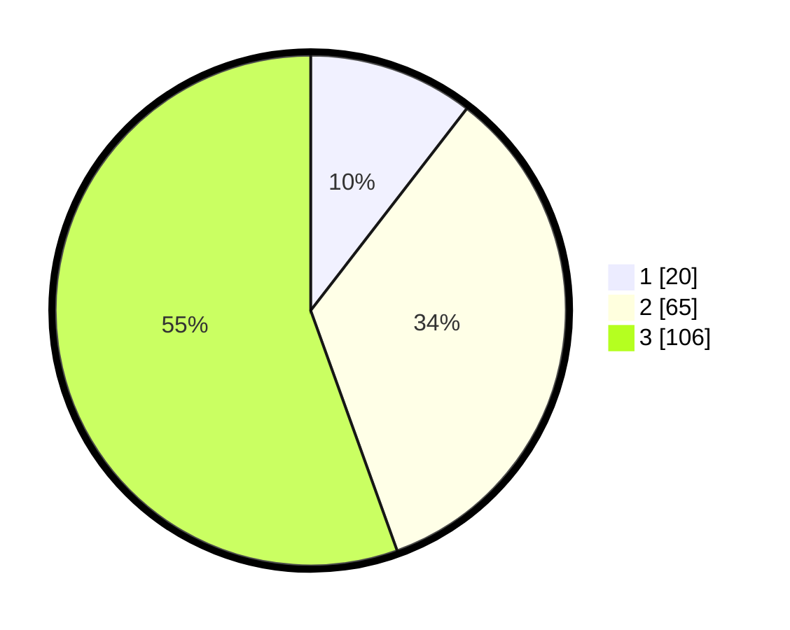

# Hasil

## Grafik

## Tabel

| No. | Nama Paslon    | Suara | Suara (raw) | Persentase |
|:--- |:-------------- | -----:| -----------:| ----------:|
| 1   | ANIES MUHAIMIN | 20    | [20][p-1]   | 10,47      |
| 2   | PRABOWO GIBRAN | 65    | [65][p-2]   | 34,03      |
| 3   | GANJAR MAHFUD  | 106   | [106][p-3]  | 55,50      |

[p-1]: https://github.com/gigit-pemilu/pemilu-2024/blob/main/pilpres/hitung-suara/sub/34-di-yogyakarta/sub/71-kota-yogyakarta/sub/03-gondokusuman/sub/1002-kotabaru/sub/006-tps/sub/paslon-1.txt
[p-2]: https://github.com/gigit-pemilu/pemilu-2024/blob/main/pilpres/hitung-suara/sub/34-di-yogyakarta/sub/71-kota-yogyakarta/sub/03-gondokusuman/sub/1002-kotabaru/sub/006-tps/sub/paslon-2.txt
[p-3]: https://github.com/gigit-pemilu/pemilu-2024/blob/main/pilpres/hitung-suara/sub/34-di-yogyakarta/sub/71-kota-yogyakarta/sub/03-gondokusuman/sub/1002-kotabaru/sub/006-tps/sub/paslon-3.txt

## Foto C Plano

https://sirekap-obj-formc.kpu.go.id/cfae/pemilu/ppwp/34/71/03/10/02/3471031002006-20240214-220404--b393983c-8b30-4bdc-b14b-d3d39d30e968.jpg

https://sirekap-obj-formc.kpu.go.id/cfae/pemilu/ppwp/34/71/03/10/02/3471031002006-20240214-220409--cf50531f-b2fe-4852-aad0-96951a57aeb4.jpg

https://sirekap-obj-formc.kpu.go.id/cfae/pemilu/ppwp/34/71/03/10/02/3471031002006-20240214-230856--2d058f1e-c9c8-497b-86f9-e3f5193599bd.jpg

## Metadata

| Key        | Value               |
| ---------- | ------------------- |
| Time Stamp | 2024-02-19 06:16:00 |

