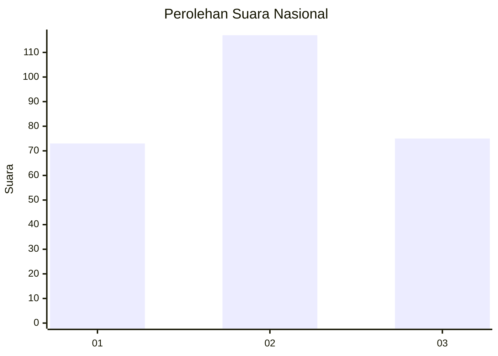
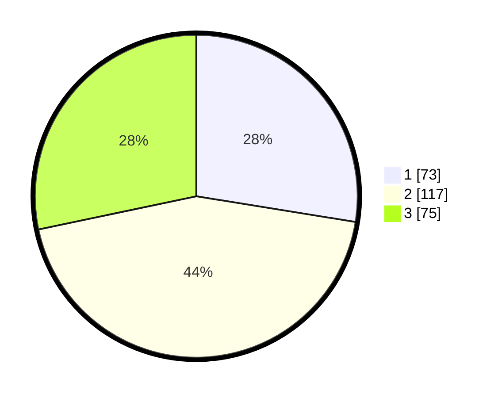

# Hasil

## Grafik

## Tabel

| No. | Nama Paslon    | Suara | Suara (raw) | Persentase |
|:--- |:-------------- | -----:| -----------:| ----------:|
| 1   | ANIES MUHAIMIN | 73    | [73][p-1]   | 27,55      |
| 2   | PRABOWO GIBRAN | 117   | [117][p-2]  | 44,15      |
| 3   | GANJAR MAHFUD  | 75    | [75][p-3]   | 28,30      |

[p-1]: https://github.com/gigit-pemilu/pemilu-2024/blob/main/pilpres/hitung-suara/sub/34-di-yogyakarta/sub/71-kota-yogyakarta/sub/03-gondokusuman/sub/1003-klitren/sub/001-tps/sub/paslon-1.txt
[p-2]: https://github.com/gigit-pemilu/pemilu-2024/blob/main/pilpres/hitung-suara/sub/34-di-yogyakarta/sub/71-kota-yogyakarta/sub/03-gondokusuman/sub/1003-klitren/sub/001-tps/sub/paslon-2.txt
[p-3]: https://github.com/gigit-pemilu/pemilu-2024/blob/main/pilpres/hitung-suara/sub/34-di-yogyakarta/sub/71-kota-yogyakarta/sub/03-gondokusuman/sub/1003-klitren/sub/001-tps/sub/paslon-3.txt

## Foto C Plano

https://sirekap-obj-formc.kpu.go.id/ea26/pemilu/ppwp/34/71/03/10/03/3471031003001-20240216-033914--1e421b9b-a8ca-490a-9ec6-ee46f3cce546.jpg

https://sirekap-obj-formc.kpu.go.id/ea26/pemilu/ppwp/34/71/03/10/03/3471031003001-20240214-195638--7feb231a-6140-49f0-8dde-23a416936a2e.jpg

https://sirekap-obj-formc.kpu.go.id/ea26/pemilu/ppwp/34/71/03/10/03/3471031003001-20240214-195722--60f85221-9f3b-41bb-9798-c5814220af66.jpg

## Metadata

| Key        | Value               |
| ---------- | ------------------- |
| Time Stamp | 2024-02-16 04:00:27 |

