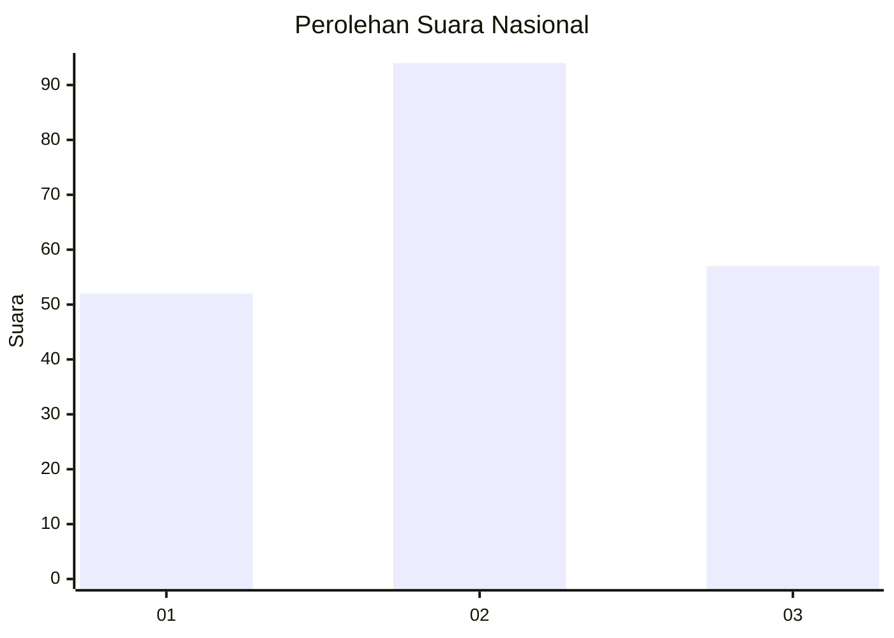
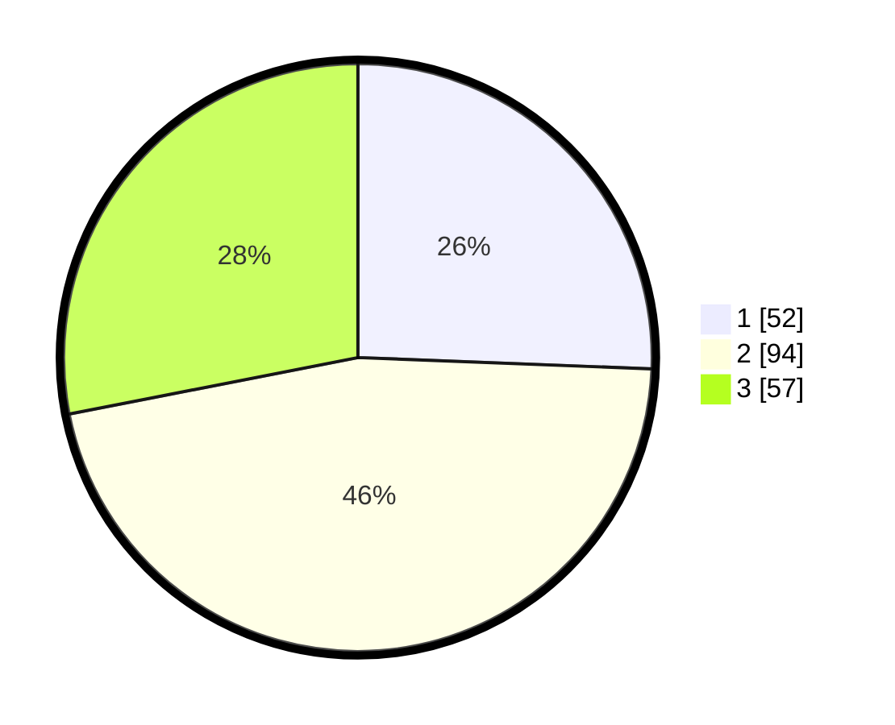

# Hasil

## Grafik

## Tabel

| No. | Nama Paslon    | Suara | Suara (raw) | Persentase |
|:--- |:-------------- | -----:| -----------:| ----------:|
| 1   | ANIES MUHAIMIN | 52    | [52][p-1]   | 25,62      |
| 2   | PRABOWO GIBRAN | 94    | [94][p-2]   | 46,31      |
| 3   | GANJAR MAHFUD  | 57    | [57][p-3]   | 28,08      |

[p-1]: https://github.com/gigit-pemilu/pemilu-2024/blob/main/pilpres/hitung-suara/sub/34-di-yogyakarta/sub/71-kota-yogyakarta/sub/03-gondokusuman/sub/1003-klitren/sub/025-tps/sub/paslon-1.txt
[p-2]: https://github.com/gigit-pemilu/pemilu-2024/blob/main/pilpres/hitung-suara/sub/34-di-yogyakarta/sub/71-kota-yogyakarta/sub/03-gondokusuman/sub/1003-klitren/sub/025-tps/sub/paslon-2.txt
[p-3]: https://github.com/gigit-pemilu/pemilu-2024/blob/main/pilpres/hitung-suara/sub/34-di-yogyakarta/sub/71-kota-yogyakarta/sub/03-gondokusuman/sub/1003-klitren/sub/025-tps/sub/paslon-3.txt

## Foto C Plano

https://sirekap-obj-formc.kpu.go.id/80eb/pemilu/ppwp/34/71/03/10/03/3471031003025-20240218-183613--c56553e8-27f9-4b49-83af-312e579bd2d5.jpg

https://sirekap-obj-formc.kpu.go.id/80eb/pemilu/ppwp/34/71/03/10/03/3471031003025-20240218-183615--ced82600-9407-428c-b87a-6bd512d7f062.jpg

https://sirekap-obj-formc.kpu.go.id/80eb/pemilu/ppwp/34/71/03/10/03/3471031003025-20240218-183614--30cb0787-2dc6-423e-8cad-0cd2c4b0daf5.jpg

## Metadata

| Key        | Value               |
| ---------- | ------------------- |
| Time Stamp | 2024-02-25 12:00:00 |

## DATA PEMILIH TETAP

Jumlah pemilih dalam DPT: **247**.
 * L: **115**.
 * P: **132**.

## DATA PENGGUNA HAK PILIH

Jumlah pengguna hak pilih dalam DPT: **195**.
 * L: **87**.
 * P: **108**.

Jumlah pengguna hak pilih dalam DPTb: **12**.
 * L: **1**.
 * P: **11**.

Jumlah pengguna hak pilih dalam DPK: **2**.
 * L: **0**.
 * P: **2**.

Jumlah pengguna hak pilih: **209**.
 * L: **88**.
 * P: **121**.

## JUMLAH SUARA SAH DAN TIDAK SAH

JUMLAH SELURUH SUARA SAH: **203**.

JUMLAH SUARA TIDAK SAH: **6**.

JUMLAH SELURUH SUARA SAH DAN SUARA TIDAK SAH: **209**.

