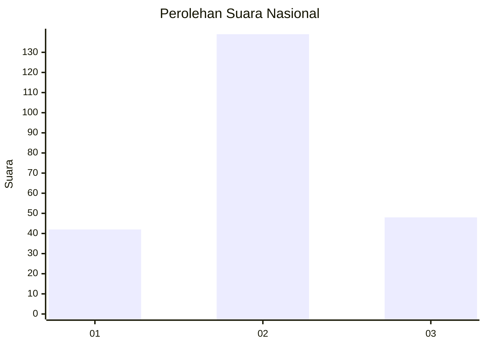
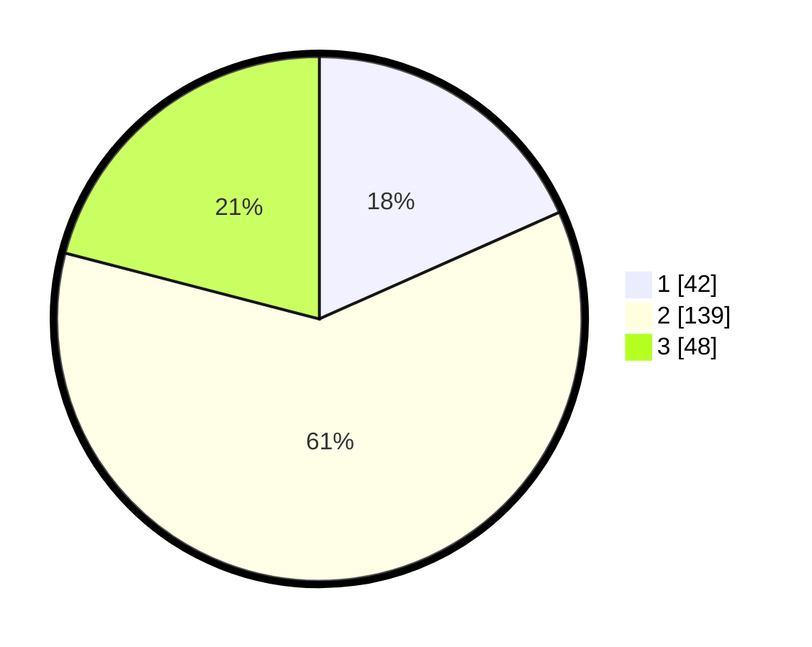

# Hasil

## Grafik

## Tabel

| No. | Nama Paslon    | Suara | Suara (raw) | Persentase |
|:--- |:-------------- | -----:| -----------:| ----------:|
| 1   | ANIES MUHAIMIN | 42    | [42][p-1]   | 18,34      |
| 2   | PRABOWO GIBRAN | 139   | [139][p-2]  | 60,70      |
| 3   | GANJAR MAHFUD  | 48    | [48][p-3]   | 20,96      |

[p-1]: https://github.com/gigit-pemilu/pemilu-2024/blob/main/pilpres/hitung-suara/sub/34-di-yogyakarta/sub/71-kota-yogyakarta/sub/03-gondokusuman/sub/1003-klitren/sub/026-tps/sub/paslon-1.txt
[p-2]: https://github.com/gigit-pemilu/pemilu-2024/blob/main/pilpres/hitung-suara/sub/34-di-yogyakarta/sub/71-kota-yogyakarta/sub/03-gondokusuman/sub/1003-klitren/sub/026-tps/sub/paslon-2.txt
[p-3]: https://github.com/gigit-pemilu/pemilu-2024/blob/main/pilpres/hitung-suara/sub/34-di-yogyakarta/sub/71-kota-yogyakarta/sub/03-gondokusuman/sub/1003-klitren/sub/026-tps/sub/paslon-3.txt

## Foto C Plano

https://sirekap-obj-formc.kpu.go.id/b506/pemilu/ppwp/34/71/03/10/03/3471031003026-20240214-215705--19332a62-97a2-4b22-b8b0-ef0c9c43a9c9.jpg

https://sirekap-obj-formc.kpu.go.id/b506/pemilu/ppwp/34/71/03/10/03/3471031003026-20240214-211542--30ec4205-aef4-47b3-a06c-516478f3e270.jpg

https://sirekap-obj-formc.kpu.go.id/b506/pemilu/ppwp/34/71/03/10/03/3471031003026-20240214-211953--1aa6922a-f2ea-474a-a584-3f219552b401.jpg

## Metadata

| Key        | Value               |
| ---------- | ------------------- |
| Time Stamp | 2024-02-15 15:00:29 |

## DATA PEMILIH TETAP

Jumlah pemilih dalam DPT: **253**.
 * L: **118**.
 * P: **135**.

## DATA PENGGUNA HAK PILIH

Jumlah pengguna hak pilih dalam DPT: **218**.
 * L: **101**.
 * P: **117**.

Jumlah pengguna hak pilih dalam DPTb: **17**.
 * L: **7**.
 * P: **10**.

Jumlah pengguna hak pilih dalam DPK: **2**.
 * L: **0**.
 * P: **2**.

Jumlah pengguna hak pilih: **237**.
 * L: **108**.
 * P: **129**.

## JUMLAH SUARA SAH DAN TIDAK SAH

JUMLAH SELURUH SUARA SAH: **229**.

JUMLAH SUARA TIDAK SAH: **8**.

JUMLAH SELURUH SUARA SAH DAN SUARA TIDAK SAH: **237**.

