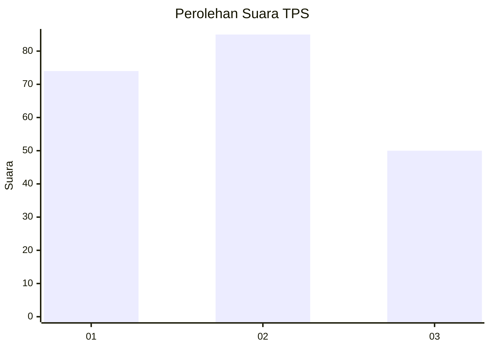
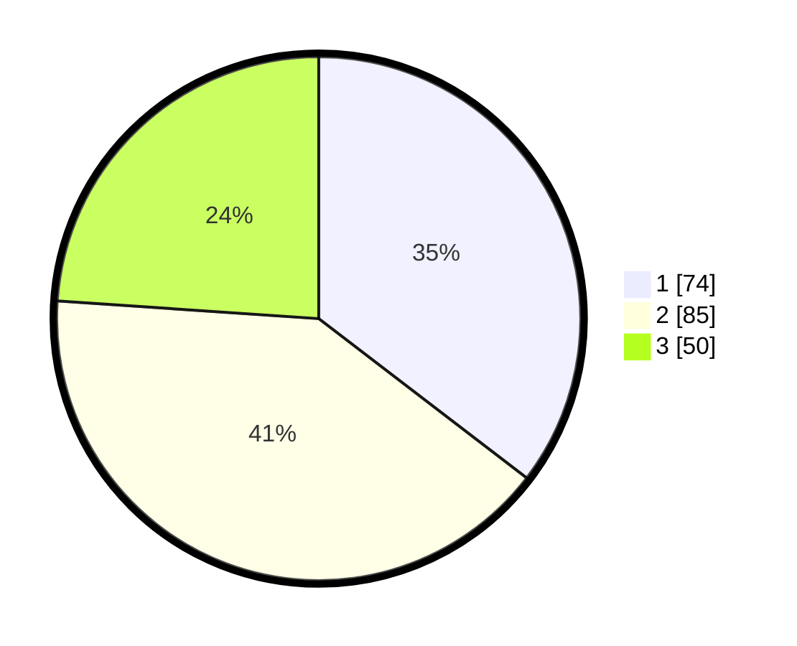

# Hasil

## Grafik

## Tabel

| No. | Nama Paslon    | Suara | Suara (raw) | Persentase |
|:--- |:-------------- | -----:| -----------:| ----------:|
| 1   | ANIES MUHAIMIN | 74    | [74][p-1]   | 35,41      |
| 2   | PRABOWO GIBRAN | 85    | [85][p-2]   | 40,67      |
| 3   | GANJAR MAHFUD  | 50    | [50][p-3]   | 23,92      |

[p-1]: https://github.com/gigit-pemilu/pemilu-2024-34-di-yogyakarta/blob/main/pilpres/hitung-suara/sub/34-di-yogyakarta/sub/71-kota-yogyakarta/sub/03-gondokusuman/sub/1003-klitren/sub/028-tps/sub/paslon-1.txt
[p-2]: https://github.com/gigit-pemilu/pemilu-2024-34-di-yogyakarta/blob/main/pilpres/hitung-suara/sub/34-di-yogyakarta/sub/71-kota-yogyakarta/sub/03-gondokusuman/sub/1003-klitren/sub/028-tps/sub/paslon-2.txt
[p-3]: https://github.com/gigit-pemilu/pemilu-2024-34-di-yogyakarta/blob/main/pilpres/hitung-suara/sub/34-di-yogyakarta/sub/71-kota-yogyakarta/sub/03-gondokusuman/sub/1003-klitren/sub/028-tps/sub/paslon-3.txt

## Foto C Plano

https://sirekap-obj-formc.kpu.go.id/4585/pemilu/ppwp/34/71/03/10/03/3471031003028-20240215-010558--01552ace-f45a-4331-963c-bf7c37ae5d98.jpg

https://sirekap-obj-formc.kpu.go.id/4585/pemilu/ppwp/34/71/03/10/03/3471031003028-20240215-010723--a4a4ff20-6365-48b3-859a-6acc622da6e7.jpg

https://sirekap-obj-formc.kpu.go.id/4585/pemilu/ppwp/34/71/03/10/03/3471031003028-20240215-010817--433b4a7d-1222-406a-abcc-22a5ad99a1d9.jpg

## Metadata

| Key        | Value               |
| ---------- | ------------------- |
| Time Stamp | 2024-02-24 22:31:28 |

