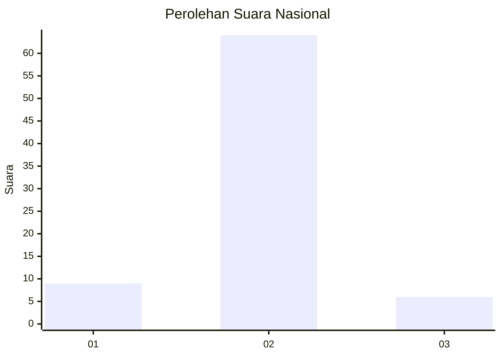
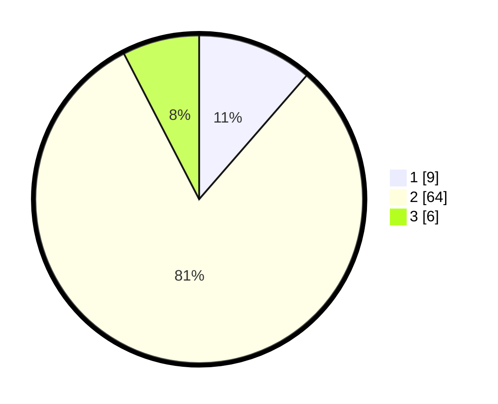

# Hasil

## Grafik

## Tabel

| No. | Nama Paslon    | Suara | Suara (raw) | Persentase |
|:--- |:-------------- | -----:| -----------:| ----------:|
| 1   | ANIES MUHAIMIN | 9     | [9][p-1]    | 11,39      |
| 2   | PRABOWO GIBRAN | 64    | [64][p-2]   | 81,01      |
| 3   | GANJAR MAHFUD  | 6     | [6][p-3]    | 7,59       |

[p-1]: https://github.com/gigit-pemilu/pemilu-2024/blob/main/pilpres/hitung-suara/sub/34-di-yogyakarta/sub/71-kota-yogyakarta/sub/03-gondokusuman/sub/1003-klitren/sub/903-tps/sub/paslon-1.txt
[p-2]: https://github.com/gigit-pemilu/pemilu-2024/blob/main/pilpres/hitung-suara/sub/34-di-yogyakarta/sub/71-kota-yogyakarta/sub/03-gondokusuman/sub/1003-klitren/sub/903-tps/sub/paslon-2.txt
[p-3]: https://github.com/gigit-pemilu/pemilu-2024/blob/main/pilpres/hitung-suara/sub/34-di-yogyakarta/sub/71-kota-yogyakarta/sub/03-gondokusuman/sub/1003-klitren/sub/903-tps/sub/paslon-3.txt

## Foto C Plano

https://sirekap-obj-formc.kpu.go.id/c2b3/pemilu/ppwp/34/71/03/10/03/3471031003903-20240214-213127--d2254db7-e20b-44c7-8ed8-ec8277e0664f.jpg

https://sirekap-obj-formc.kpu.go.id/c2b3/pemilu/ppwp/34/71/03/10/03/3471031003903-20240215-104939--8eb2af3b-cd81-421c-a6d5-f27b59ccb531.jpg

https://sirekap-obj-formc.kpu.go.id/c2b3/pemilu/ppwp/34/71/03/10/03/3471031003903-20240214-213440--a48b472d-96db-4ed0-9c93-ed562eb3f913.jpg

## Metadata

| Key        | Value               |
| ---------- | ------------------- |
| Time Stamp | 2024-02-25 10:00:00 |

## DATA PEMILIH TETAP

Jumlah pemilih dalam DPT: **126**.
 * L: **84**.
 * P: **42**.

## DATA PENGGUNA HAK PILIH

Jumlah pengguna hak pilih dalam DPT: **71**.
 * L: **41**.
 * P: **30**.

Jumlah pengguna hak pilih dalam DPTb: **8**.
 * L: **4**.
 * P: **4**.

Jumlah pengguna hak pilih dalam DPK: **0**.
 * L: **0**.
 * P: **0**.

Jumlah pengguna hak pilih: **79**.
 * L: **45**.
 * P: **34**.

## JUMLAH SUARA SAH DAN TIDAK SAH

JUMLAH SELURUH SUARA SAH: **79**.

JUMLAH SUARA TIDAK SAH: **0**.

JUMLAH SELURUH SUARA SAH DAN SUARA TIDAK SAH: **79**.

