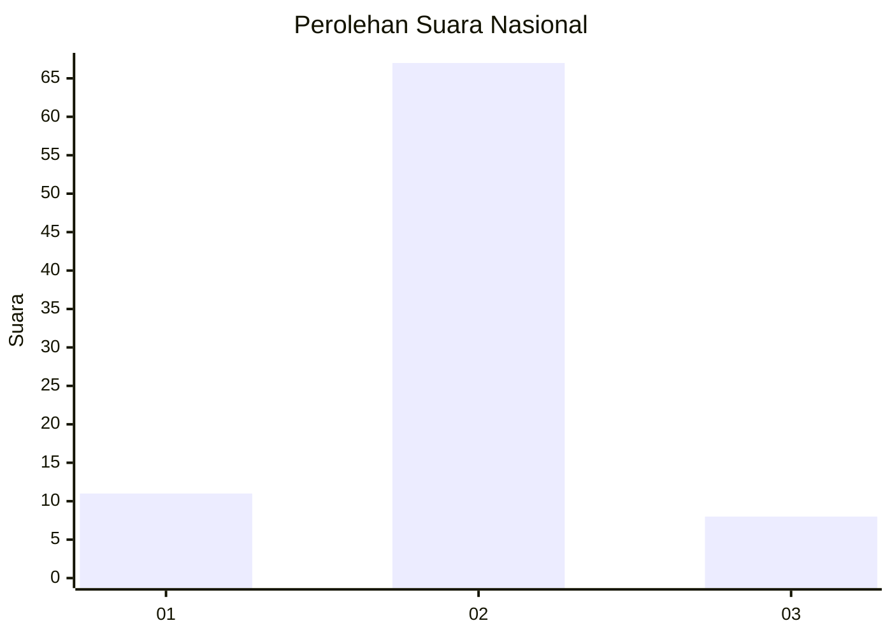
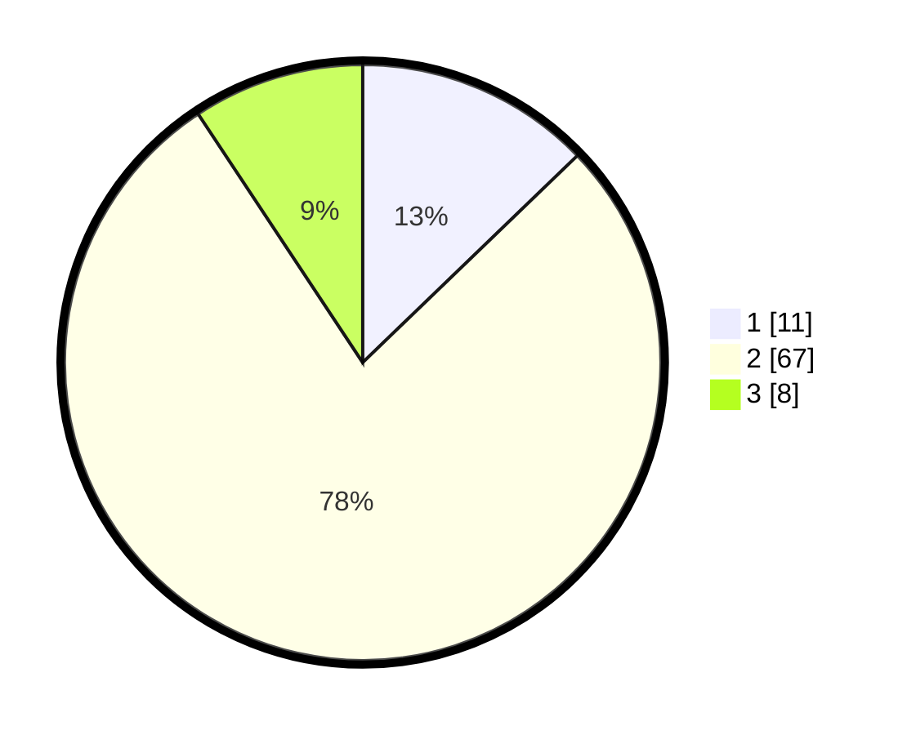

# Hasil

## Grafik

## Tabel

| No. | Nama Paslon    | Suara | Suara (raw) | Persentase |
|:--- |:-------------- | -----:| -----------:| ----------:|
| 1   | ANIES MUHAIMIN | 11    | [11][p-1]   | 12,79      |
| 2   | PRABOWO GIBRAN | 67    | [67][p-2]   | 77,91      |
| 3   | GANJAR MAHFUD  | 8     | [8][p-3]    | 9,30       |

[p-1]: https://github.com/gigit-pemilu/pemilu-2024/blob/main/pilpres/hitung-suara/sub/34-di-yogyakarta/sub/71-kota-yogyakarta/sub/03-gondokusuman/sub/1003-klitren/sub/904-tps/sub/paslon-1.txt
[p-2]: https://github.com/gigit-pemilu/pemilu-2024/blob/main/pilpres/hitung-suara/sub/34-di-yogyakarta/sub/71-kota-yogyakarta/sub/03-gondokusuman/sub/1003-klitren/sub/904-tps/sub/paslon-2.txt
[p-3]: https://github.com/gigit-pemilu/pemilu-2024/blob/main/pilpres/hitung-suara/sub/34-di-yogyakarta/sub/71-kota-yogyakarta/sub/03-gondokusuman/sub/1003-klitren/sub/904-tps/sub/paslon-3.txt

## Foto C Plano

https://sirekap-obj-formc.kpu.go.id/fabe/pemilu/ppwp/34/71/03/10/03/3471031003904-20240214-210338--68ba69ea-3183-46f4-8473-7c2e57e1fc6b.jpg

https://sirekap-obj-formc.kpu.go.id/fabe/pemilu/ppwp/34/71/03/10/03/3471031003904-20240214-210511--6f9ad8d1-983d-472d-b0c7-d8256c40d776.jpg

https://sirekap-obj-formc.kpu.go.id/fabe/pemilu/ppwp/34/71/03/10/03/3471031003904-20240214-210642--b8f8484f-e60e-46da-9528-b3425235fe59.jpg

## Metadata

| Key        | Value               |
| ---------- | ------------------- |
| Time Stamp | 2024-02-15 12:00:28 |

## DATA PEMILIH TETAP

Jumlah pemilih dalam DPT: **278**.
 * L: **223**.
 * P: **55**.

## DATA PENGGUNA HAK PILIH

Jumlah pengguna hak pilih dalam DPT: **80**.
 * L: **51**.
 * P: **29**.

Jumlah pengguna hak pilih dalam DPTb: **8**.
 * L: **4**.
 * P: **4**.

Jumlah pengguna hak pilih dalam DPK: **0**.
 * L: **0**.
 * P: **0**.

Jumlah pengguna hak pilih: **88**.
 * L: **55**.
 * P: **33**.

## JUMLAH SUARA SAH DAN TIDAK SAH

JUMLAH SELURUH SUARA SAH: **86**.

JUMLAH SUARA TIDAK SAH: **2**.

JUMLAH SELURUH SUARA SAH DAN SUARA TIDAK SAH: **88**.

