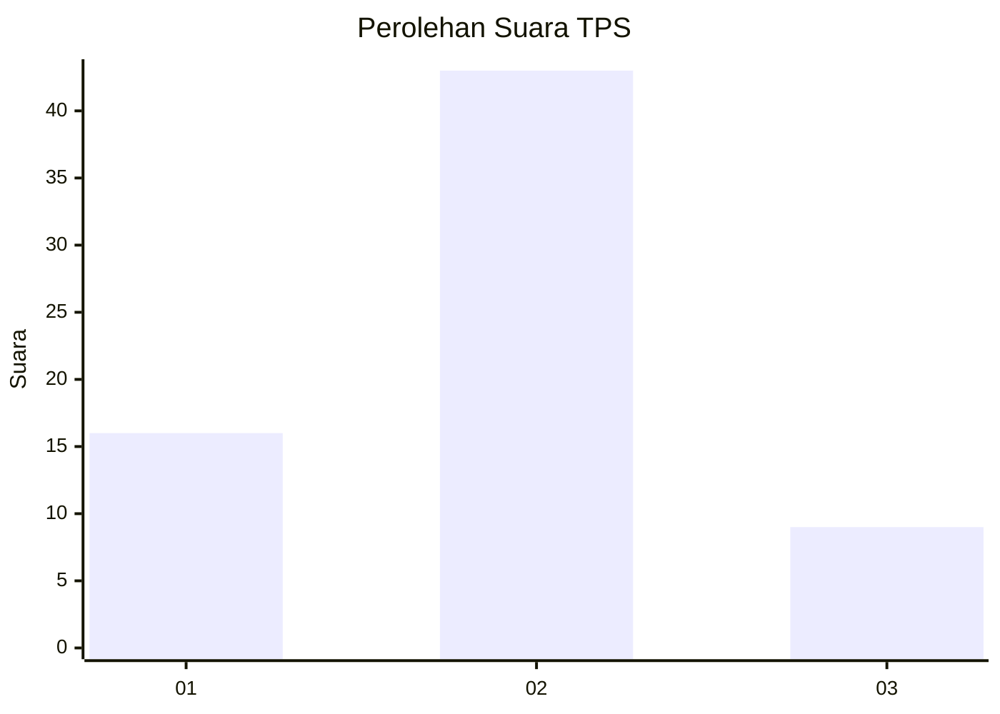
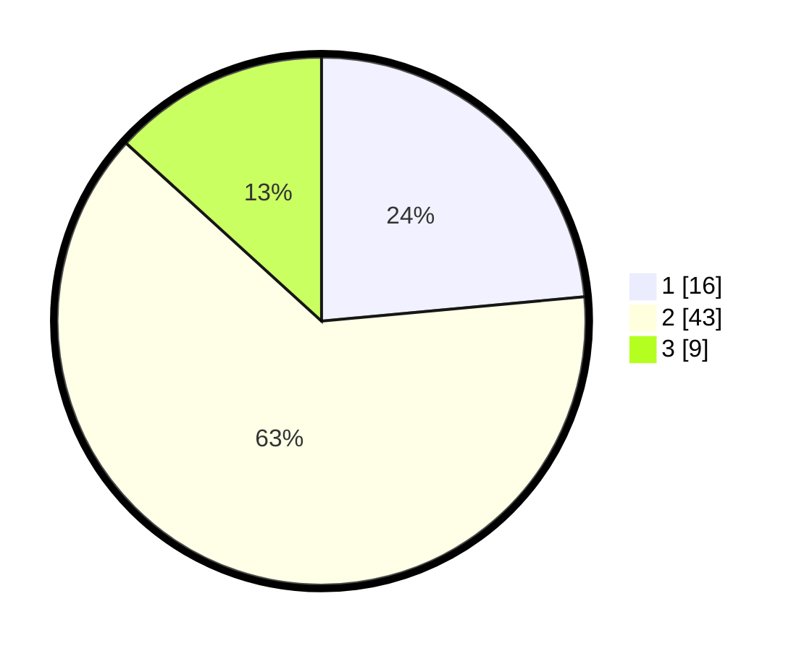

# Hasil

## Grafik

## Tabel

| No. | Nama Paslon    | Suara | Suara (raw) | Persentase |
|:--- |:-------------- | -----:| -----------:| ----------:|
| 1   | ANIES MUHAIMIN | 16    | [16][p-1]   | 23,53      |
| 2   | PRABOWO GIBRAN | 43    | [43][p-2]   | 63,24      |
| 3   | GANJAR MAHFUD  | 9     | [9][p-3]    | 13,24      |

[p-1]: https://github.com/gigit-pemilu/pemilu-2024-34-di-yogyakarta/blob/main/pilpres/hitung-suara/sub/34-di-yogyakarta/sub/71-kota-yogyakarta/sub/03-gondokusuman/sub/1003-klitren/sub/905-tps/sub/paslon-1.txt
[p-2]: https://github.com/gigit-pemilu/pemilu-2024-34-di-yogyakarta/blob/main/pilpres/hitung-suara/sub/34-di-yogyakarta/sub/71-kota-yogyakarta/sub/03-gondokusuman/sub/1003-klitren/sub/905-tps/sub/paslon-2.txt
[p-3]: https://github.com/gigit-pemilu/pemilu-2024-34-di-yogyakarta/blob/main/pilpres/hitung-suara/sub/34-di-yogyakarta/sub/71-kota-yogyakarta/sub/03-gondokusuman/sub/1003-klitren/sub/905-tps/sub/paslon-3.txt

## Foto C Plano

https://sirekap-obj-formc.kpu.go.id/e098/pemilu/ppwp/34/71/03/10/03/3471031003905-20240216-031101--22b3f98f-dc07-44f2-a04d-9a373ce8dd3c.jpg

https://sirekap-obj-formc.kpu.go.id/e098/pemilu/ppwp/34/71/03/10/03/3471031003905-20240216-031115--e9fcbd86-db82-41c1-9269-4aca8c0b9bb3.jpg

https://sirekap-obj-formc.kpu.go.id/e098/pemilu/ppwp/34/71/03/10/03/3471031003905-20240216-031110--72587131-44e0-45b5-b191-539737dc764e.jpg

## Metadata

| Key        | Value               |
| ---------- | ------------------- |
| Time Stamp | 2024-02-16 05:00:26 |

## DATA PEMILIH TETAP

Jumlah pemilih dalam DPT: **258**.
 * L: **211**.
 * P: **47**.

## DATA PENGGUNA HAK PILIH

Jumlah pengguna hak pilih dalam DPT: **59**.
 * L: **42**.
 * P: **17**.

Jumlah pengguna hak pilih dalam DPTb: **9**.
 * L: **5**.
 * P: **4**.

Jumlah pengguna hak pilih dalam DPK: **0**.
 * L: **0**.
 * P: **0**.

Jumlah pengguna hak pilih: **68**.
 * L: **47**.
 * P: **21**.

## JUMLAH SUARA SAH DAN TIDAK SAH

JUMLAH SELURUH SUARA SAH: **68**.

JUMLAH SUARA TIDAK SAH: **0**.

JUMLAH SELURUH SUARA SAH DAN SUARA TIDAK SAH: **68**.

