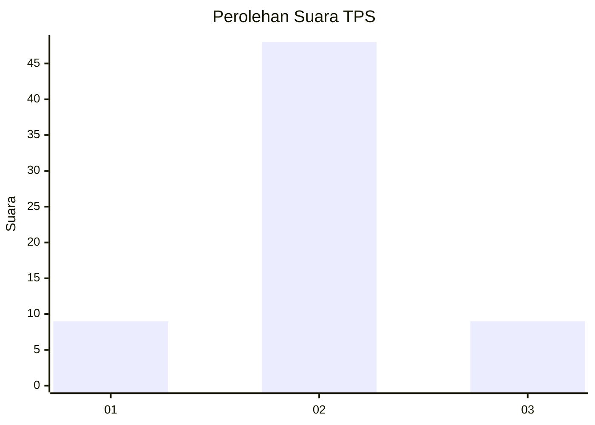
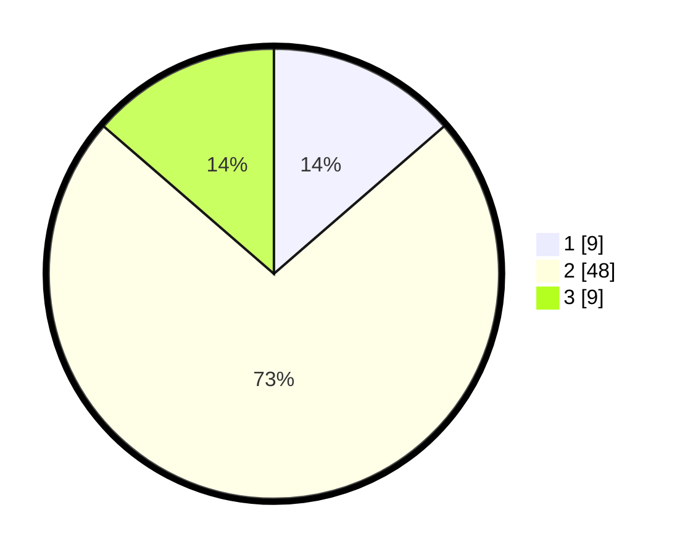

# Hasil

## Grafik

## Tabel

| No. | Nama Paslon    | Suara | Suara (raw) | Persentase |
|:--- |:-------------- | -----:| -----------:| ----------:|
| 1   | ANIES MUHAIMIN | 9     | [9][p-1]    | 13,64      |
| 2   | PRABOWO GIBRAN | 48    | [48][p-2]   | 72,73      |
| 3   | GANJAR MAHFUD  | 9     | [9][p-3]    | 13,64      |

[p-1]: https://github.com/gigit-pemilu/pemilu-2024-34-di-yogyakarta/blob/main/pilpres/hitung-suara/sub/34-di-yogyakarta/sub/71-kota-yogyakarta/sub/03-gondokusuman/sub/1003-klitren/sub/906-tps/sub/paslon-1.txt
[p-2]: https://github.com/gigit-pemilu/pemilu-2024-34-di-yogyakarta/blob/main/pilpres/hitung-suara/sub/34-di-yogyakarta/sub/71-kota-yogyakarta/sub/03-gondokusuman/sub/1003-klitren/sub/906-tps/sub/paslon-2.txt
[p-3]: https://github.com/gigit-pemilu/pemilu-2024-34-di-yogyakarta/blob/main/pilpres/hitung-suara/sub/34-di-yogyakarta/sub/71-kota-yogyakarta/sub/03-gondokusuman/sub/1003-klitren/sub/906-tps/sub/paslon-3.txt

## Foto C Plano

https://sirekap-obj-formc.kpu.go.id/3f58/pemilu/ppwp/34/71/03/10/03/3471031003906-20240214-205955--5944bb70-39af-402b-af3d-b50c85ee673f.jpg

https://sirekap-obj-formc.kpu.go.id/3f58/pemilu/ppwp/34/71/03/10/03/3471031003906-20240214-210017--73c0d872-4e8c-4a22-bb76-e1f708e50dcb.jpg

https://sirekap-obj-formc.kpu.go.id/3f58/pemilu/ppwp/34/71/03/10/03/3471031003906-20240214-210006--9a0866d7-8320-46bc-a185-f4b9f54047b5.jpg

## Metadata

| Key        | Value               |
| ---------- | ------------------- |
| Time Stamp | 2024-02-15 12:00:28 |

## DATA PEMILIH TETAP

Jumlah pemilih dalam DPT: **266**.
 * L: **204**.
 * P: **62**.

## DATA PENGGUNA HAK PILIH

Jumlah pengguna hak pilih dalam DPT: **57**.
 * L: **40**.
 * P: **17**.

Jumlah pengguna hak pilih dalam DPTb: **9**.
 * L: **5**.
 * P: **4**.

Jumlah pengguna hak pilih dalam DPK: **0**.
 * L: **0**.
 * P: **0**.

Jumlah pengguna hak pilih: **66**.
 * L: **45**.
 * P: **21**.

## JUMLAH SUARA SAH DAN TIDAK SAH

JUMLAH SELURUH SUARA SAH: **66**.

JUMLAH SUARA TIDAK SAH: **0**.

JUMLAH SELURUH SUARA SAH DAN SUARA TIDAK SAH: **66**.

