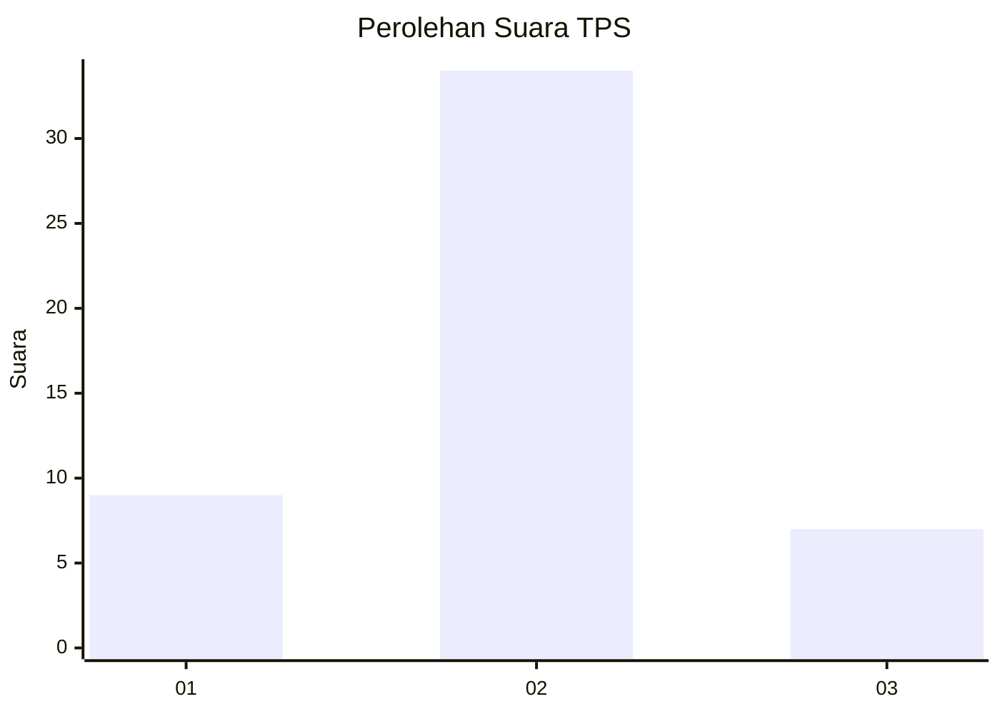
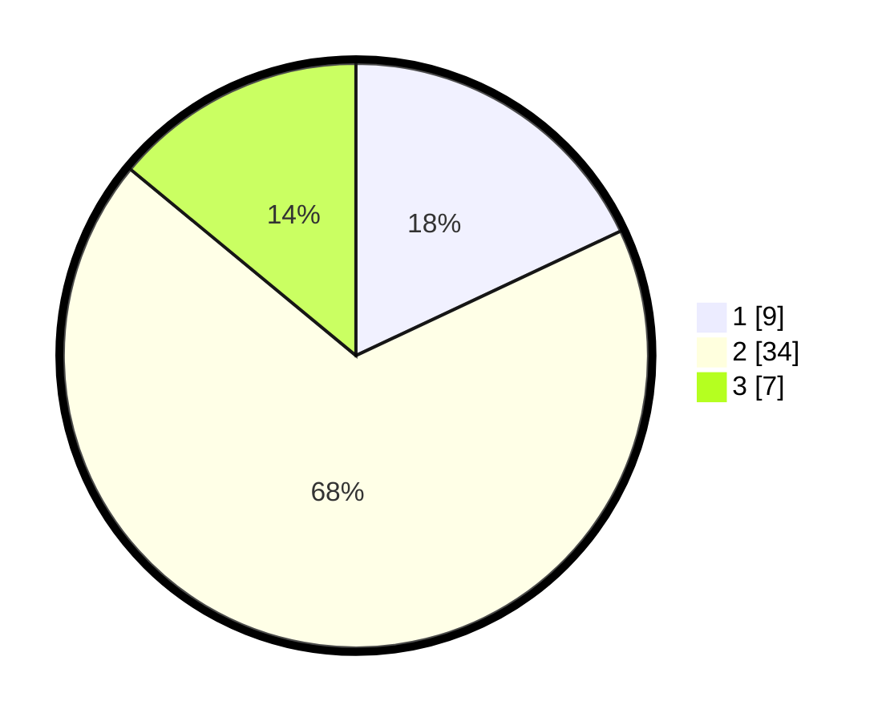

# Hasil

## Grafik

## Tabel

| No. | Nama Paslon    | Suara | Suara (raw) | Persentase |
|:--- |:-------------- | -----:| -----------:| ----------:|
| 1   | ANIES MUHAIMIN | 9     | [9][p-1]    | 18,00      |
| 2   | PRABOWO GIBRAN | 34    | [34][p-2]   | 68,00      |
| 3   | GANJAR MAHFUD  | 7     | [7][p-3]    | 14,00      |

[p-1]: https://github.com/gigit-pemilu/pemilu-2024-34-di-yogyakarta/blob/main/pilpres/hitung-suara/sub/34-di-yogyakarta/sub/71-kota-yogyakarta/sub/03-gondokusuman/sub/1003-klitren/sub/908-tps/sub/paslon-1.txt
[p-2]: https://github.com/gigit-pemilu/pemilu-2024-34-di-yogyakarta/blob/main/pilpres/hitung-suara/sub/34-di-yogyakarta/sub/71-kota-yogyakarta/sub/03-gondokusuman/sub/1003-klitren/sub/908-tps/sub/paslon-2.txt
[p-3]: https://github.com/gigit-pemilu/pemilu-2024-34-di-yogyakarta/blob/main/pilpres/hitung-suara/sub/34-di-yogyakarta/sub/71-kota-yogyakarta/sub/03-gondokusuman/sub/1003-klitren/sub/908-tps/sub/paslon-3.txt

## Foto C Plano

https://sirekap-obj-formc.kpu.go.id/b9a1/pemilu/ppwp/34/71/03/10/03/3471031003908-20240219-101850--a00a2153-9256-4d55-a57d-729509f7788f.jpg

https://sirekap-obj-formc.kpu.go.id/b9a1/pemilu/ppwp/34/71/03/10/03/3471031003908-20240219-101939--c825ff27-9976-4df1-b915-e0e700171ee3.jpg

https://sirekap-obj-formc.kpu.go.id/b9a1/pemilu/ppwp/34/71/03/10/03/3471031003908-20240219-102013--0d0c503f-365e-4cae-b5bd-93dfe18cc563.jpg

## Metadata

| Key        | Value               |
| ---------- | ------------------- |
| Time Stamp | 2024-02-19 11:00:00 |

## DATA PEMILIH TETAP

Jumlah pemilih dalam DPT: **198**.
 * L: **155**.
 * P: **43**.

## DATA PENGGUNA HAK PILIH

Jumlah pengguna hak pilih dalam DPT: **43**.
 * L: **28**.
 * P: **15**.

Jumlah pengguna hak pilih dalam DPTb: **7**.
 * L: **3**.
 * P: **4**.

Jumlah pengguna hak pilih dalam DPK: **0**.
 * L: **0**.
 * P: **0**.

Jumlah pengguna hak pilih: **50**.
 * L: **31**.
 * P: **19**.

## JUMLAH SUARA SAH DAN TIDAK SAH

JUMLAH SELURUH SUARA SAH: **50**.

JUMLAH SUARA TIDAK SAH: **0**.

JUMLAH SELURUH SUARA SAH DAN SUARA TIDAK SAH: **50**.

