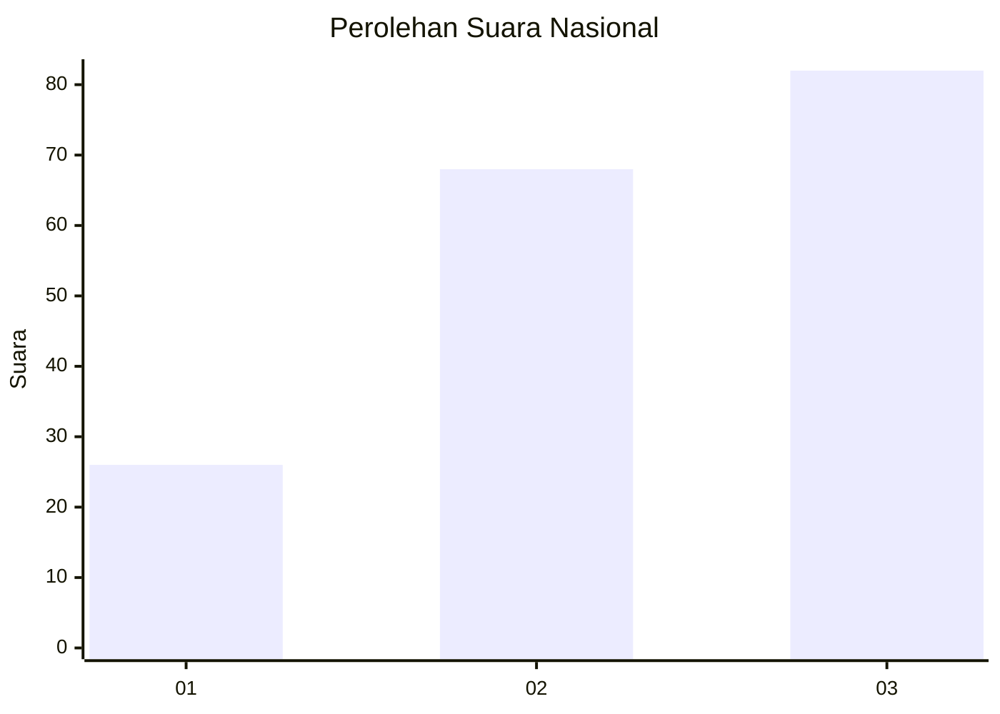
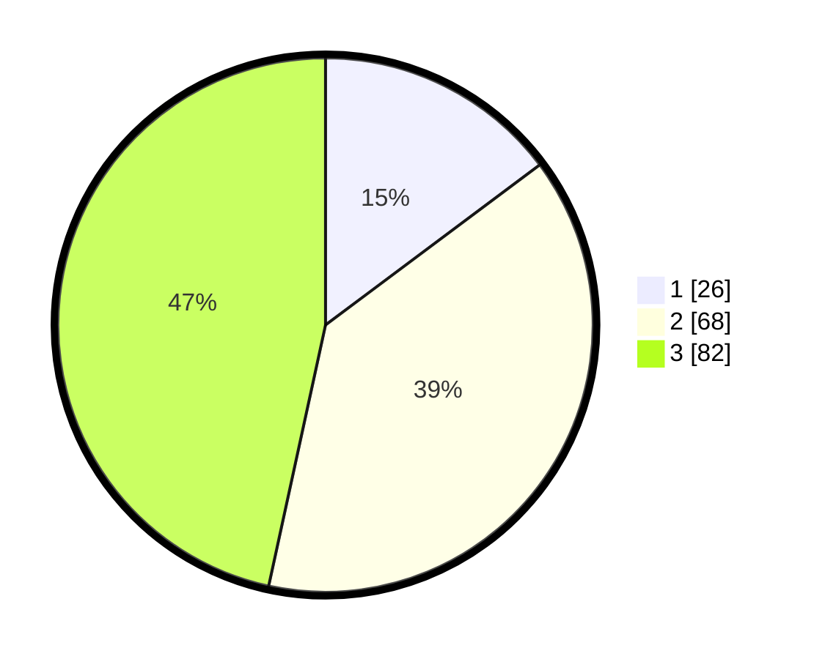

# Hasil

## Grafik

## Tabel

| No. | Nama Paslon    | Suara | Suara (raw) | Persentase |
|:--- |:-------------- | -----:| -----------:| ----------:|
| 1   | ANIES MUHAIMIN | 26    | [26][p-1]   | 14,77      |
| 2   | PRABOWO GIBRAN | 68    | [68][p-2]   | 38,64      |
| 3   | GANJAR MAHFUD  | 82    | [82][p-3]   | 46,59      |

[p-1]: https://github.com/gigit-pemilu/pemilu-2024/blob/main/pilpres/hitung-suara/sub/34-di-yogyakarta/sub/71-kota-yogyakarta/sub/03-gondokusuman/sub/1004-baciro/sub/001-tps/sub/paslon-1.txt
[p-2]: https://github.com/gigit-pemilu/pemilu-2024/blob/main/pilpres/hitung-suara/sub/34-di-yogyakarta/sub/71-kota-yogyakarta/sub/03-gondokusuman/sub/1004-baciro/sub/001-tps/sub/paslon-2.txt
[p-3]: https://github.com/gigit-pemilu/pemilu-2024/blob/main/pilpres/hitung-suara/sub/34-di-yogyakarta/sub/71-kota-yogyakarta/sub/03-gondokusuman/sub/1004-baciro/sub/001-tps/sub/paslon-3.txt

## Foto C Plano

https://sirekap-obj-formc.kpu.go.id/49e0/pemilu/ppwp/34/71/03/10/04/3471031004001-20240216-123706--2075d21e-1053-41b3-bc25-fd812be9131d.jpg

https://sirekap-obj-formc.kpu.go.id/49e0/pemilu/ppwp/34/71/03/10/04/3471031004001-20240216-123709--742cdbef-efb1-4be8-95cd-11be986db21e.jpg

https://sirekap-obj-formc.kpu.go.id/49e0/pemilu/ppwp/34/71/03/10/04/3471031004001-20240216-123707--35a2260a-71c3-43a6-9b6f-f9751bd73c04.jpg

## Metadata

| Key        | Value               |
| ---------- | ------------------- |
| Time Stamp | 2024-02-17 13:37:34 |

## DATA PEMILIH TETAP

Jumlah pemilih dalam DPT: **206**.
 * L: **102**.
 * P: **104**.

## DATA PENGGUNA HAK PILIH

Jumlah pengguna hak pilih dalam DPT: **159**.
 * L: **77**.
 * P: **82**.

Jumlah pengguna hak pilih dalam DPTb: **16**.
 * L: **2**.
 * P: **14**.

Jumlah pengguna hak pilih dalam DPK: **3**.
 * L: **2**.
 * P: **1**.

Jumlah pengguna hak pilih: **178**.
 * L: **81**.
 * P: **97**.

## JUMLAH SUARA SAH DAN TIDAK SAH

JUMLAH SELURUH SUARA SAH: **176**.

JUMLAH SUARA TIDAK SAH: **2**.

JUMLAH SELURUH SUARA SAH DAN SUARA TIDAK SAH: **178**.

