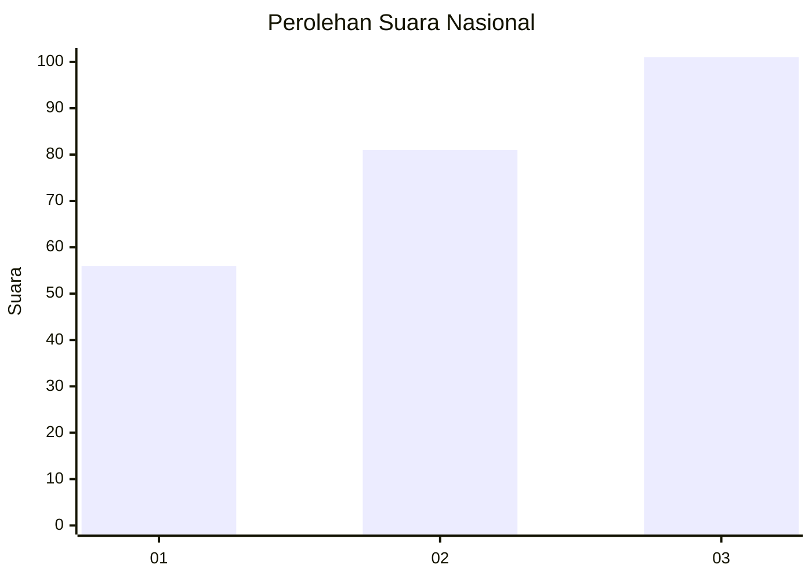
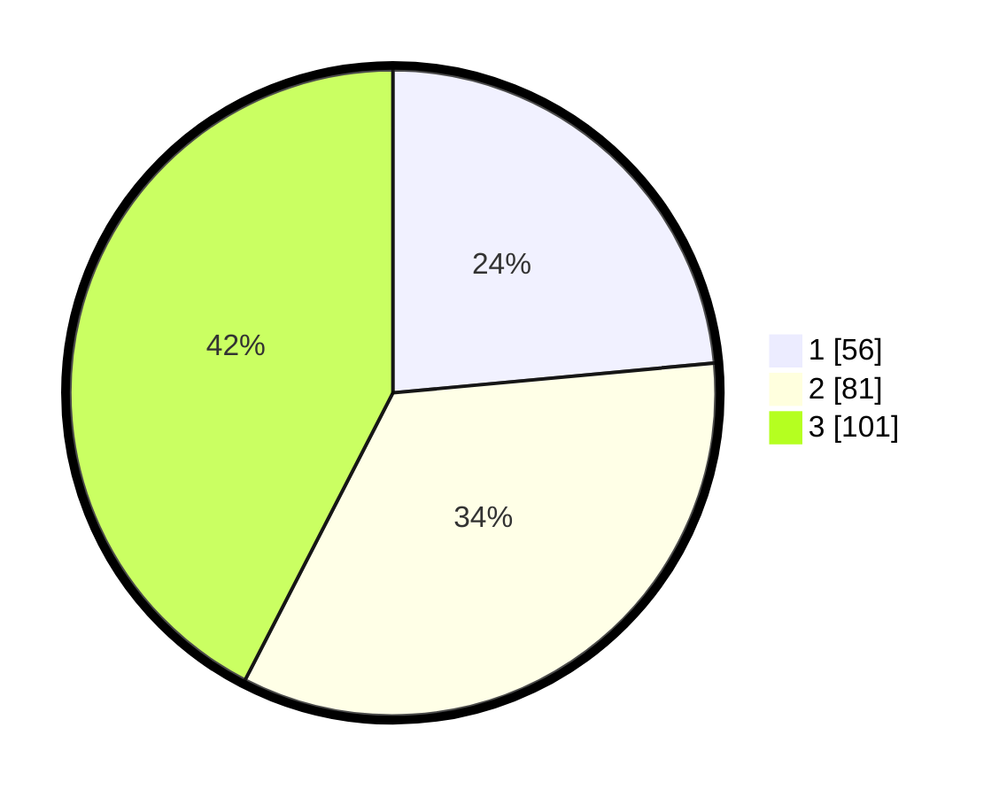

# Hasil

## Grafik

## Tabel

| No. | Nama Paslon    | Suara | Suara (raw) | Persentase |
|:--- |:-------------- | -----:| -----------:| ----------:|
| 1   | ANIES MUHAIMIN | 56    | [56][p-1]   | 23,53      |
| 2   | PRABOWO GIBRAN | 81    | [81][p-2]   | 34,03      |
| 3   | GANJAR MAHFUD  | 101   | [101][p-3]  | 42,44      |

[p-1]: https://github.com/gigit-pemilu/pemilu-2024/blob/main/pilpres/hitung-suara/sub/34-di-yogyakarta/sub/71-kota-yogyakarta/sub/03-gondokusuman/sub/1004-baciro/sub/003-tps/sub/paslon-1.txt
[p-2]: https://github.com/gigit-pemilu/pemilu-2024/blob/main/pilpres/hitung-suara/sub/34-di-yogyakarta/sub/71-kota-yogyakarta/sub/03-gondokusuman/sub/1004-baciro/sub/003-tps/sub/paslon-2.txt
[p-3]: https://github.com/gigit-pemilu/pemilu-2024/blob/main/pilpres/hitung-suara/sub/34-di-yogyakarta/sub/71-kota-yogyakarta/sub/03-gondokusuman/sub/1004-baciro/sub/003-tps/sub/paslon-3.txt

## Foto C Plano

https://sirekap-obj-formc.kpu.go.id/14c9/pemilu/ppwp/34/71/03/10/04/3471031004003-20240214-155145--d5a7856b-931b-453c-ab94-f2f9ac676c9c.jpg

https://sirekap-obj-formc.kpu.go.id/14c9/pemilu/ppwp/34/71/03/10/04/3471031004003-20240214-155247--a074add8-5fd6-4b79-b1dc-3d66de6ae3e2.jpg

https://sirekap-obj-formc.kpu.go.id/14c9/pemilu/ppwp/34/71/03/10/04/3471031004003-20240214-155542--205e3b6f-d7cb-4020-ab89-2169a60ab82f.jpg

## Metadata

| Key        | Value               |
| ---------- | ------------------- |
| Time Stamp | 2024-02-14 21:46:01 |

## DATA PEMILIH TETAP

Jumlah pemilih dalam DPT: **279**.
 * L: **134**.
 * P: **145**.

## DATA PENGGUNA HAK PILIH

Jumlah pengguna hak pilih dalam DPT: **228**.
 * L: **108**.
 * P: **120**.

Jumlah pengguna hak pilih dalam DPTb: **15**.
 * L: **5**.
 * P: **10**.

Jumlah pengguna hak pilih dalam DPK: **2**.
 * L: **1**.
 * P: **1**.

Jumlah pengguna hak pilih: **245**.
 * L: **114**.
 * P: **131**.

## JUMLAH SUARA SAH DAN TIDAK SAH

JUMLAH SELURUH SUARA SAH: **238**.

JUMLAH SUARA TIDAK SAH: **7**.

JUMLAH SELURUH SUARA SAH DAN SUARA TIDAK SAH: **245**.

