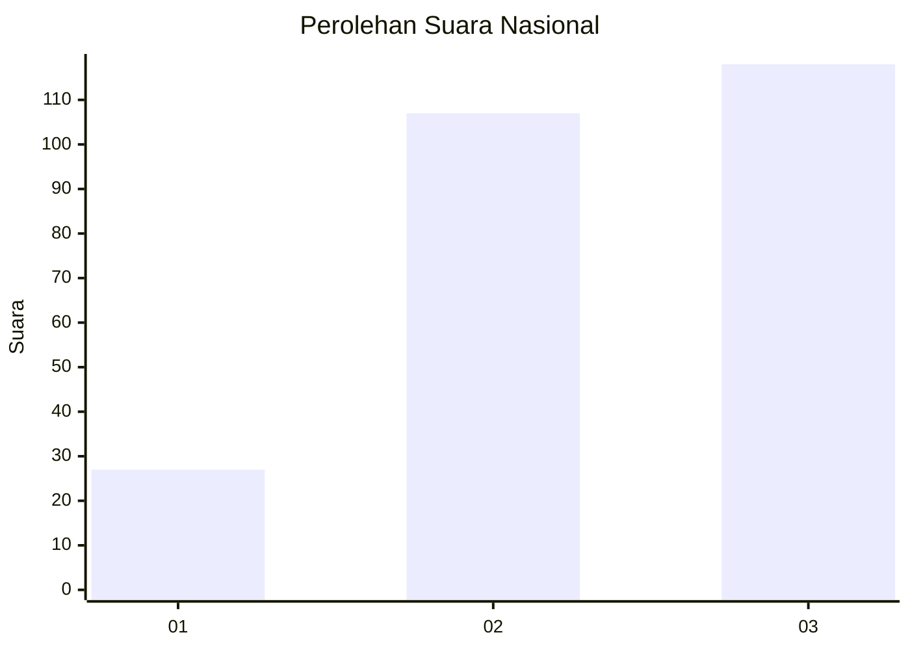
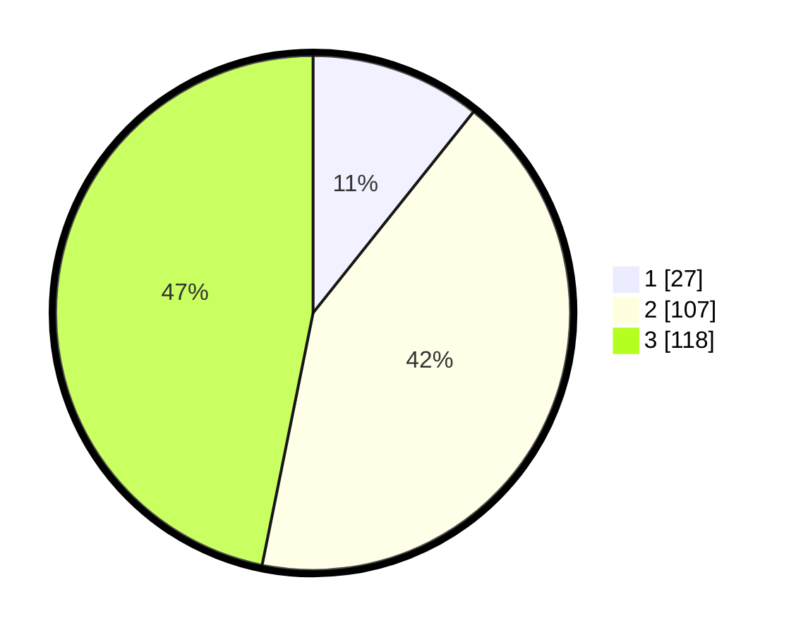

# Hasil

## Grafik

## Tabel

| No. | Nama Paslon    | Suara | Suara (raw) | Persentase |
|:--- |:-------------- | -----:| -----------:| ----------:|
| 1   | ANIES MUHAIMIN | 27    | [27][p-1]   | 10,71      |
| 2   | PRABOWO GIBRAN | 107   | [107][p-2]  | 42,46      |
| 3   | GANJAR MAHFUD  | 118   | [118][p-3]  | 46,83      |

[p-1]: https://github.com/gigit-pemilu/pemilu-2024/blob/main/pilpres/hitung-suara/sub/34-di-yogyakarta/sub/71-kota-yogyakarta/sub/03-gondokusuman/sub/1004-baciro/sub/004-tps/sub/paslon-1.txt
[p-2]: https://github.com/gigit-pemilu/pemilu-2024/blob/main/pilpres/hitung-suara/sub/34-di-yogyakarta/sub/71-kota-yogyakarta/sub/03-gondokusuman/sub/1004-baciro/sub/004-tps/sub/paslon-2.txt
[p-3]: https://github.com/gigit-pemilu/pemilu-2024/blob/main/pilpres/hitung-suara/sub/34-di-yogyakarta/sub/71-kota-yogyakarta/sub/03-gondokusuman/sub/1004-baciro/sub/004-tps/sub/paslon-3.txt

## Foto C Plano

https://sirekap-obj-formc.kpu.go.id/ef27/pemilu/ppwp/34/71/03/10/04/3471031004004-20240217-235817--625a4456-ba52-42f5-ac0d-0f9f2b59635f.jpg

https://sirekap-obj-formc.kpu.go.id/ef27/pemilu/ppwp/34/71/03/10/04/3471031004004-20240218-000036--1017bf22-829a-418a-8069-684d52a207cf.jpg

https://sirekap-obj-formc.kpu.go.id/ef27/pemilu/ppwp/34/71/03/10/04/3471031004004-20240218-000215--14c85eca-4ff6-49ef-aac2-4eacc6623df3.jpg

## Metadata

| Key        | Value               |
| ---------- | ------------------- |
| Time Stamp | 2024-02-19 06:16:00 |

## DATA PEMILIH TETAP

Jumlah pemilih dalam DPT: **236**.
 * L: **102**.
 * P: **134**.

## DATA PENGGUNA HAK PILIH

Jumlah pengguna hak pilih dalam DPT: **236**.
 * L: **102**.
 * P: **134**.

Jumlah pengguna hak pilih dalam DPTb: **17**.
 * L: **10**.
 * P: **7**.

Jumlah pengguna hak pilih dalam DPK: **0**.
 * L: **0**.
 * P: **0**.

Jumlah pengguna hak pilih: **253**.
 * L: **112**.
 * P: **141**.

## JUMLAH SUARA SAH DAN TIDAK SAH

JUMLAH SELURUH SUARA SAH: **252**.

JUMLAH SUARA TIDAK SAH: **1**.

JUMLAH SELURUH SUARA SAH DAN SUARA TIDAK SAH: **253**.

