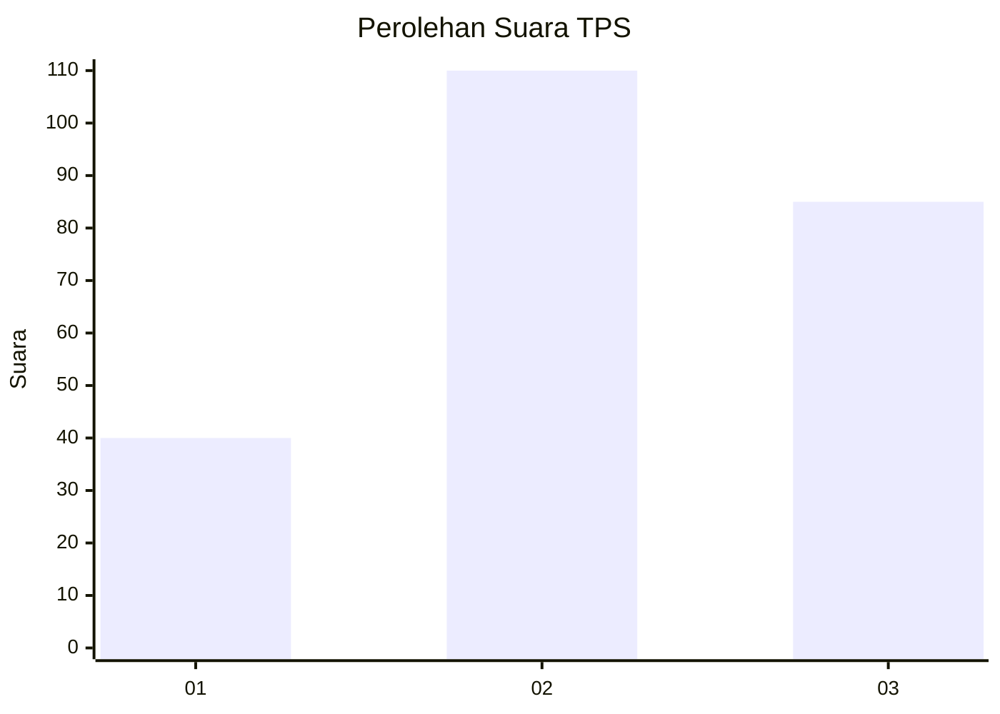
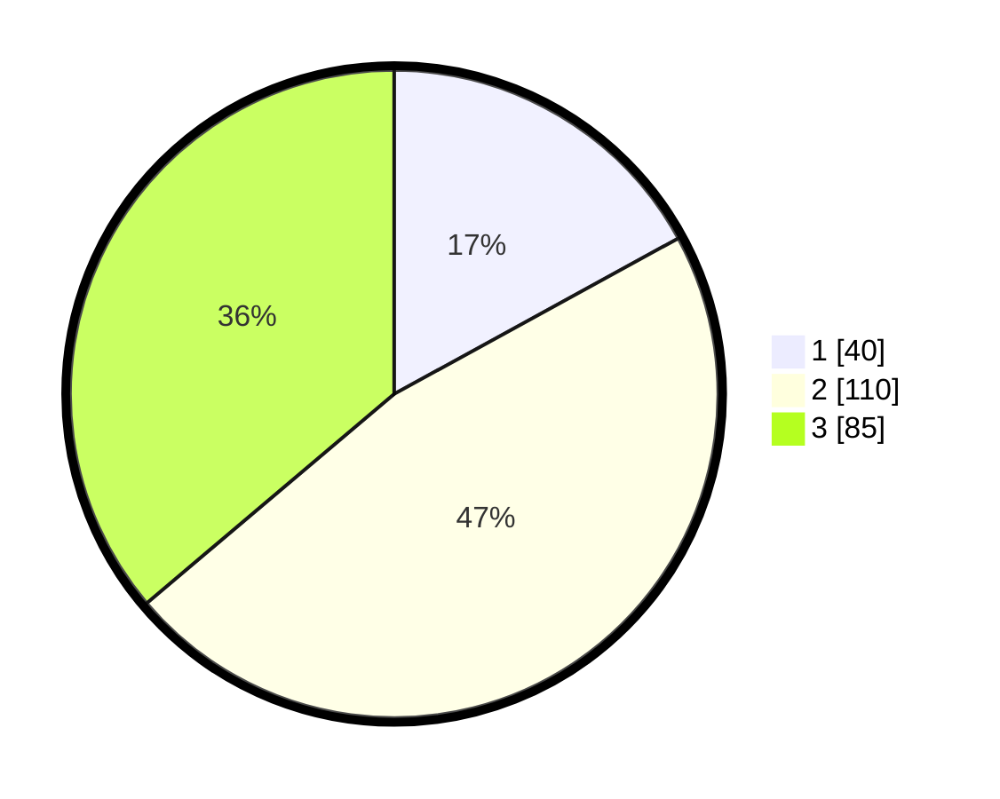

# Hasil

## Grafik

## Tabel

| No. | Nama Paslon    | Suara | Suara (raw) | Persentase |
|:--- |:-------------- | -----:| -----------:| ----------:|
| 1   | ANIES MUHAIMIN | 40    | [40][p-1]   | 17,02      |
| 2   | PRABOWO GIBRAN | 110   | [110][p-2]  | 46,81      |
| 3   | GANJAR MAHFUD  | 85    | [85][p-3]   | 36,17      |

[p-1]: https://github.com/gigit-pemilu/pemilu-2024-34-di-yogyakarta/blob/main/pilpres/hitung-suara/sub/34-di-yogyakarta/sub/71-kota-yogyakarta/sub/03-gondokusuman/sub/1004-baciro/sub/005-tps/sub/paslon-1.txt
[p-2]: https://github.com/gigit-pemilu/pemilu-2024-34-di-yogyakarta/blob/main/pilpres/hitung-suara/sub/34-di-yogyakarta/sub/71-kota-yogyakarta/sub/03-gondokusuman/sub/1004-baciro/sub/005-tps/sub/paslon-2.txt
[p-3]: https://github.com/gigit-pemilu/pemilu-2024-34-di-yogyakarta/blob/main/pilpres/hitung-suara/sub/34-di-yogyakarta/sub/71-kota-yogyakarta/sub/03-gondokusuman/sub/1004-baciro/sub/005-tps/sub/paslon-3.txt

## Foto C Plano

https://sirekap-obj-formc.kpu.go.id/b5bf/pemilu/ppwp/34/71/03/10/04/3471031004005-20240216-123534--3aeb420c-dcce-4716-afa3-63872148b398.jpg

https://sirekap-obj-formc.kpu.go.id/b5bf/pemilu/ppwp/34/71/03/10/04/3471031004005-20240216-124501--06a8fe34-3368-4736-96c4-96e596cd4b7d.jpg

https://sirekap-obj-formc.kpu.go.id/b5bf/pemilu/ppwp/34/71/03/10/04/3471031004005-20240216-124626--b89e06c3-51fa-45cc-b5e9-3a51586afae5.jpg

## Metadata

| Key        | Value               |
| ---------- | ------------------- |
| Time Stamp | 2024-02-17 13:37:34 |

## DATA PEMILIH TETAP

Jumlah pemilih dalam DPT: **284**.
 * L: **133**.
 * P: **151**.

## DATA PENGGUNA HAK PILIH

Jumlah pengguna hak pilih dalam DPT: **224**.
 * L: **94**.
 * P: **130**.

Jumlah pengguna hak pilih dalam DPTb: **17**.
 * L: **8**.
 * P: **9**.

Jumlah pengguna hak pilih dalam DPK: **2**.
 * L: **1**.
 * P: **1**.

Jumlah pengguna hak pilih: **243**.
 * L: **103**.
 * P: **140**.

## JUMLAH SUARA SAH DAN TIDAK SAH

JUMLAH SELURUH SUARA SAH: **235**.

JUMLAH SUARA TIDAK SAH: **8**.

JUMLAH SELURUH SUARA SAH DAN SUARA TIDAK SAH: **243**.

