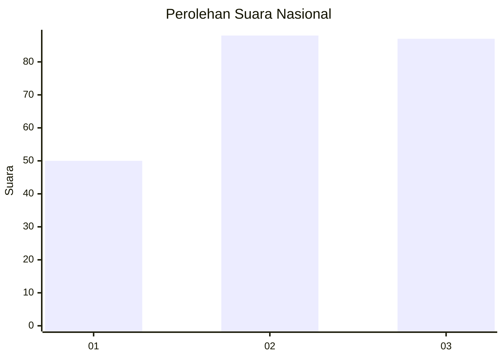
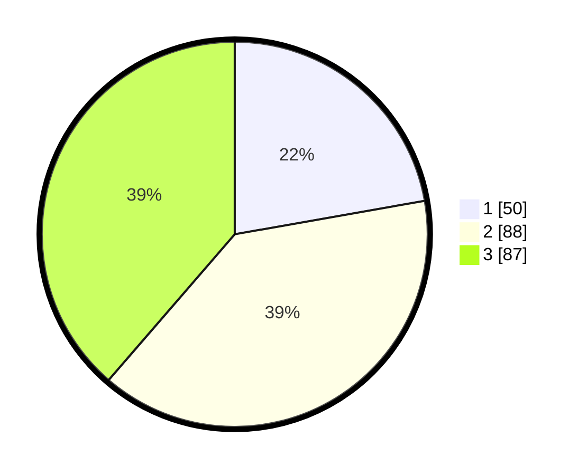

# Hasil

## Grafik

## Tabel

| No. | Nama Paslon    | Suara | Suara (raw) | Persentase |
|:--- |:-------------- | -----:| -----------:| ----------:|
| 1   | ANIES MUHAIMIN | 50    | [50][p-1]   | 22,22      |
| 2   | PRABOWO GIBRAN | 88    | [88][p-2]   | 39,11      |
| 3   | GANJAR MAHFUD  | 87    | [87][p-3]   | 38,67      |

[p-1]: https://github.com/gigit-pemilu/pemilu-2024/blob/main/pilpres/hitung-suara/sub/34-di-yogyakarta/sub/71-kota-yogyakarta/sub/03-gondokusuman/sub/1004-baciro/sub/016-tps/sub/paslon-1.txt
[p-2]: https://github.com/gigit-pemilu/pemilu-2024/blob/main/pilpres/hitung-suara/sub/34-di-yogyakarta/sub/71-kota-yogyakarta/sub/03-gondokusuman/sub/1004-baciro/sub/016-tps/sub/paslon-2.txt
[p-3]: https://github.com/gigit-pemilu/pemilu-2024/blob/main/pilpres/hitung-suara/sub/34-di-yogyakarta/sub/71-kota-yogyakarta/sub/03-gondokusuman/sub/1004-baciro/sub/016-tps/sub/paslon-3.txt

## Foto C Plano

https://sirekap-obj-formc.kpu.go.id/07be/pemilu/ppwp/34/71/03/10/04/3471031004016-20240214-230521--2ebdf584-57d5-4e99-8e6a-7a6b9a455167.jpg

https://sirekap-obj-formc.kpu.go.id/07be/pemilu/ppwp/34/71/03/10/04/3471031004016-20240215-035124--be677549-4711-467a-abc8-a6ffa9ffeb1b.jpg

https://sirekap-obj-formc.kpu.go.id/07be/pemilu/ppwp/34/71/03/10/04/3471031004016-20240215-035037--3c7f315d-dd58-48d7-8fea-5eae3e1a85b2.jpg

## Metadata

| Key        | Value               |
| ---------- | ------------------- |
| Time Stamp | 2024-02-15 12:00:28 |

