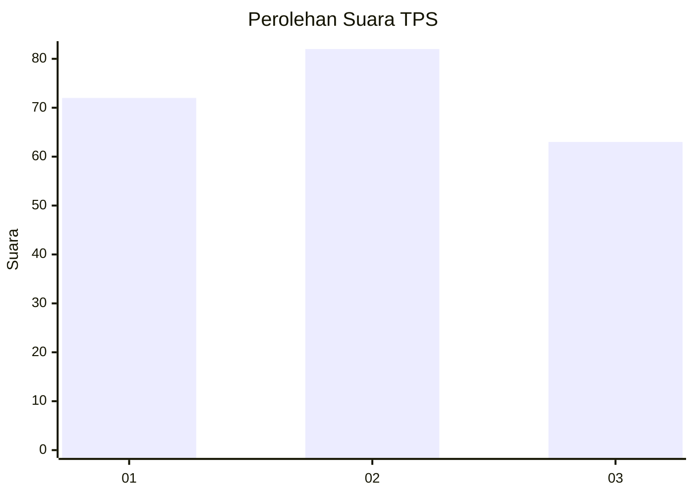
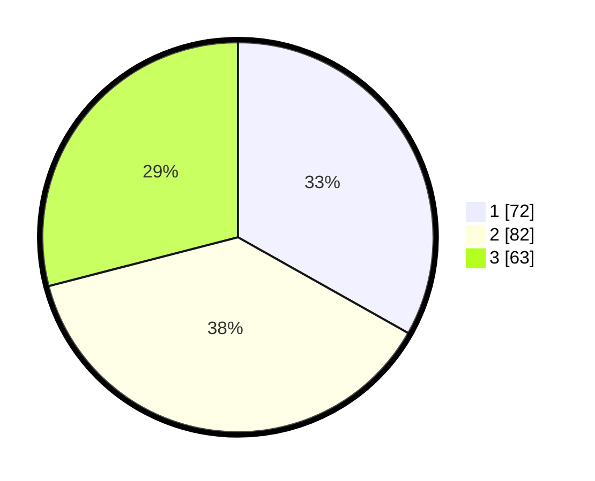

# Hasil

## Grafik

## Tabel

| No. | Nama Paslon    | Suara | Suara (raw) | Persentase |
|:--- |:-------------- | -----:| -----------:| ----------:|
| 1   | ANIES MUHAIMIN | 72    | [72][p-1]   | 33,18      |
| 2   | PRABOWO GIBRAN | 82    | [82][p-2]   | 37,79      |
| 3   | GANJAR MAHFUD  | 63    | [63][p-3]   | 29,03      |

[p-1]: https://github.com/gigit-pemilu/pemilu-2024-34-di-yogyakarta/blob/main/pilpres/hitung-suara/sub/34-di-yogyakarta/sub/71-kota-yogyakarta/sub/03-gondokusuman/sub/1004-baciro/sub/018-tps/sub/paslon-1.txt
[p-2]: https://github.com/gigit-pemilu/pemilu-2024-34-di-yogyakarta/blob/main/pilpres/hitung-suara/sub/34-di-yogyakarta/sub/71-kota-yogyakarta/sub/03-gondokusuman/sub/1004-baciro/sub/018-tps/sub/paslon-2.txt
[p-3]: https://github.com/gigit-pemilu/pemilu-2024-34-di-yogyakarta/blob/main/pilpres/hitung-suara/sub/34-di-yogyakarta/sub/71-kota-yogyakarta/sub/03-gondokusuman/sub/1004-baciro/sub/018-tps/sub/paslon-3.txt

## Foto C Plano

https://sirekap-obj-formc.kpu.go.id/3298/pemilu/ppwp/34/71/03/10/04/3471031004018-20240214-235332--2cad0271-0a73-45a1-888f-dec3f58c0b90.jpg

https://sirekap-obj-formc.kpu.go.id/3298/pemilu/ppwp/34/71/03/10/04/3471031004018-20240214-235559--84cd1f57-58ca-40b9-aff8-806726da192f.jpg

https://sirekap-obj-formc.kpu.go.id/3298/pemilu/ppwp/34/71/03/10/04/3471031004018-20240214-235803--ce0585dd-6ab8-4588-b903-e7fa703325fc.jpg

## Metadata

| Key        | Value               |
| ---------- | ------------------- |
| Time Stamp | 2024-02-24 22:31:28 |

