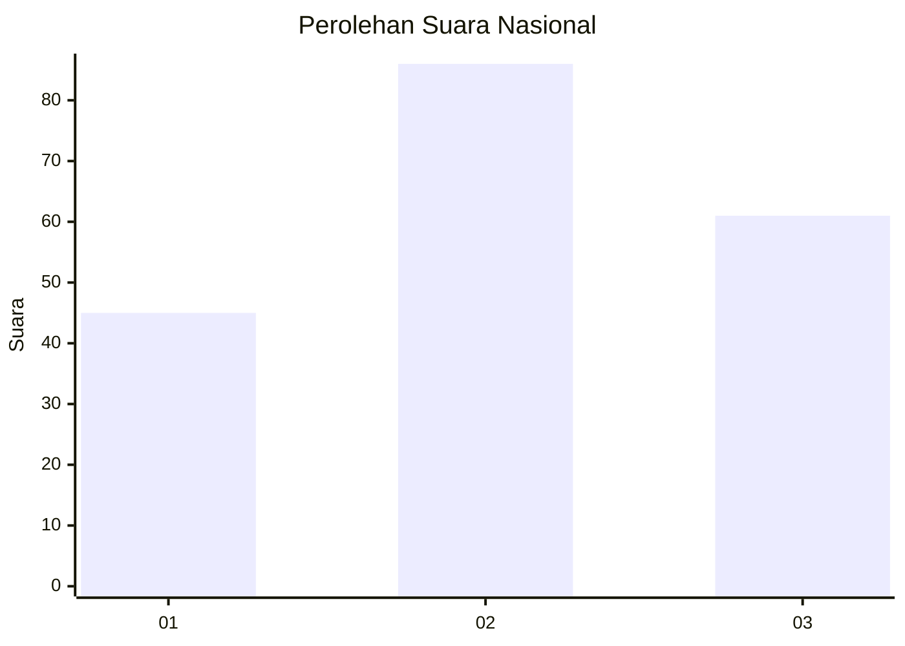
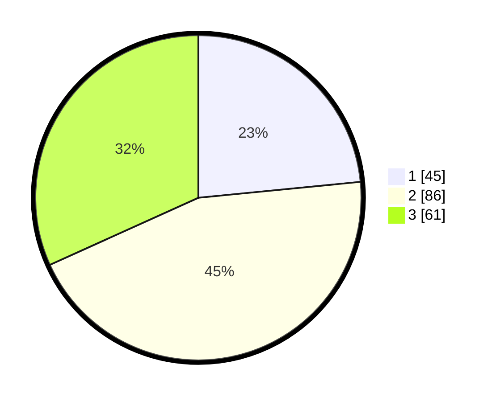

# Hasil

## Grafik

## Tabel

| No. | Nama Paslon    | Suara | Suara (raw) | Persentase |
|:--- |:-------------- | -----:| -----------:| ----------:|
| 1   | ANIES MUHAIMIN | 45    | [45][p-1]   | 23,44      |
| 2   | PRABOWO GIBRAN | 86    | [86][p-2]   | 44,79      |
| 3   | GANJAR MAHFUD  | 61    | [61][p-3]   | 31,77      |

[p-1]: https://github.com/gigit-pemilu/pemilu-2024/blob/main/pilpres/hitung-suara/sub/34-di-yogyakarta/sub/71-kota-yogyakarta/sub/03-gondokusuman/sub/1004-baciro/sub/032-tps/sub/paslon-1.txt
[p-2]: https://github.com/gigit-pemilu/pemilu-2024/blob/main/pilpres/hitung-suara/sub/34-di-yogyakarta/sub/71-kota-yogyakarta/sub/03-gondokusuman/sub/1004-baciro/sub/032-tps/sub/paslon-2.txt
[p-3]: https://github.com/gigit-pemilu/pemilu-2024/blob/main/pilpres/hitung-suara/sub/34-di-yogyakarta/sub/71-kota-yogyakarta/sub/03-gondokusuman/sub/1004-baciro/sub/032-tps/sub/paslon-3.txt

## Foto C Plano

https://sirekap-obj-formc.kpu.go.id/20b7/pemilu/ppwp/34/71/03/10/04/3471031004032-20240217-223325--4ea2cf64-25bc-40c6-9caf-68d9a82c6dfa.jpg

https://sirekap-obj-formc.kpu.go.id/20b7/pemilu/ppwp/34/71/03/10/04/3471031004032-20240217-223506--6b18ed5f-96a6-4817-a530-ab55fe0efc39.jpg

https://sirekap-obj-formc.kpu.go.id/20b7/pemilu/ppwp/34/71/03/10/04/3471031004032-20240217-223756--8d90c5bc-6e23-4724-83a0-b307bf78ac3b.jpg

## Metadata

| Key        | Value               |
| ---------- | ------------------- |
| Time Stamp | 2024-02-21 10:00:00 |

## DATA PEMILIH TETAP

Jumlah pemilih dalam DPT: **221**.
 * L: **94**.
 * P: **127**.

## DATA PENGGUNA HAK PILIH

Jumlah pengguna hak pilih dalam DPT: **182**.
 * L: **71**.
 * P: **111**.

Jumlah pengguna hak pilih dalam DPTb: **19**.
 * L: **6**.
 * P: **13**.

Jumlah pengguna hak pilih dalam DPK: **0**.
 * L: **0**.
 * P: **0**.

Jumlah pengguna hak pilih: **201**.
 * L: **77**.
 * P: **124**.

## JUMLAH SUARA SAH DAN TIDAK SAH

JUMLAH SELURUH SUARA SAH: **192**.

JUMLAH SUARA TIDAK SAH: **9**.

JUMLAH SELURUH SUARA SAH DAN SUARA TIDAK SAH: **201**.

