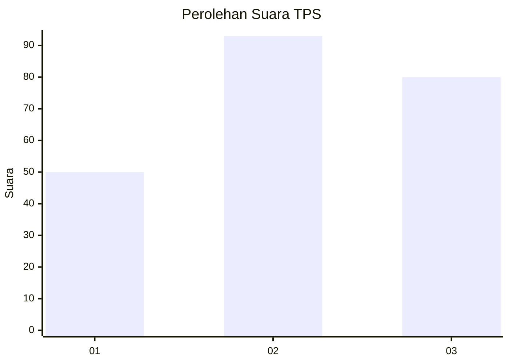
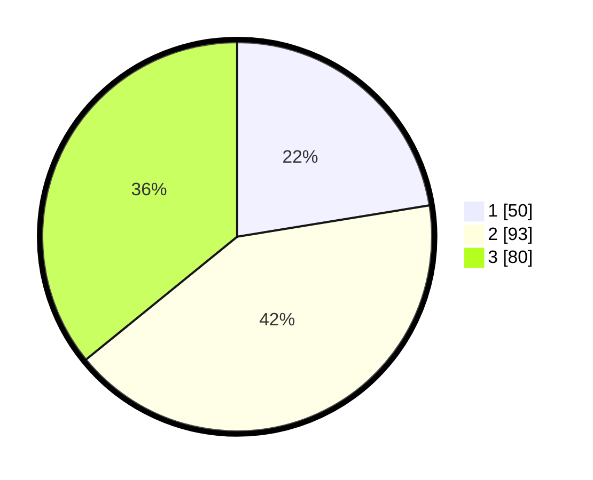

# Hasil

## Grafik

## Tabel

| No. | Nama Paslon    | Suara | Suara (raw) | Persentase |
|:--- |:-------------- | -----:| -----------:| ----------:|
| 1   | ANIES MUHAIMIN | 50    | [50][p-1]   | 22,42      |
| 2   | PRABOWO GIBRAN | 93    | [93][p-2]   | 41,70      |
| 3   | GANJAR MAHFUD  | 80    | [80][p-3]   | 35,87      |

[p-1]: https://github.com/gigit-pemilu/pemilu-2024-34-di-yogyakarta/blob/main/pilpres/hitung-suara/sub/34-di-yogyakarta/sub/71-kota-yogyakarta/sub/03-gondokusuman/sub/1004-baciro/sub/034-tps/sub/paslon-1.txt
[p-2]: https://github.com/gigit-pemilu/pemilu-2024-34-di-yogyakarta/blob/main/pilpres/hitung-suara/sub/34-di-yogyakarta/sub/71-kota-yogyakarta/sub/03-gondokusuman/sub/1004-baciro/sub/034-tps/sub/paslon-2.txt
[p-3]: https://github.com/gigit-pemilu/pemilu-2024-34-di-yogyakarta/blob/main/pilpres/hitung-suara/sub/34-di-yogyakarta/sub/71-kota-yogyakarta/sub/03-gondokusuman/sub/1004-baciro/sub/034-tps/sub/paslon-3.txt

## Foto C Plano

https://sirekap-obj-formc.kpu.go.id/ceb5/pemilu/ppwp/34/71/03/10/04/3471031004034-20240216-225428--517e0c51-767d-4c56-bfb6-65171b45ff65.jpg

https://sirekap-obj-formc.kpu.go.id/ceb5/pemilu/ppwp/34/71/03/10/04/3471031004034-20240216-225715--709b5e91-5e41-4f8f-8871-57664a651595.jpg

https://sirekap-obj-formc.kpu.go.id/ceb5/pemilu/ppwp/34/71/03/10/04/3471031004034-20240216-225845--75fbd1d7-5ce6-4db3-a6c4-1ce15bd015dc.jpg

## Metadata

| Key        | Value               |
| ---------- | ------------------- |
| Time Stamp | 2024-02-16 23:00:00 |

## DATA PEMILIH TETAP

Jumlah pemilih dalam DPT: **230**.
 * L: **112**.
 * P: **118**.

## DATA PENGGUNA HAK PILIH

Jumlah pengguna hak pilih dalam DPT: **180**.
 * L: **75**.
 * P: **105**.

Jumlah pengguna hak pilih dalam DPTb: **37**.
 * L: **4**.
 * P: **33**.

Jumlah pengguna hak pilih dalam DPK: **7**.
 * L: **5**.
 * P: **2**.

Jumlah pengguna hak pilih: **224**.
 * L: **84**.
 * P: **140**.

## JUMLAH SUARA SAH DAN TIDAK SAH

JUMLAH SELURUH SUARA SAH: **223**.

JUMLAH SUARA TIDAK SAH: **1**.

JUMLAH SELURUH SUARA SAH DAN SUARA TIDAK SAH: **224**.

