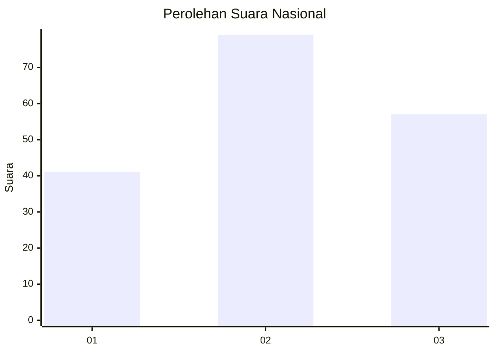
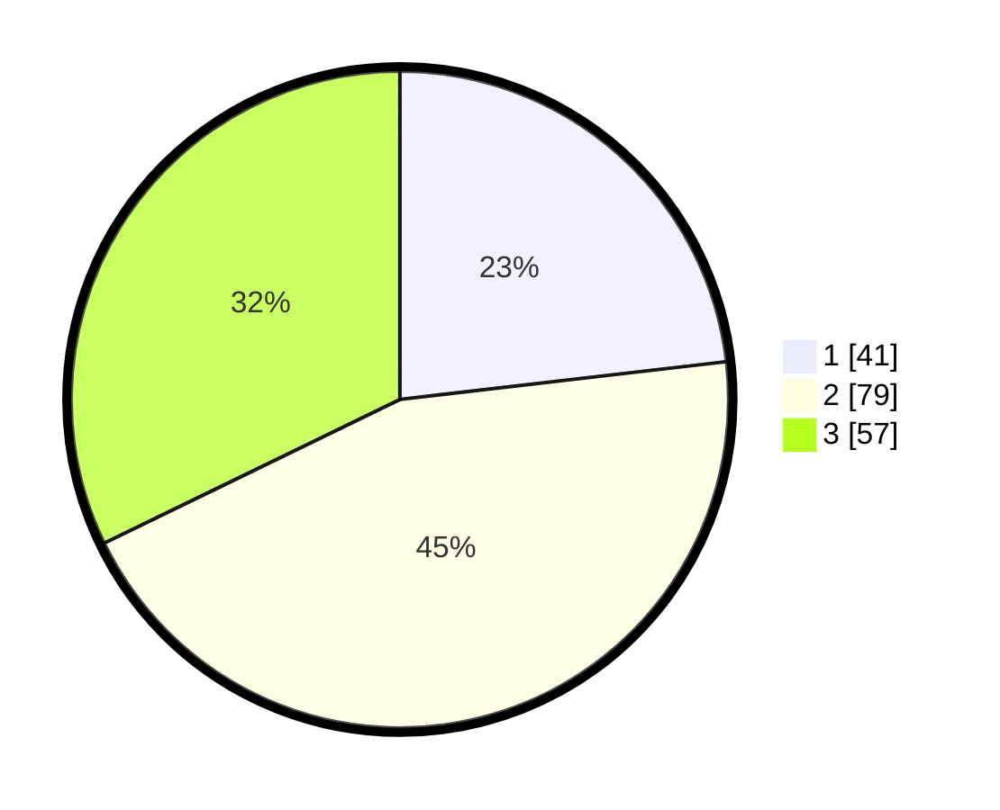

# Hasil

## Grafik

## Tabel

| No. | Nama Paslon    | Suara | Suara (raw) | Persentase |
|:--- |:-------------- | -----:| -----------:| ----------:|
| 1   | ANIES MUHAIMIN | 41    | [41][p-1]   | 23,16      |
| 2   | PRABOWO GIBRAN | 79    | [79][p-2]   | 44,63      |
| 3   | GANJAR MAHFUD  | 57    | [57][p-3]   | 32,20      |

[p-1]: https://github.com/gigit-pemilu/pemilu-2024/blob/main/pilpres/hitung-suara/sub/34-di-yogyakarta/sub/71-kota-yogyakarta/sub/03-gondokusuman/sub/1005-terban/sub/016-tps/sub/paslon-1.txt
[p-2]: https://github.com/gigit-pemilu/pemilu-2024/blob/main/pilpres/hitung-suara/sub/34-di-yogyakarta/sub/71-kota-yogyakarta/sub/03-gondokusuman/sub/1005-terban/sub/016-tps/sub/paslon-2.txt
[p-3]: https://github.com/gigit-pemilu/pemilu-2024/blob/main/pilpres/hitung-suara/sub/34-di-yogyakarta/sub/71-kota-yogyakarta/sub/03-gondokusuman/sub/1005-terban/sub/016-tps/sub/paslon-3.txt

## Foto C Plano

https://sirekap-obj-formc.kpu.go.id/f4be/pemilu/ppwp/34/71/03/10/05/3471031005016-20240216-093114--b3d3ddf9-5402-4a6b-9d50-ee574914e2e8.jpg

https://sirekap-obj-formc.kpu.go.id/f4be/pemilu/ppwp/34/71/03/10/05/3471031005016-20240216-093116--3088e212-59b4-4360-a1e9-08ee79ab6b1e.jpg

https://sirekap-obj-formc.kpu.go.id/f4be/pemilu/ppwp/34/71/03/10/05/3471031005016-20240216-093115--93cdebe1-5c0a-4ea7-be65-32b0faee931b.jpg

## Metadata

| Key        | Value               |
| ---------- | ------------------- |
| Time Stamp | 2024-02-17 13:37:34 |

## DATA PEMILIH TETAP

Jumlah pemilih dalam DPT: **201**.
 * L: **88**.
 * P: **113**.

## DATA PENGGUNA HAK PILIH

Jumlah pengguna hak pilih dalam DPT: **163**.
 * L: **68**.
 * P: **95**.

Jumlah pengguna hak pilih dalam DPTb: **16**.
 * L: **11**.
 * P: **5**.

Jumlah pengguna hak pilih dalam DPK: **1**.
 * L: **1**.
 * P: **0**.

Jumlah pengguna hak pilih: **180**.
 * L: **80**.
 * P: **100**.

## JUMLAH SUARA SAH DAN TIDAK SAH

JUMLAH SELURUH SUARA SAH: **177**.

JUMLAH SUARA TIDAK SAH: **3**.

JUMLAH SELURUH SUARA SAH DAN SUARA TIDAK SAH: **180**.

