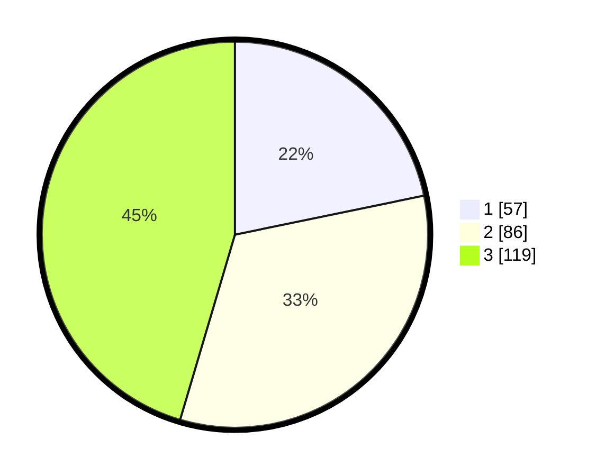

# Hasil

## Grafik

## Tabel

| No. | Nama Paslon    | Suara | Suara (raw) | Persentase |
|:--- |:-------------- | -----:| -----------:| ----------:|
| 1   | ANIES MUHAIMIN | 57    | [57][p-1]   | 21,76      |
| 2   | PRABOWO GIBRAN | 86    | [86][p-2]   | 32,82      |
| 3   | GANJAR MAHFUD  | 119   | [119][p-3]  | 45,42      |

[p-1]: https://github.com/gigit-pemilu/pemilu-2024/blob/main/pilpres/hitung-suara/sub/34-di-yogyakarta/sub/71-kota-yogyakarta/sub/03-gondokusuman/sub/1005-terban/sub/017-tps/sub/paslon-1.txt
[p-2]: https://github.com/gigit-pemilu/pemilu-2024/blob/main/pilpres/hitung-suara/sub/34-di-yogyakarta/sub/71-kota-yogyakarta/sub/03-gondokusuman/sub/1005-terban/sub/017-tps/sub/paslon-2.txt
[p-3]: https://github.com/gigit-pemilu/pemilu-2024/blob/main/pilpres/hitung-suara/sub/34-di-yogyakarta/sub/71-kota-yogyakarta/sub/03-gondokusuman/sub/1005-terban/sub/017-tps/sub/paslon-3.txt

## Foto C Plano

https://sirekap-obj-formc.kpu.go.id/6e6c/pemilu/ppwp/34/71/03/10/05/3471031005017-20240216-150311--387c1360-5f97-4cd4-a425-c9104a186f7e.jpg

https://sirekap-obj-formc.kpu.go.id/6e6c/pemilu/ppwp/34/71/03/10/05/3471031005017-20240216-150312--6e42b791-b273-41f0-b23e-03320650a3d8.jpg

https://sirekap-obj-formc.kpu.go.id/6e6c/pemilu/ppwp/34/71/03/10/05/3471031005017-20240216-150312--4967c796-3df5-4643-b986-a3f6ec7e9b02.jpg

## Metadata

| Key        | Value               |
| ---------- | ------------------- |
| Time Stamp | 2024-02-17 13:42:09 |

## DATA PEMILIH TETAP

Jumlah pemilih dalam DPT: **273**.
 * L: **113**.
 * P: **160**.

## DATA PENGGUNA HAK PILIH

Jumlah pengguna hak pilih dalam DPT: **238**.
 * L: **88**.
 * P: **150**.

Jumlah pengguna hak pilih dalam DPTb: **23**.
 * L: **14**.
 * P: **9**.

Jumlah pengguna hak pilih dalam DPK: **4**.
 * L: **1**.
 * P: **3**.

Jumlah pengguna hak pilih: **265**.
 * L: **103**.
 * P: **162**.

## JUMLAH SUARA SAH DAN TIDAK SAH

JUMLAH SELURUH SUARA SAH: **262**.

JUMLAH SUARA TIDAK SAH: **3**.

JUMLAH SELURUH SUARA SAH DAN SUARA TIDAK SAH: **265**.

