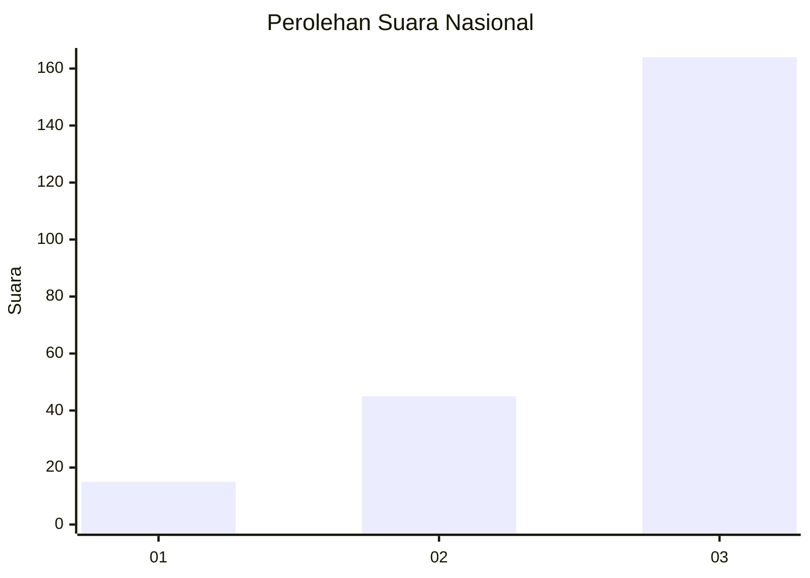
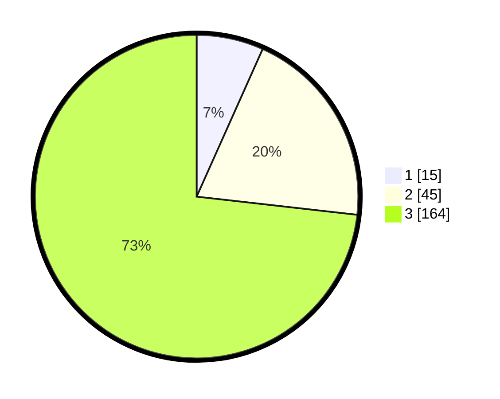

# Hasil

## Grafik

## Tabel

| No. | Nama Paslon    | Suara | Suara (raw) | Persentase |
|:--- |:-------------- | -----:| -----------:| ----------:|
| 1   | ANIES MUHAIMIN | 15    | [15][p-1]   | 6,70       |
| 2   | PRABOWO GIBRAN | 45    | [45][p-2]   | 20,09      |
| 3   | GANJAR MAHFUD  | 164   | [164][p-3]  | 73,21      |

[p-1]: https://github.com/gigit-pemilu/pemilu-2024/blob/main/pilpres/hitung-suara/sub/34-di-yogyakarta/sub/71-kota-yogyakarta/sub/03-gondokusuman/sub/1005-terban/sub/018-tps/sub/paslon-1.txt
[p-2]: https://github.com/gigit-pemilu/pemilu-2024/blob/main/pilpres/hitung-suara/sub/34-di-yogyakarta/sub/71-kota-yogyakarta/sub/03-gondokusuman/sub/1005-terban/sub/018-tps/sub/paslon-2.txt
[p-3]: https://github.com/gigit-pemilu/pemilu-2024/blob/main/pilpres/hitung-suara/sub/34-di-yogyakarta/sub/71-kota-yogyakarta/sub/03-gondokusuman/sub/1005-terban/sub/018-tps/sub/paslon-3.txt

## Foto C Plano

https://sirekap-obj-formc.kpu.go.id/9bd5/pemilu/ppwp/34/71/03/10/05/3471031005018-20240216-053752--58e011dd-e1fb-47df-81b4-5c93d541e7b0.jpg

https://sirekap-obj-formc.kpu.go.id/9bd5/pemilu/ppwp/34/71/03/10/05/3471031005018-20240216-053755--3d8510e6-2373-4b9d-8e40-026b64167453.jpg

https://sirekap-obj-formc.kpu.go.id/9bd5/pemilu/ppwp/34/71/03/10/05/3471031005018-20240216-053753--81a8ce57-b39f-4b15-bce1-1fd800bf1b74.jpg

## Metadata

| Key        | Value               |
| ---------- | ------------------- |
| Time Stamp | 2024-02-16 08:00:28 |

## DATA PEMILIH TETAP

Jumlah pemilih dalam DPT: **252**.
 * L: **51**.
 * P: **201**.

## DATA PENGGUNA HAK PILIH

Jumlah pengguna hak pilih dalam DPT: **178**.
 * L: **42**.
 * P: **136**.

Jumlah pengguna hak pilih dalam DPTb: **49**.
 * L: **25**.
 * P: **24**.

Jumlah pengguna hak pilih dalam DPK: **1**.
 * L: **1**.
 * P: **0**.

Jumlah pengguna hak pilih: **228**.
 * L: **68**.
 * P: **160**.

## JUMLAH SUARA SAH DAN TIDAK SAH

JUMLAH SELURUH SUARA SAH: **224**.

JUMLAH SUARA TIDAK SAH: **4**.

JUMLAH SELURUH SUARA SAH DAN SUARA TIDAK SAH: **228**.

