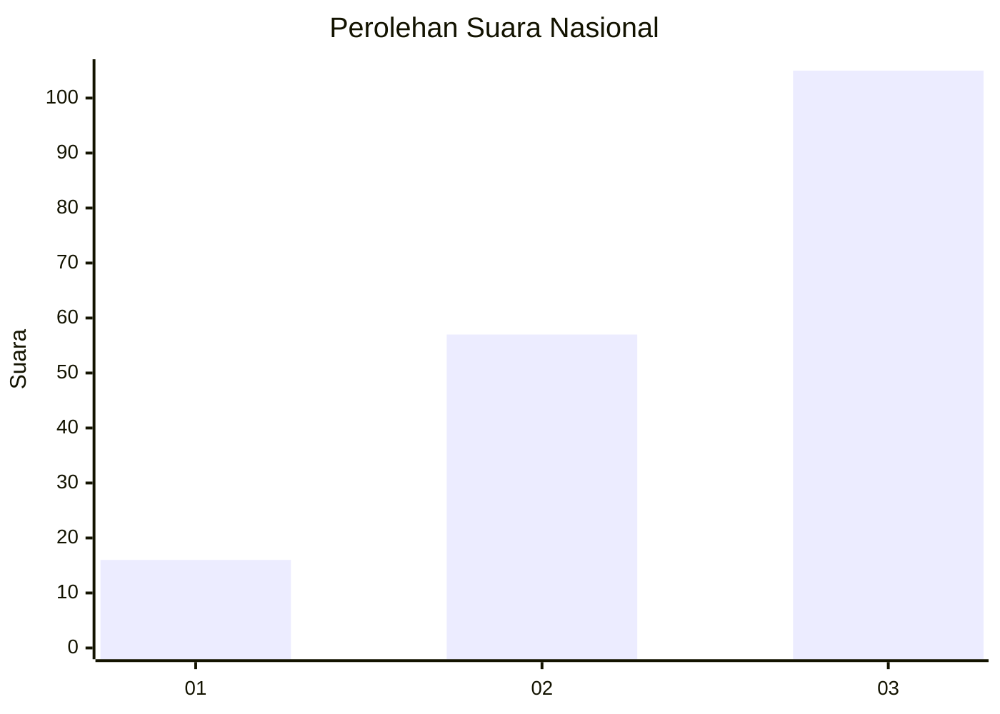
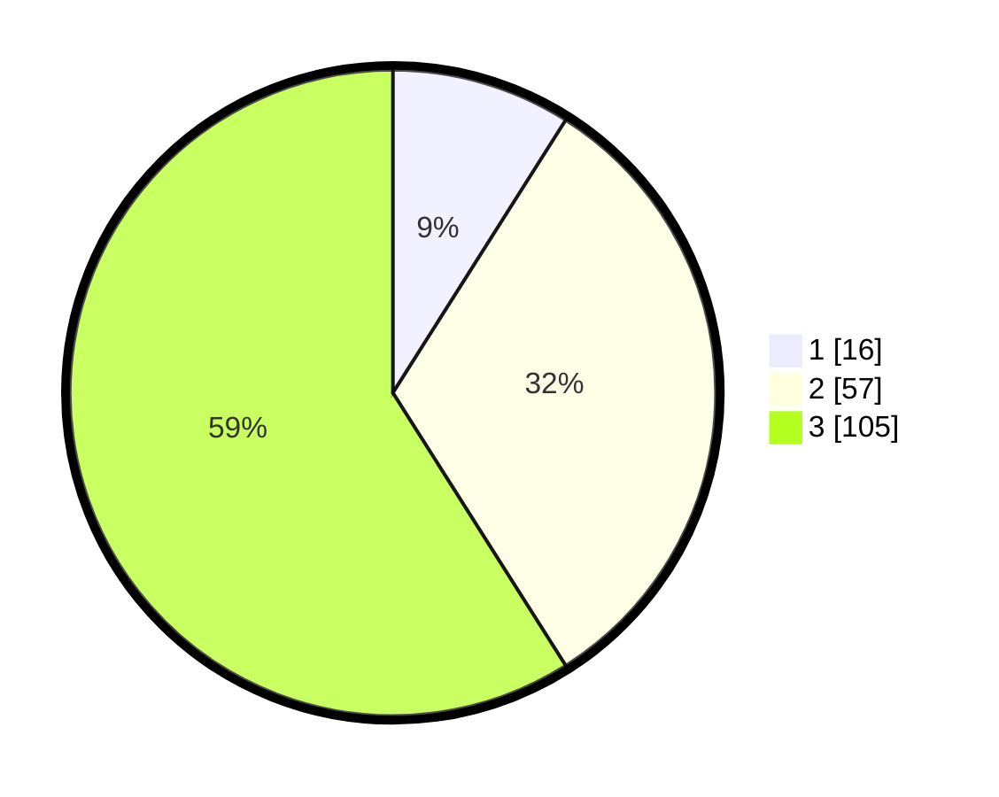

# Hasil

## Grafik

## Tabel

| No. | Nama Paslon    | Suara | Suara (raw) | Persentase |
|:--- |:-------------- | -----:| -----------:| ----------:|
| 1   | ANIES MUHAIMIN | 16    | [16][p-1]   | 8,99       |
| 2   | PRABOWO GIBRAN | 57    | [57][p-2]   | 32,02      |
| 3   | GANJAR MAHFUD  | 105   | [105][p-3]  | 58,99      |

[p-1]: https://github.com/gigit-pemilu/pemilu-2024/blob/main/pilpres/hitung-suara/sub/34-di-yogyakarta/sub/71-kota-yogyakarta/sub/04-danurejan/sub/1001-suryatmajan/sub/001-tps/sub/paslon-1.txt
[p-2]: https://github.com/gigit-pemilu/pemilu-2024/blob/main/pilpres/hitung-suara/sub/34-di-yogyakarta/sub/71-kota-yogyakarta/sub/04-danurejan/sub/1001-suryatmajan/sub/001-tps/sub/paslon-2.txt
[p-3]: https://github.com/gigit-pemilu/pemilu-2024/blob/main/pilpres/hitung-suara/sub/34-di-yogyakarta/sub/71-kota-yogyakarta/sub/04-danurejan/sub/1001-suryatmajan/sub/001-tps/sub/paslon-3.txt

## Foto C Plano

https://sirekap-obj-formc.kpu.go.id/2d1c/pemilu/ppwp/34/71/04/10/01/3471041001001-20240214-222737--e0f51b9c-9b76-41ba-94b7-2e8d36deb240.jpg

https://sirekap-obj-formc.kpu.go.id/2d1c/pemilu/ppwp/34/71/04/10/01/3471041001001-20240214-222921--4f81a6a7-d647-4cb0-96e8-c2bafb6675b0.jpg

https://sirekap-obj-formc.kpu.go.id/2d1c/pemilu/ppwp/34/71/04/10/01/3471041001001-20240214-223221--99f87da5-f2b6-4db8-9881-bf9c3dedcbca.jpg

## Metadata

| Key        | Value               |
| ---------- | ------------------- |
| Time Stamp | 2024-02-24 23:00:00 |

