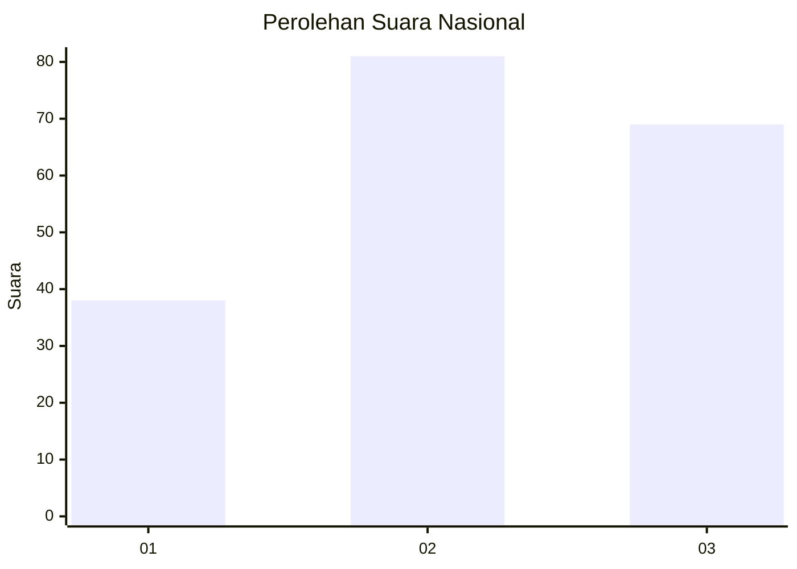
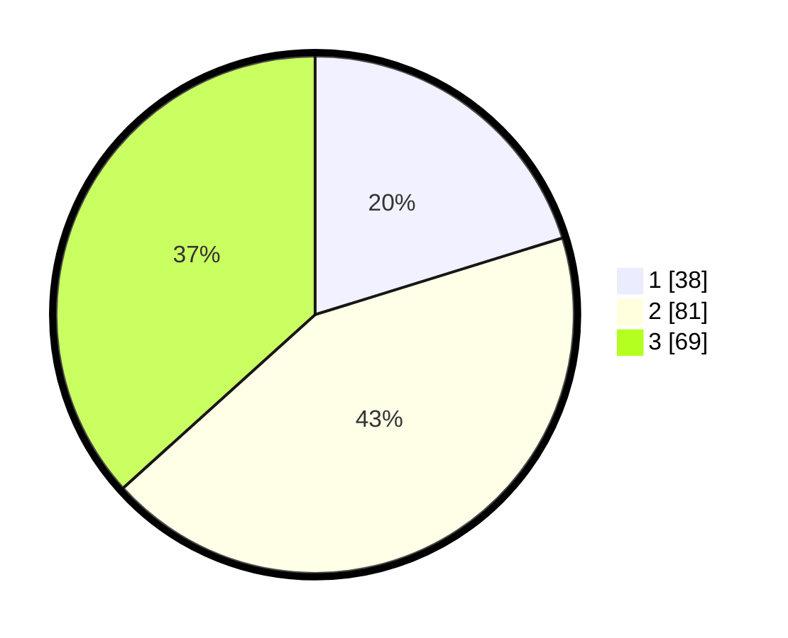

# Hasil

## Grafik

## Tabel

| No. | Nama Paslon    | Suara | Suara (raw) | Persentase |
|:--- |:-------------- | -----:| -----------:| ----------:|
| 1   | ANIES MUHAIMIN | 38    | [38][p-1]   | 20,21      |
| 2   | PRABOWO GIBRAN | 81    | [81][p-2]   | 43,09      |
| 3   | GANJAR MAHFUD  | 69    | [69][p-3]   | 36,70      |

[p-1]: https://github.com/gigit-pemilu/pemilu-2024/blob/main/pilpres/hitung-suara/sub/34-di-yogyakarta/sub/71-kota-yogyakarta/sub/04-danurejan/sub/1001-suryatmajan/sub/003-tps/sub/paslon-1.txt
[p-2]: https://github.com/gigit-pemilu/pemilu-2024/blob/main/pilpres/hitung-suara/sub/34-di-yogyakarta/sub/71-kota-yogyakarta/sub/04-danurejan/sub/1001-suryatmajan/sub/003-tps/sub/paslon-2.txt
[p-3]: https://github.com/gigit-pemilu/pemilu-2024/blob/main/pilpres/hitung-suara/sub/34-di-yogyakarta/sub/71-kota-yogyakarta/sub/04-danurejan/sub/1001-suryatmajan/sub/003-tps/sub/paslon-3.txt

## Foto C Plano

https://sirekap-obj-formc.kpu.go.id/b96b/pemilu/ppwp/34/71/04/10/01/3471041001003-20240215-050934--a6859798-ae44-4c35-8720-e91bc8e3e983.jpg

https://sirekap-obj-formc.kpu.go.id/b96b/pemilu/ppwp/34/71/04/10/01/3471041001003-20240215-050953--03560471-26b4-422c-99fe-e06ae49c5899.jpg

https://sirekap-obj-formc.kpu.go.id/b96b/pemilu/ppwp/34/71/04/10/01/3471041001003-20240215-051007--2b20e3f1-818f-4a3a-8387-fa87762fcfee.jpg

## Metadata

| Key        | Value               |
| ---------- | ------------------- |
| Time Stamp | 2024-02-16 01:00:27 |

## DATA PEMILIH TETAP

Jumlah pemilih dalam DPT: **225**.
 * L: **105**.
 * P: **120**.

## DATA PENGGUNA HAK PILIH

Jumlah pengguna hak pilih dalam DPT: **188**.
 * L: **87**.
 * P: **101**.

Jumlah pengguna hak pilih dalam DPTb: **5**.
 * L: **2**.
 * P: **3**.

Jumlah pengguna hak pilih dalam DPK: **1**.
 * L: **0**.
 * P: **1**.

Jumlah pengguna hak pilih: **194**.
 * L: **89**.
 * P: **105**.

## JUMLAH SUARA SAH DAN TIDAK SAH

JUMLAH SELURUH SUARA SAH: **188**.

JUMLAH SUARA TIDAK SAH: **6**.

JUMLAH SELURUH SUARA SAH DAN SUARA TIDAK SAH: **194**.

