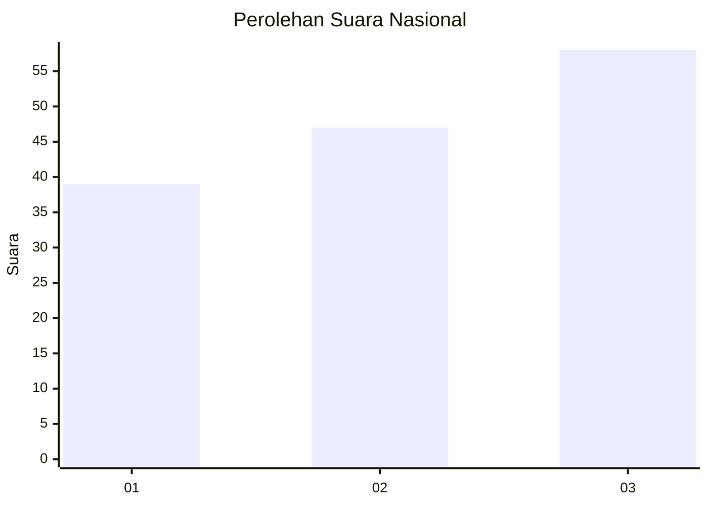
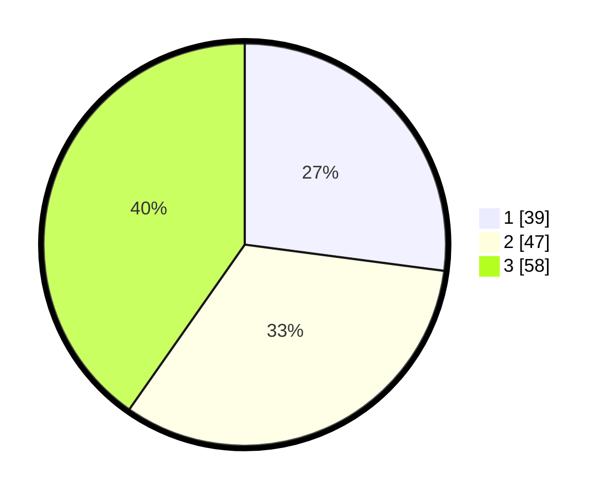

# Hasil

## Grafik

## Tabel

| No. | Nama Paslon    | Suara | Suara (raw) | Persentase |
|:--- |:-------------- | -----:| -----------:| ----------:|
| 1   | ANIES MUHAIMIN | 39    | [39][p-1]   | 27,08      |
| 2   | PRABOWO GIBRAN | 47    | [47][p-2]   | 32,64      |
| 3   | GANJAR MAHFUD  | 58    | [58][p-3]   | 40,28      |

[p-1]: https://github.com/gigit-pemilu/pemilu-2024/blob/main/pilpres/hitung-suara/sub/34-di-yogyakarta/sub/71-kota-yogyakarta/sub/04-danurejan/sub/1001-suryatmajan/sub/004-tps/sub/paslon-1.txt
[p-2]: https://github.com/gigit-pemilu/pemilu-2024/blob/main/pilpres/hitung-suara/sub/34-di-yogyakarta/sub/71-kota-yogyakarta/sub/04-danurejan/sub/1001-suryatmajan/sub/004-tps/sub/paslon-2.txt
[p-3]: https://github.com/gigit-pemilu/pemilu-2024/blob/main/pilpres/hitung-suara/sub/34-di-yogyakarta/sub/71-kota-yogyakarta/sub/04-danurejan/sub/1001-suryatmajan/sub/004-tps/sub/paslon-3.txt

## Foto C Plano

https://sirekap-obj-formc.kpu.go.id/5d3c/pemilu/ppwp/34/71/04/10/01/3471041001004-20240214-232226--55ec9c31-8859-4f47-8249-54dcae289fb2.jpg

https://sirekap-obj-formc.kpu.go.id/5d3c/pemilu/ppwp/34/71/04/10/01/3471041001004-20240216-165355--7118464e-fd22-4eb1-a652-a98f2e902348.jpg

https://sirekap-obj-formc.kpu.go.id/5d3c/pemilu/ppwp/34/71/04/10/01/3471041001004-20240216-165637--265eab57-db88-4bf4-8f9b-816c56be4479.jpg

## Metadata

| Key        | Value               |
| ---------- | ------------------- |
| Time Stamp | 2024-02-17 14:45:18 |

## DATA PEMILIH TETAP

Jumlah pemilih dalam DPT: **171**.
 * L: **88**.
 * P: **83**.

## DATA PENGGUNA HAK PILIH

Jumlah pengguna hak pilih dalam DPT: **141**.
 * L: **72**.
 * P: **69**.

Jumlah pengguna hak pilih dalam DPTb: **3**.
 * L: **1**.
 * P: **2**.

Jumlah pengguna hak pilih dalam DPK: **3**.
 * L: **1**.
 * P: **2**.

Jumlah pengguna hak pilih: **147**.
 * L: **74**.
 * P: **73**.

## JUMLAH SUARA SAH DAN TIDAK SAH

JUMLAH SELURUH SUARA SAH: **144**.

JUMLAH SUARA TIDAK SAH: **3**.

JUMLAH SELURUH SUARA SAH DAN SUARA TIDAK SAH: **147**.

