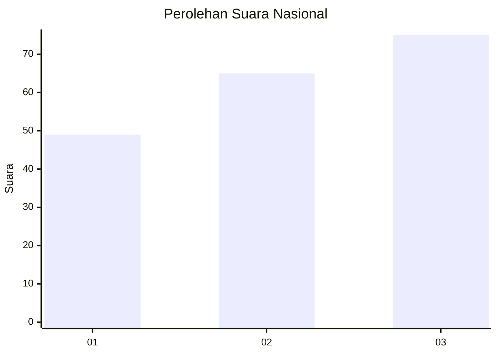
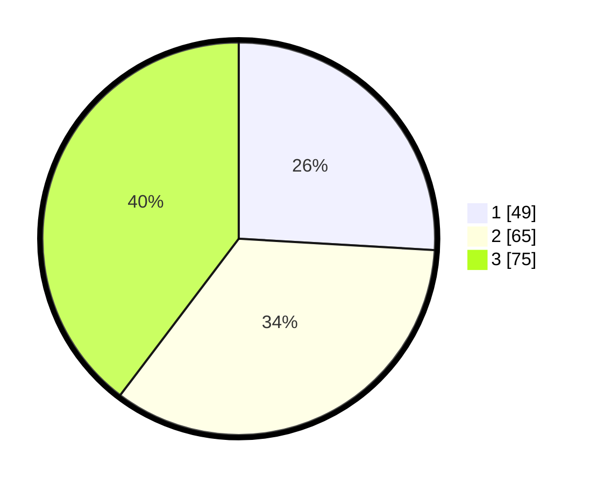

# Hasil

## Grafik

## Tabel

| No. | Nama Paslon    | Suara | Suara (raw) | Persentase |
|:--- |:-------------- | -----:| -----------:| ----------:|
| 1   | ANIES MUHAIMIN | 49    | [49][p-1]   | 25,93      |
| 2   | PRABOWO GIBRAN | 65    | [65][p-2]   | 34,39      |
| 3   | GANJAR MAHFUD  | 75    | [75][p-3]   | 39,68      |

[p-1]: https://github.com/gigit-pemilu/pemilu-2024/blob/main/pilpres/hitung-suara/sub/34-di-yogyakarta/sub/71-kota-yogyakarta/sub/04-danurejan/sub/1001-suryatmajan/sub/008-tps/sub/paslon-1.txt
[p-2]: https://github.com/gigit-pemilu/pemilu-2024/blob/main/pilpres/hitung-suara/sub/34-di-yogyakarta/sub/71-kota-yogyakarta/sub/04-danurejan/sub/1001-suryatmajan/sub/008-tps/sub/paslon-2.txt
[p-3]: https://github.com/gigit-pemilu/pemilu-2024/blob/main/pilpres/hitung-suara/sub/34-di-yogyakarta/sub/71-kota-yogyakarta/sub/04-danurejan/sub/1001-suryatmajan/sub/008-tps/sub/paslon-3.txt

## Foto C Plano

https://sirekap-obj-formc.kpu.go.id/085f/pemilu/ppwp/34/71/04/10/01/3471041001008-20240214-155029--9434f43f-175c-49c4-908a-ce4ff9f0610a.jpg

https://sirekap-obj-formc.kpu.go.id/085f/pemilu/ppwp/34/71/04/10/01/3471041001008-20240214-155249--08609180-2e82-49de-8d7f-2ab2fd95d769.jpg

https://sirekap-obj-formc.kpu.go.id/085f/pemilu/ppwp/34/71/04/10/01/3471041001008-20240214-155422--3b84ed39-d39f-4eb7-982a-927404cfd8bd.jpg

## Metadata

| Key        | Value               |
| ---------- | ------------------- |
| Time Stamp | 2024-02-24 22:31:28 |

