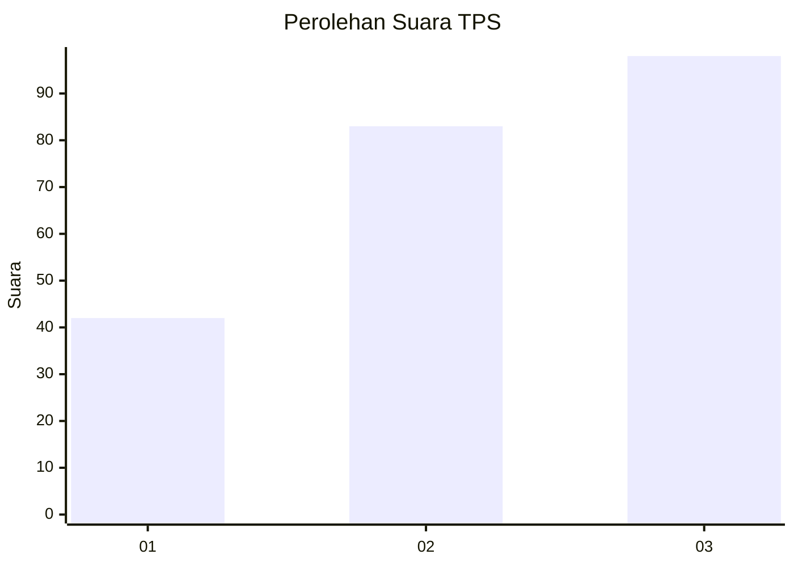
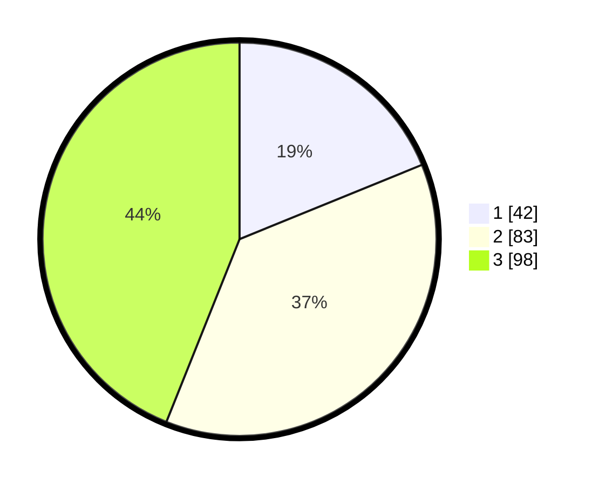

# Hasil

## Grafik

## Tabel

| No. | Nama Paslon    | Suara | Suara (raw) | Persentase |
|:--- |:-------------- | -----:| -----------:| ----------:|
| 1   | ANIES MUHAIMIN | 42    | [42][p-1]   | 18,83      |
| 2   | PRABOWO GIBRAN | 83    | [83][p-2]   | 37,22      |
| 3   | GANJAR MAHFUD  | 98    | [98][p-3]   | 43,95      |

[p-1]: https://github.com/gigit-pemilu/pemilu-2024-34-di-yogyakarta/blob/main/pilpres/hitung-suara/sub/34-di-yogyakarta/sub/71-kota-yogyakarta/sub/04-danurejan/sub/1001-suryatmajan/sub/013-tps/sub/paslon-1.txt
[p-2]: https://github.com/gigit-pemilu/pemilu-2024-34-di-yogyakarta/blob/main/pilpres/hitung-suara/sub/34-di-yogyakarta/sub/71-kota-yogyakarta/sub/04-danurejan/sub/1001-suryatmajan/sub/013-tps/sub/paslon-2.txt
[p-3]: https://github.com/gigit-pemilu/pemilu-2024-34-di-yogyakarta/blob/main/pilpres/hitung-suara/sub/34-di-yogyakarta/sub/71-kota-yogyakarta/sub/04-danurejan/sub/1001-suryatmajan/sub/013-tps/sub/paslon-3.txt

## Foto C Plano

https://sirekap-obj-formc.kpu.go.id/831d/pemilu/ppwp/34/71/04/10/01/3471041001013-20240214-155123--5ee2776b-f44d-488d-9b17-0fee765c530e.jpg

https://sirekap-obj-formc.kpu.go.id/831d/pemilu/ppwp/34/71/04/10/01/3471041001013-20240214-155055--57672d46-f471-4ffa-b2af-c731469bddaf.jpg

https://sirekap-obj-formc.kpu.go.id/831d/pemilu/ppwp/34/71/04/10/01/3471041001013-20240214-155140--b9ed1b53-4ef8-4bc9-ad9a-d4e375f96745.jpg

## Metadata

| Key        | Value               |
| ---------- | ------------------- |
| Time Stamp | 2024-02-24 22:31:28 |

