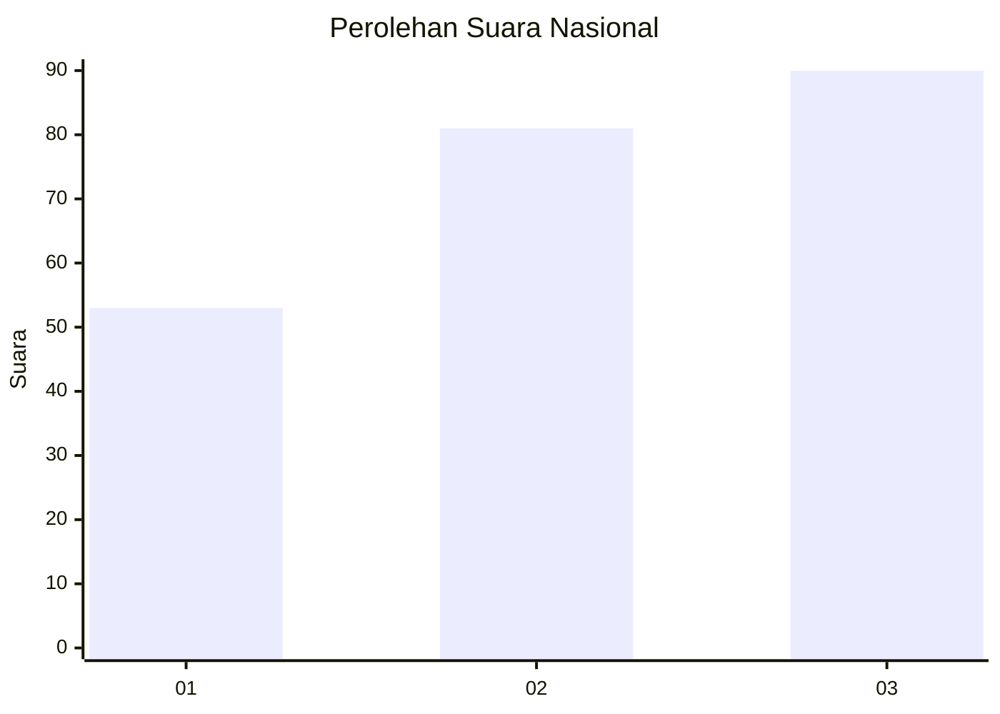
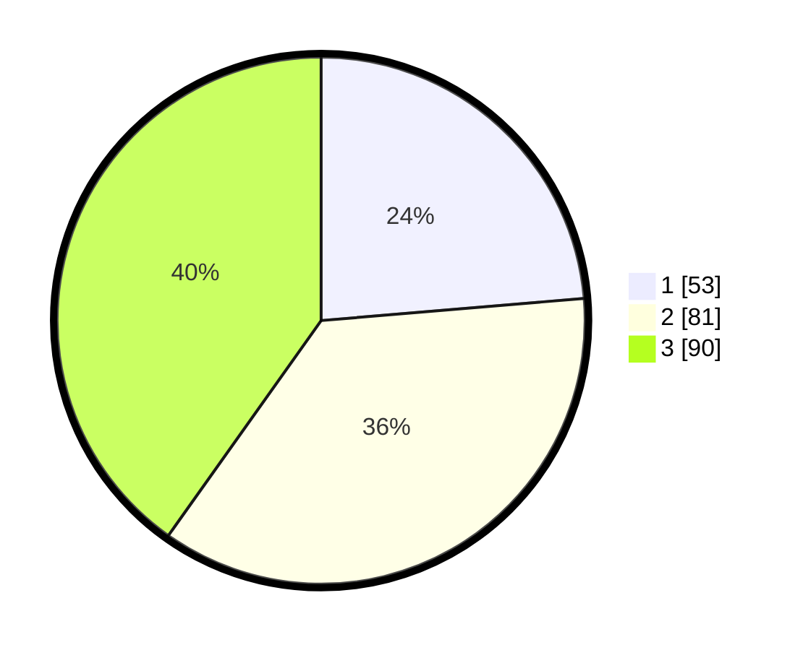

# Hasil

## Grafik

## Tabel

| No. | Nama Paslon    | Suara | Suara (raw) | Persentase |
|:--- |:-------------- | -----:| -----------:| ----------:|
| 1   | ANIES MUHAIMIN | 53    | [53][p-1]   | 23,66      |
| 2   | PRABOWO GIBRAN | 81    | [81][p-2]   | 36,16      |
| 3   | GANJAR MAHFUD  | 90    | [90][p-3]   | 40,18      |

[p-1]: https://github.com/gigit-pemilu/pemilu-2024/blob/main/pilpres/hitung-suara/sub/34-di-yogyakarta/sub/71-kota-yogyakarta/sub/04-danurejan/sub/1001-suryatmajan/sub/014-tps/sub/paslon-1.txt
[p-2]: https://github.com/gigit-pemilu/pemilu-2024/blob/main/pilpres/hitung-suara/sub/34-di-yogyakarta/sub/71-kota-yogyakarta/sub/04-danurejan/sub/1001-suryatmajan/sub/014-tps/sub/paslon-2.txt
[p-3]: https://github.com/gigit-pemilu/pemilu-2024/blob/main/pilpres/hitung-suara/sub/34-di-yogyakarta/sub/71-kota-yogyakarta/sub/04-danurejan/sub/1001-suryatmajan/sub/014-tps/sub/paslon-3.txt

## Foto C Plano

https://sirekap-obj-formc.kpu.go.id/d7db/pemilu/ppwp/34/71/04/10/01/3471041001014-20240215-053315--8acb29f9-3d0b-473f-a35f-69312f12a9cb.jpg

https://sirekap-obj-formc.kpu.go.id/d7db/pemilu/ppwp/34/71/04/10/01/3471041001014-20240215-024345--64eed4a2-8dcf-4178-9951-9398e058c63c.jpg

https://sirekap-obj-formc.kpu.go.id/d7db/pemilu/ppwp/34/71/04/10/01/3471041001014-20240215-053355--f8afe507-f08f-4bd9-9b9a-180170d08f3d.jpg

## Metadata

| Key        | Value               |
| ---------- | ------------------- |
| Time Stamp | 2024-02-15 20:30:46 |

