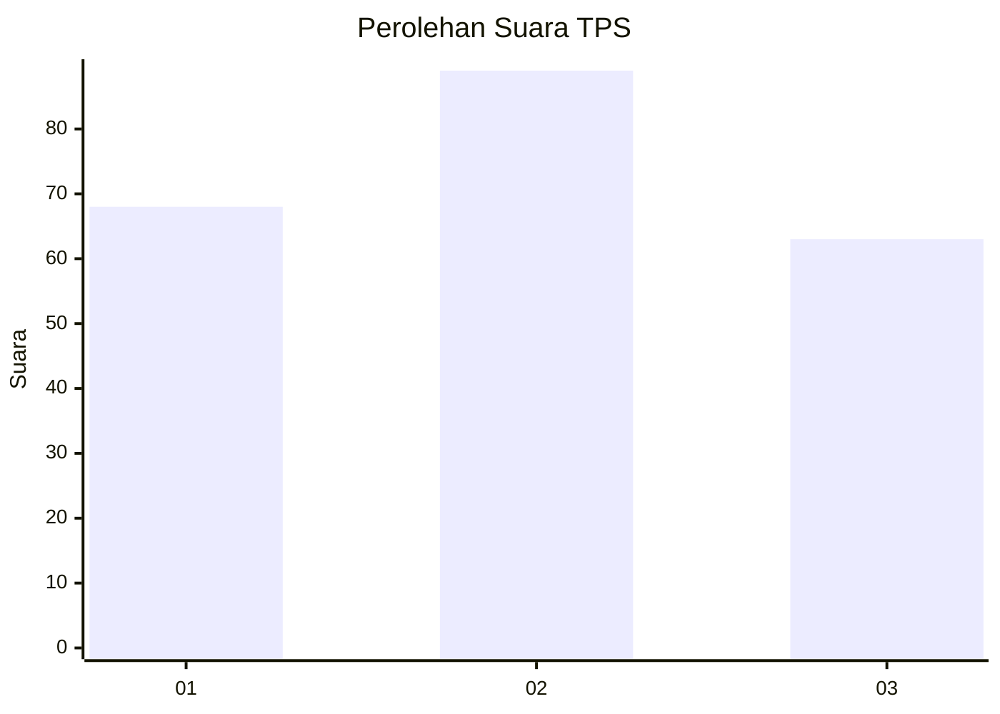
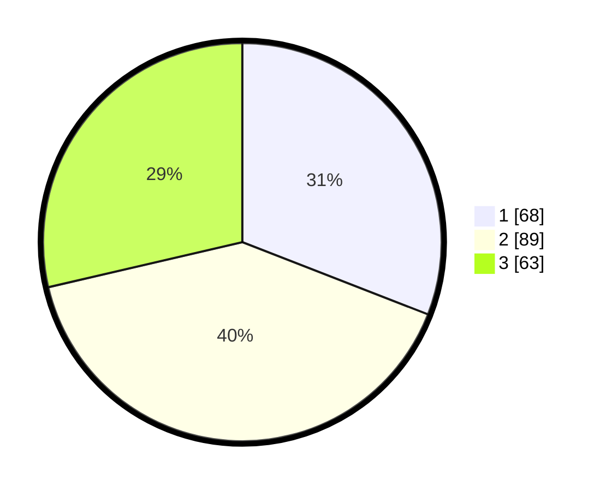

# Hasil

## Grafik

## Tabel

| No. | Nama Paslon    | Suara | Suara (raw) | Persentase |
|:--- |:-------------- | -----:| -----------:| ----------:|
| 1   | ANIES MUHAIMIN | 68    | [68][p-1]   | 30,91      |
| 2   | PRABOWO GIBRAN | 89    | [89][p-2]   | 40,45      |
| 3   | GANJAR MAHFUD  | 63    | [63][p-3]   | 28,64      |

[p-1]: https://github.com/gigit-pemilu/pemilu-2024-34-di-yogyakarta/blob/main/pilpres/hitung-suara/sub/34-di-yogyakarta/sub/71-kota-yogyakarta/sub/04-danurejan/sub/1002-tegalpanggung/sub/002-tps/sub/paslon-1.txt
[p-2]: https://github.com/gigit-pemilu/pemilu-2024-34-di-yogyakarta/blob/main/pilpres/hitung-suara/sub/34-di-yogyakarta/sub/71-kota-yogyakarta/sub/04-danurejan/sub/1002-tegalpanggung/sub/002-tps/sub/paslon-2.txt
[p-3]: https://github.com/gigit-pemilu/pemilu-2024-34-di-yogyakarta/blob/main/pilpres/hitung-suara/sub/34-di-yogyakarta/sub/71-kota-yogyakarta/sub/04-danurejan/sub/1002-tegalpanggung/sub/002-tps/sub/paslon-3.txt

## Foto C Plano

https://sirekap-obj-formc.kpu.go.id/a691/pemilu/ppwp/34/71/04/10/02/3471041002002-20240315-095752--af07046a-3369-4cbf-96fa-f83733c98c83.jpg

https://sirekap-obj-formc.kpu.go.id/a691/pemilu/ppwp/34/71/04/10/02/3471041002002-20240214-225945--5b22262b-240c-4e60-945e-e6053dcac770.jpg

https://sirekap-obj-formc.kpu.go.id/a691/pemilu/ppwp/34/71/04/10/02/3471041002002-20240214-230105--71b45d70-9141-4b60-8642-ed474d632cb5.jpg

## Metadata

| Key        | Value               |
| ---------- | ------------------- |
| Time Stamp | 2024-03-15 10:00:00 |

