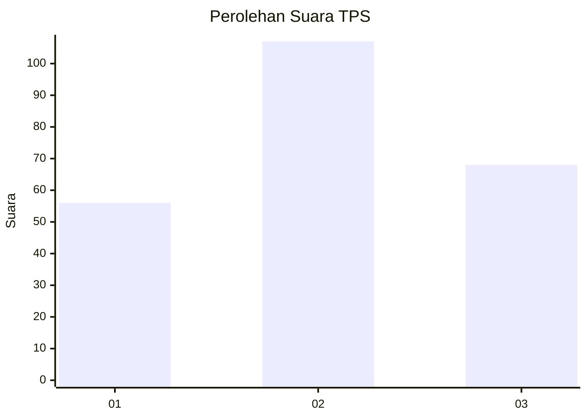
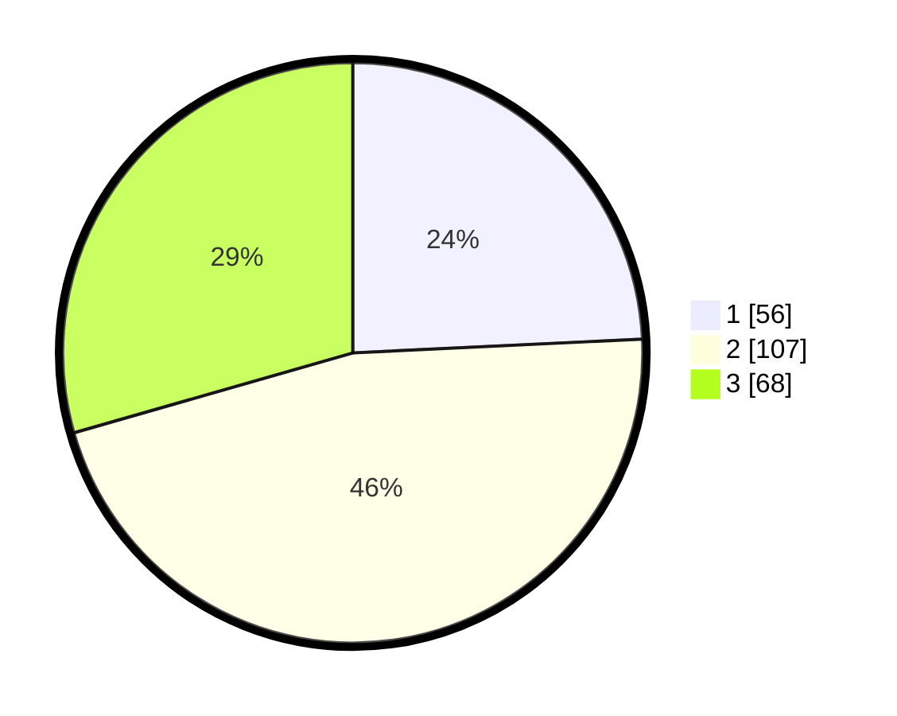

# Hasil

## Grafik

## Tabel

| No. | Nama Paslon    | Suara | Suara (raw) | Persentase |
|:--- |:-------------- | -----:| -----------:| ----------:|
| 1   | ANIES MUHAIMIN | 56    | [56][p-1]   | 24,24      |
| 2   | PRABOWO GIBRAN | 107   | [107][p-2]  | 46,32      |
| 3   | GANJAR MAHFUD  | 68    | [68][p-3]   | 29,44      |

[p-1]: https://github.com/gigit-pemilu/pemilu-2024-34-di-yogyakarta/blob/main/pilpres/hitung-suara/sub/34-di-yogyakarta/sub/71-kota-yogyakarta/sub/04-danurejan/sub/1002-tegalpanggung/sub/003-tps/sub/paslon-1.txt
[p-2]: https://github.com/gigit-pemilu/pemilu-2024-34-di-yogyakarta/blob/main/pilpres/hitung-suara/sub/34-di-yogyakarta/sub/71-kota-yogyakarta/sub/04-danurejan/sub/1002-tegalpanggung/sub/003-tps/sub/paslon-2.txt
[p-3]: https://github.com/gigit-pemilu/pemilu-2024-34-di-yogyakarta/blob/main/pilpres/hitung-suara/sub/34-di-yogyakarta/sub/71-kota-yogyakarta/sub/04-danurejan/sub/1002-tegalpanggung/sub/003-tps/sub/paslon-3.txt

## Foto C Plano

https://sirekap-obj-formc.kpu.go.id/3bcf/pemilu/ppwp/34/71/04/10/02/3471041002003-20240214-190534--fb14bf5d-fe77-4113-87d4-d826f3a7a311.jpg

https://sirekap-obj-formc.kpu.go.id/3bcf/pemilu/ppwp/34/71/04/10/02/3471041002003-20240214-190429--eabed82e-ab27-4028-9b69-edc3177e9d59.jpg

https://sirekap-obj-formc.kpu.go.id/3bcf/pemilu/ppwp/34/71/04/10/02/3471041002003-20240214-191823--deedab12-b70e-4217-b4d0-102f43ad8692.jpg

## Metadata

| Key        | Value               |
| ---------- | ------------------- |
| Time Stamp | 2024-02-24 22:31:28 |

