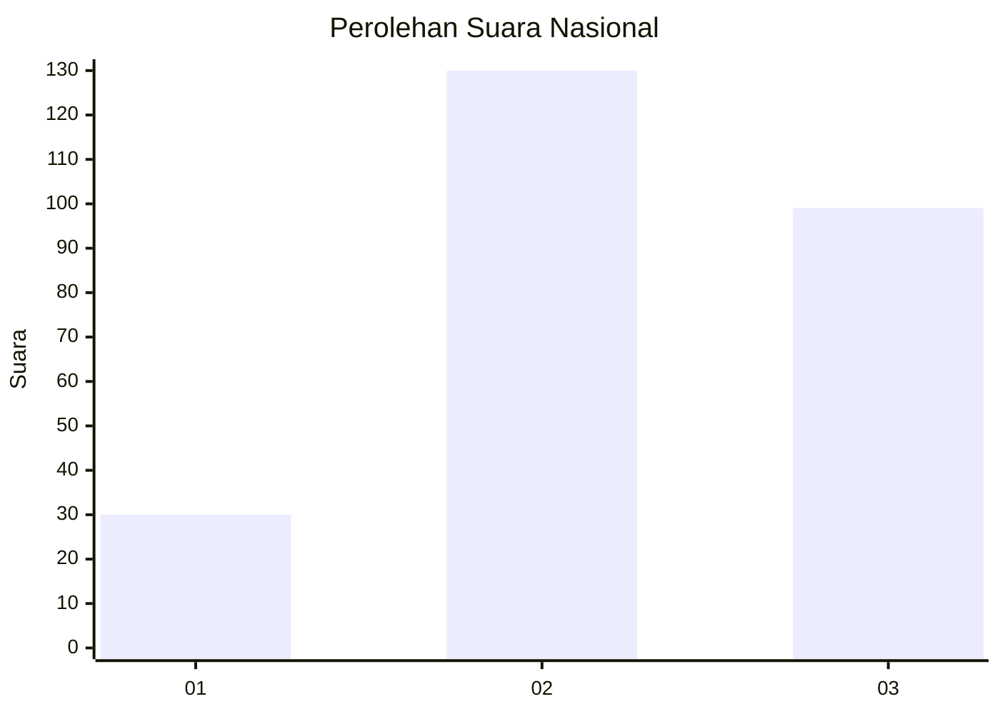
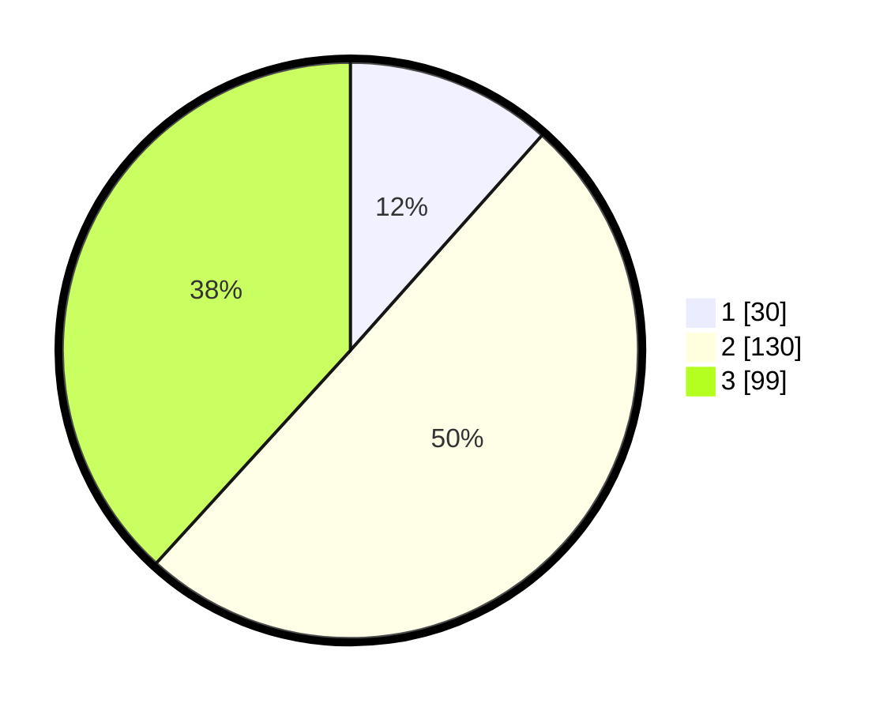

# Hasil

## Grafik

## Tabel

| No. | Nama Paslon    | Suara | Suara (raw) | Persentase |
|:--- |:-------------- | -----:| -----------:| ----------:|
| 1   | ANIES MUHAIMIN | 30    | [30][p-1]   | 11,58      |
| 2   | PRABOWO GIBRAN | 130   | [130][p-2]  | 50,19      |
| 3   | GANJAR MAHFUD  | 99    | [99][p-3]   | 38,22      |

[p-1]: https://github.com/gigit-pemilu/pemilu-2024/blob/main/pilpres/hitung-suara/sub/34-di-yogyakarta/sub/71-kota-yogyakarta/sub/04-danurejan/sub/1002-tegalpanggung/sub/005-tps/sub/paslon-1.txt
[p-2]: https://github.com/gigit-pemilu/pemilu-2024/blob/main/pilpres/hitung-suara/sub/34-di-yogyakarta/sub/71-kota-yogyakarta/sub/04-danurejan/sub/1002-tegalpanggung/sub/005-tps/sub/paslon-2.txt
[p-3]: https://github.com/gigit-pemilu/pemilu-2024/blob/main/pilpres/hitung-suara/sub/34-di-yogyakarta/sub/71-kota-yogyakarta/sub/04-danurejan/sub/1002-tegalpanggung/sub/005-tps/sub/paslon-3.txt

## Foto C Plano

https://sirekap-obj-formc.kpu.go.id/734c/pemilu/ppwp/34/71/04/10/02/3471041002005-20240216-203319--9ddbbbd7-b943-4a5f-985a-c551534b2ffc.jpg

https://sirekap-obj-formc.kpu.go.id/734c/pemilu/ppwp/34/71/04/10/02/3471041002005-20240216-203341--ce0b86de-db8e-4cc5-a3a9-27c88bd8936f.jpg

https://sirekap-obj-formc.kpu.go.id/734c/pemilu/ppwp/34/71/04/10/02/3471041002005-20240216-202619--88882082-707f-4445-887d-e3d58e612d3e.jpg

## Metadata

| Key        | Value               |
| ---------- | ------------------- |
| Time Stamp | 2024-02-24 22:31:28 |

