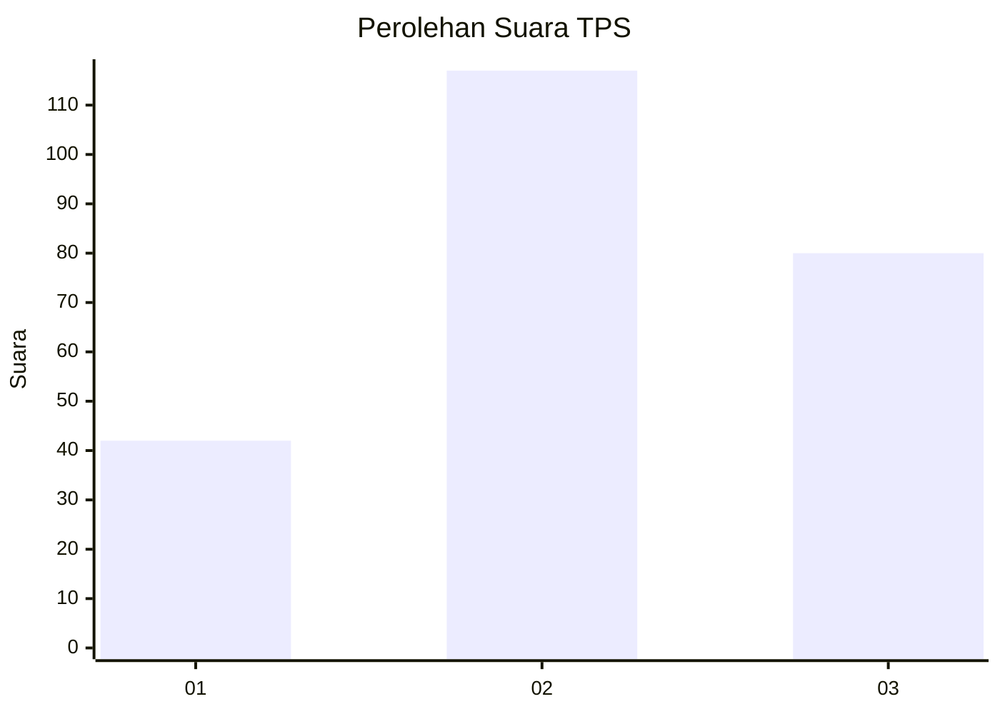
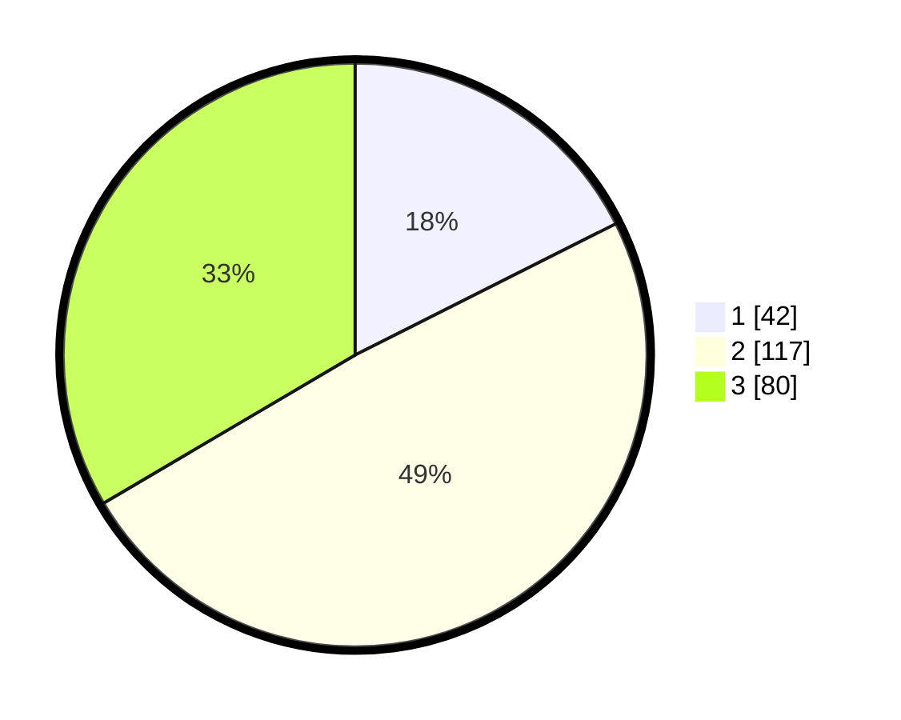

# Hasil

## Grafik

## Tabel

| No. | Nama Paslon    | Suara | Suara (raw) | Persentase |
|:--- |:-------------- | -----:| -----------:| ----------:|
| 1   | ANIES MUHAIMIN | 42    | [42][p-1]   | 17,57      |
| 2   | PRABOWO GIBRAN | 117   | [117][p-2]  | 48,95      |
| 3   | GANJAR MAHFUD  | 80    | [80][p-3]   | 33,47      |

[p-1]: https://github.com/gigit-pemilu/pemilu-2024-34-di-yogyakarta/blob/main/pilpres/hitung-suara/sub/34-di-yogyakarta/sub/71-kota-yogyakarta/sub/04-danurejan/sub/1002-tegalpanggung/sub/013-tps/sub/paslon-1.txt
[p-2]: https://github.com/gigit-pemilu/pemilu-2024-34-di-yogyakarta/blob/main/pilpres/hitung-suara/sub/34-di-yogyakarta/sub/71-kota-yogyakarta/sub/04-danurejan/sub/1002-tegalpanggung/sub/013-tps/sub/paslon-2.txt
[p-3]: https://github.com/gigit-pemilu/pemilu-2024-34-di-yogyakarta/blob/main/pilpres/hitung-suara/sub/34-di-yogyakarta/sub/71-kota-yogyakarta/sub/04-danurejan/sub/1002-tegalpanggung/sub/013-tps/sub/paslon-3.txt

## Foto C Plano

https://sirekap-obj-formc.kpu.go.id/cdd7/pemilu/ppwp/34/71/04/10/02/3471041002013-20240214-192516--40da136f-2cb0-487a-b408-d0c761dc387e.jpg

https://sirekap-obj-formc.kpu.go.id/cdd7/pemilu/ppwp/34/71/04/10/02/3471041002013-20240215-005415--c29d46c2-a9a1-45af-a950-02a49fe581b2.jpg

https://sirekap-obj-formc.kpu.go.id/cdd7/pemilu/ppwp/34/71/04/10/02/3471041002013-20240215-005639--54def038-79b5-4da8-91db-9316101bd7a7.jpg

## Metadata

| Key        | Value               |
| ---------- | ------------------- |
| Time Stamp | 2024-02-24 22:31:28 |

