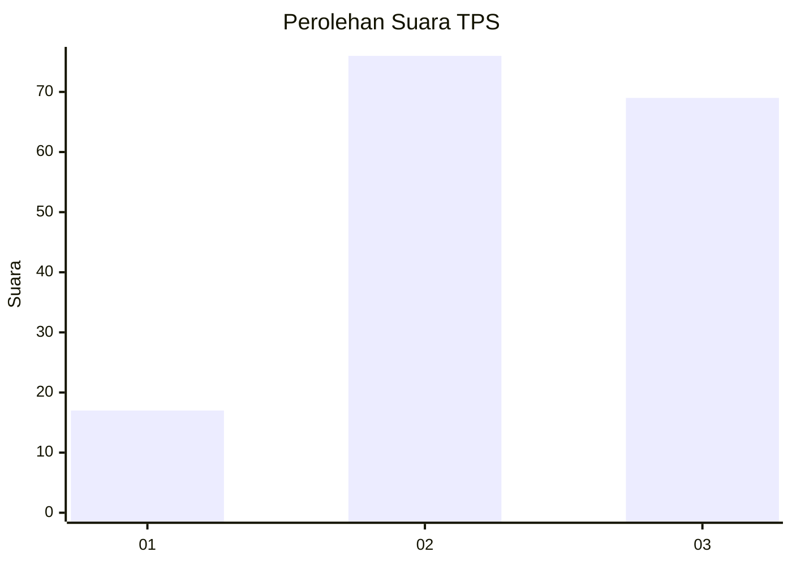
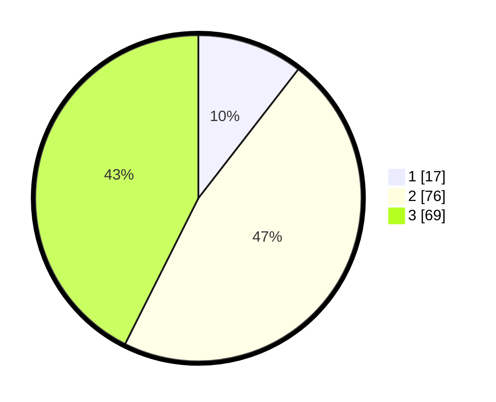

# Hasil

## Grafik

## Tabel

| No. | Nama Paslon    | Suara | Suara (raw) | Persentase |
|:--- |:-------------- | -----:| -----------:| ----------:|
| 1   | ANIES MUHAIMIN | 17    | [17][p-1]   | 10,49      |
| 2   | PRABOWO GIBRAN | 76    | [76][p-2]   | 46,91      |
| 3   | GANJAR MAHFUD  | 69    | [69][p-3]   | 42,59      |

[p-1]: https://github.com/gigit-pemilu/pemilu-2024-34-di-yogyakarta/blob/main/pilpres/hitung-suara/sub/34-di-yogyakarta/sub/71-kota-yogyakarta/sub/04-danurejan/sub/1002-tegalpanggung/sub/020-tps/sub/paslon-1.txt
[p-2]: https://github.com/gigit-pemilu/pemilu-2024-34-di-yogyakarta/blob/main/pilpres/hitung-suara/sub/34-di-yogyakarta/sub/71-kota-yogyakarta/sub/04-danurejan/sub/1002-tegalpanggung/sub/020-tps/sub/paslon-2.txt
[p-3]: https://github.com/gigit-pemilu/pemilu-2024-34-di-yogyakarta/blob/main/pilpres/hitung-suara/sub/34-di-yogyakarta/sub/71-kota-yogyakarta/sub/04-danurejan/sub/1002-tegalpanggung/sub/020-tps/sub/paslon-3.txt

## Foto C Plano

https://sirekap-obj-formc.kpu.go.id/74f3/pemilu/ppwp/34/71/04/10/02/3471041002020-20240215-030010--83519372-5e4e-4553-964e-c007d76b2139.jpg

https://sirekap-obj-formc.kpu.go.id/74f3/pemilu/ppwp/34/71/04/10/02/3471041002020-20240215-030047--341e3520-0e4a-44db-af31-6d91ed2745cd.jpg

https://sirekap-obj-formc.kpu.go.id/74f3/pemilu/ppwp/34/71/04/10/02/3471041002020-20240215-030124--411ea6a7-fceb-476e-8179-9d6ef53b3f3b.jpg

## Metadata

| Key        | Value               |
| ---------- | ------------------- |
| Time Stamp | 2024-02-24 22:31:28 |

