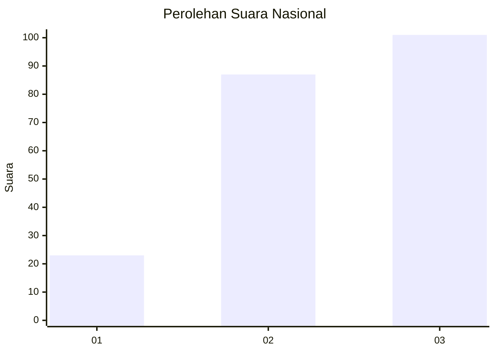
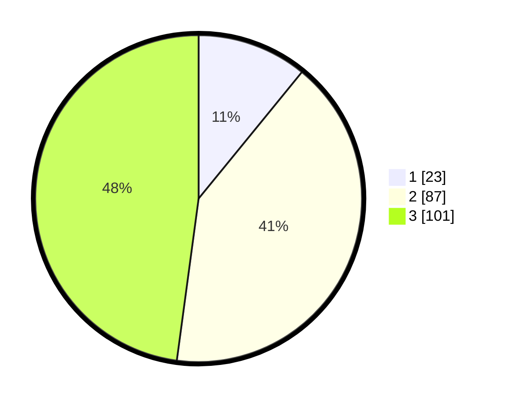

# Hasil

## Grafik

## Tabel

| No. | Nama Paslon    | Suara | Suara (raw) | Persentase |
|:--- |:-------------- | -----:| -----------:| ----------:|
| 1   | ANIES MUHAIMIN | 23    | [23][p-1]   | 10,90      |
| 2   | PRABOWO GIBRAN | 87    | [87][p-2]   | 41,23      |
| 3   | GANJAR MAHFUD  | 101   | [101][p-3]  | 47,87      |

[p-1]: https://github.com/gigit-pemilu/pemilu-2024/blob/main/pilpres/hitung-suara/sub/34-di-yogyakarta/sub/71-kota-yogyakarta/sub/04-danurejan/sub/1002-tegalpanggung/sub/022-tps/sub/paslon-1.txt
[p-2]: https://github.com/gigit-pemilu/pemilu-2024/blob/main/pilpres/hitung-suara/sub/34-di-yogyakarta/sub/71-kota-yogyakarta/sub/04-danurejan/sub/1002-tegalpanggung/sub/022-tps/sub/paslon-2.txt
[p-3]: https://github.com/gigit-pemilu/pemilu-2024/blob/main/pilpres/hitung-suara/sub/34-di-yogyakarta/sub/71-kota-yogyakarta/sub/04-danurejan/sub/1002-tegalpanggung/sub/022-tps/sub/paslon-3.txt

## Foto C Plano

https://sirekap-obj-formc.kpu.go.id/0ec3/pemilu/ppwp/34/71/04/10/02/3471041002022-20240214-213443--1f25ab4e-674e-4f57-938b-1a48f2ef744b.jpg

https://sirekap-obj-formc.kpu.go.id/0ec3/pemilu/ppwp/34/71/04/10/02/3471041002022-20240214-195654--af7d1c80-e9c9-40e3-ba81-9ab1c65a5046.jpg

https://sirekap-obj-formc.kpu.go.id/0ec3/pemilu/ppwp/34/71/04/10/02/3471041002022-20240214-195713--fcf1ca3d-2d5b-48e1-b8f9-c1fa4ba8487d.jpg

## Metadata

| Key        | Value               |
| ---------- | ------------------- |
| Time Stamp | 2024-02-15 12:00:28 |

