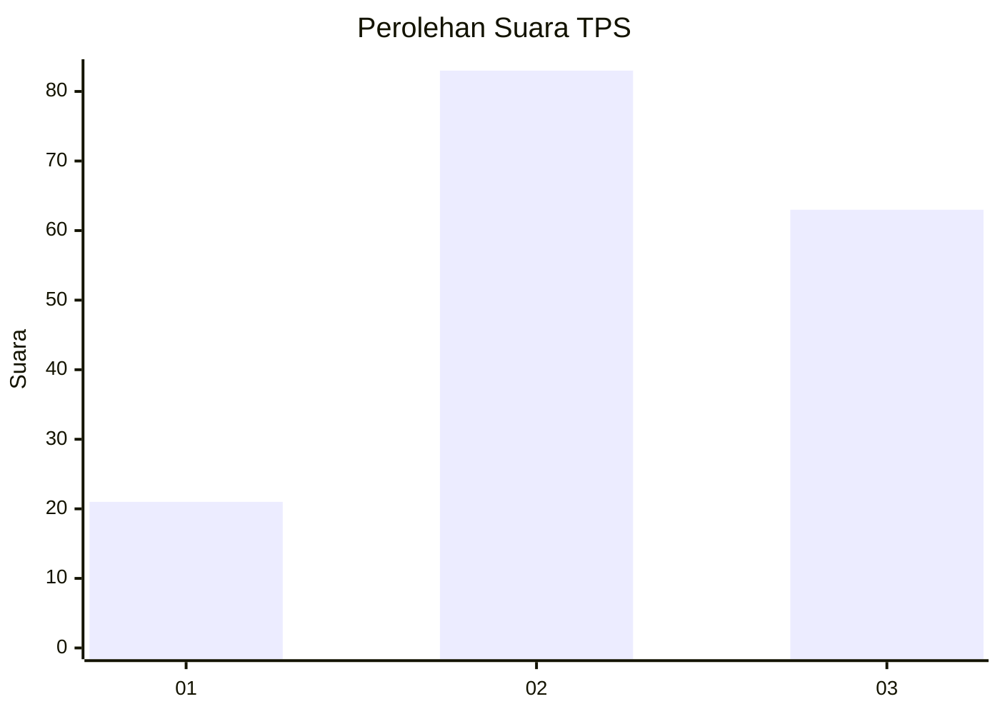
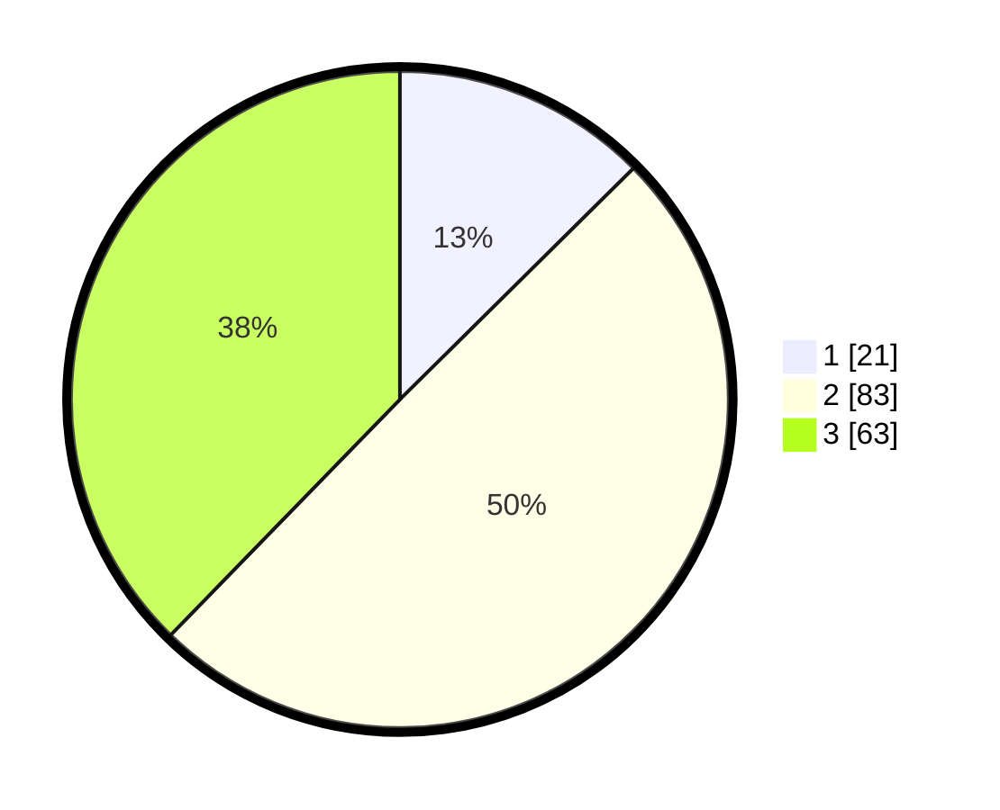

# Hasil

## Grafik

## Tabel

| No. | Nama Paslon    | Suara | Suara (raw) | Persentase |
|:--- |:-------------- | -----:| -----------:| ----------:|
| 1   | ANIES MUHAIMIN | 21    | [21][p-1]   | 12,57      |
| 2   | PRABOWO GIBRAN | 83    | [83][p-2]   | 49,70      |
| 3   | GANJAR MAHFUD  | 63    | [63][p-3]   | 37,72      |

[p-1]: https://github.com/gigit-pemilu/pemilu-2024-34-di-yogyakarta/blob/main/pilpres/hitung-suara/sub/34-di-yogyakarta/sub/71-kota-yogyakarta/sub/04-danurejan/sub/1002-tegalpanggung/sub/024-tps/sub/paslon-1.txt
[p-2]: https://github.com/gigit-pemilu/pemilu-2024-34-di-yogyakarta/blob/main/pilpres/hitung-suara/sub/34-di-yogyakarta/sub/71-kota-yogyakarta/sub/04-danurejan/sub/1002-tegalpanggung/sub/024-tps/sub/paslon-2.txt
[p-3]: https://github.com/gigit-pemilu/pemilu-2024-34-di-yogyakarta/blob/main/pilpres/hitung-suara/sub/34-di-yogyakarta/sub/71-kota-yogyakarta/sub/04-danurejan/sub/1002-tegalpanggung/sub/024-tps/sub/paslon-3.txt

## Foto C Plano

https://sirekap-obj-formc.kpu.go.id/965d/pemilu/ppwp/34/71/04/10/02/3471041002024-20240216-230257--17c679ab-9379-44f2-8908-5f5d459bed68.jpg

https://sirekap-obj-formc.kpu.go.id/965d/pemilu/ppwp/34/71/04/10/02/3471041002024-20240214-160141--0e059eff-0fd5-4848-a56f-5d6e9fceadff.jpg

https://sirekap-obj-formc.kpu.go.id/965d/pemilu/ppwp/34/71/04/10/02/3471041002024-20240216-225521--040ecaf8-ecb5-4b90-9523-6f78d5e29770.jpg

## Metadata

| Key        | Value               |
| ---------- | ------------------- |
| Time Stamp | 2024-02-16 23:30:00 |

