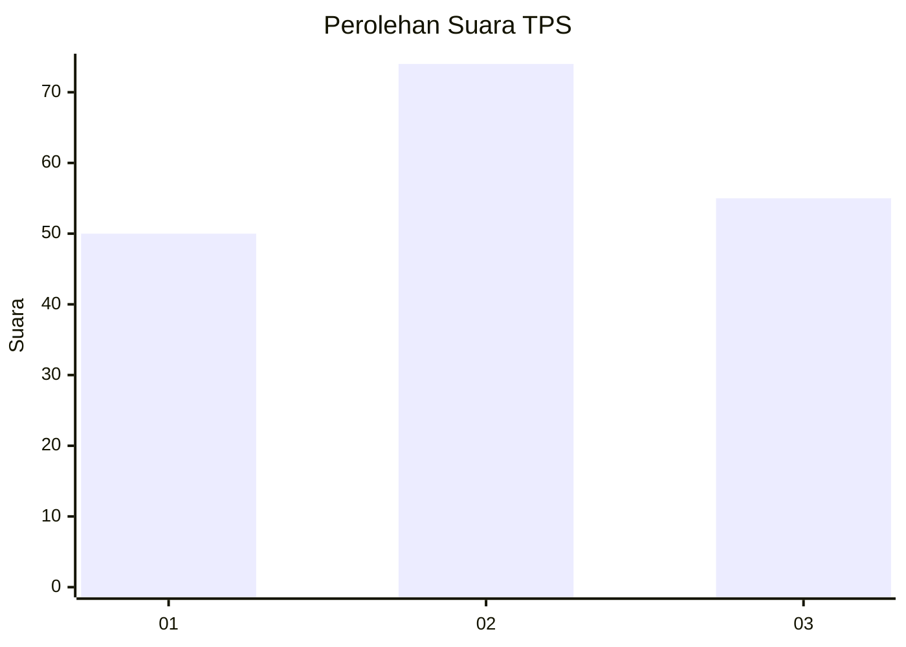
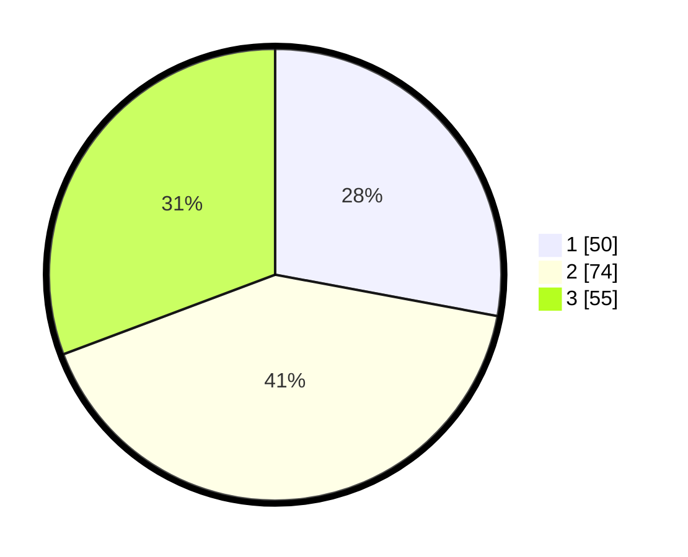

# Hasil

## Grafik

## Tabel

| No. | Nama Paslon    | Suara | Suara (raw) | Persentase |
|:--- |:-------------- | -----:| -----------:| ----------:|
| 1   | ANIES MUHAIMIN | 50    | [50][p-1]   | 27,93      |
| 2   | PRABOWO GIBRAN | 74    | [74][p-2]   | 41,34      |
| 3   | GANJAR MAHFUD  | 55    | [55][p-3]   | 30,73      |

[p-1]: https://github.com/gigit-pemilu/pemilu-2024-34-di-yogyakarta/blob/main/pilpres/hitung-suara/sub/34-di-yogyakarta/sub/71-kota-yogyakarta/sub/04-danurejan/sub/1003-bausasran/sub/003-tps/sub/paslon-1.txt
[p-2]: https://github.com/gigit-pemilu/pemilu-2024-34-di-yogyakarta/blob/main/pilpres/hitung-suara/sub/34-di-yogyakarta/sub/71-kota-yogyakarta/sub/04-danurejan/sub/1003-bausasran/sub/003-tps/sub/paslon-2.txt
[p-3]: https://github.com/gigit-pemilu/pemilu-2024-34-di-yogyakarta/blob/main/pilpres/hitung-suara/sub/34-di-yogyakarta/sub/71-kota-yogyakarta/sub/04-danurejan/sub/1003-bausasran/sub/003-tps/sub/paslon-3.txt

## Foto C Plano

https://sirekap-obj-formc.kpu.go.id/7670/pemilu/ppwp/34/71/04/10/03/3471041003003-20240214-202258--e53fe945-d837-42f4-a66a-2c8d1edb2db9.jpg

https://sirekap-obj-formc.kpu.go.id/7670/pemilu/ppwp/34/71/04/10/03/3471041003003-20240214-202234--cc0a8a86-f1b8-480b-8c50-8f7669c37495.jpg

https://sirekap-obj-formc.kpu.go.id/7670/pemilu/ppwp/34/71/04/10/03/3471041003003-20240214-190937--8a39446d-2502-4092-bd3a-2fb8c8bf234c.jpg

## Metadata

| Key        | Value               |
| ---------- | ------------------- |
| Time Stamp | 2024-02-14 21:46:01 |

## DATA PEMILIH TETAP

Jumlah pemilih dalam DPT: **221**.
 * L: **98**.
 * P: **123**.

## DATA PENGGUNA HAK PILIH

Jumlah pengguna hak pilih dalam DPT: **161**.
 * L: **67**.
 * P: **94**.

Jumlah pengguna hak pilih dalam DPTb: **17**.
 * L: **7**.
 * P: **10**.

Jumlah pengguna hak pilih dalam DPK: **2**.
 * L: **0**.
 * P: **2**.

Jumlah pengguna hak pilih: **180**.
 * L: **74**.
 * P: **106**.

## JUMLAH SUARA SAH DAN TIDAK SAH

JUMLAH SELURUH SUARA SAH: **179**.

JUMLAH SUARA TIDAK SAH: **1**.

JUMLAH SELURUH SUARA SAH DAN SUARA TIDAK SAH: **180**.

