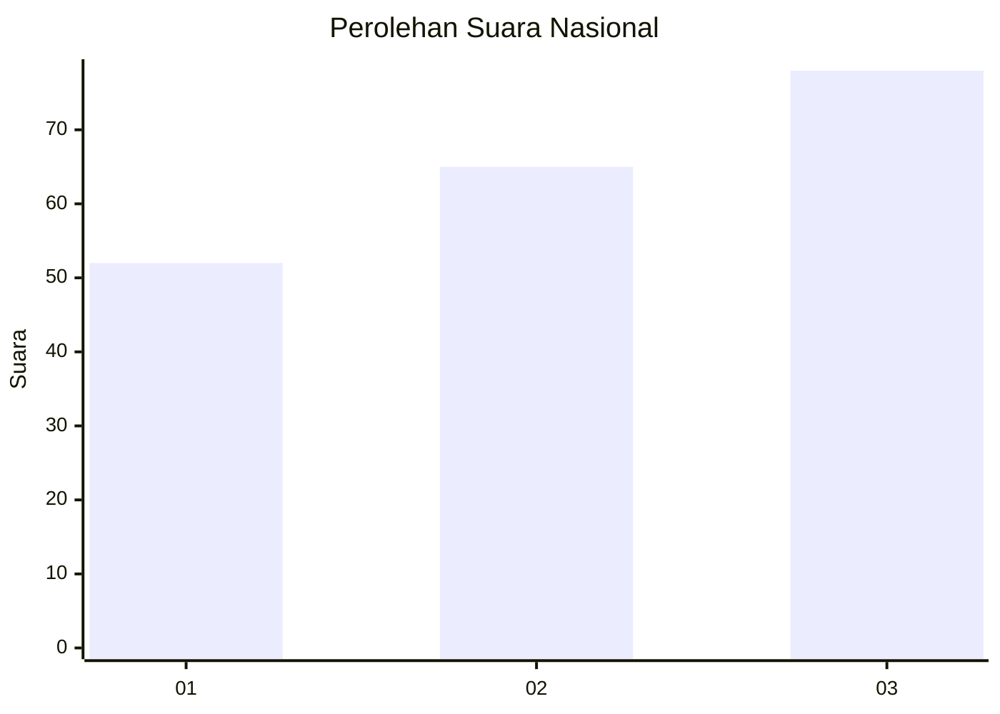
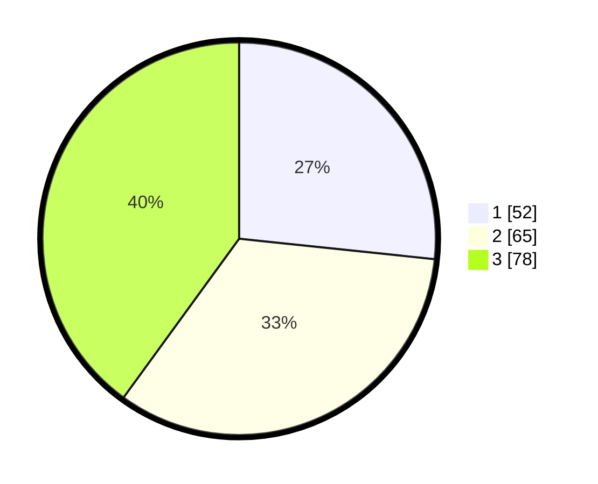

# Hasil

## Grafik

## Tabel

| No. | Nama Paslon    | Suara | Suara (raw) | Persentase |
|:--- |:-------------- | -----:| -----------:| ----------:|
| 1   | ANIES MUHAIMIN | 52    | [52][p-1]   | 26,67      |
| 2   | PRABOWO GIBRAN | 65    | [65][p-2]   | 33,33      |
| 3   | GANJAR MAHFUD  | 78    | [78][p-3]   | 40,00      |

[p-1]: https://github.com/gigit-pemilu/pemilu-2024/blob/main/pilpres/hitung-suara/sub/34-di-yogyakarta/sub/71-kota-yogyakarta/sub/04-danurejan/sub/1003-bausasran/sub/004-tps/sub/paslon-1.txt
[p-2]: https://github.com/gigit-pemilu/pemilu-2024/blob/main/pilpres/hitung-suara/sub/34-di-yogyakarta/sub/71-kota-yogyakarta/sub/04-danurejan/sub/1003-bausasran/sub/004-tps/sub/paslon-2.txt
[p-3]: https://github.com/gigit-pemilu/pemilu-2024/blob/main/pilpres/hitung-suara/sub/34-di-yogyakarta/sub/71-kota-yogyakarta/sub/04-danurejan/sub/1003-bausasran/sub/004-tps/sub/paslon-3.txt

## Foto C Plano

https://sirekap-obj-formc.kpu.go.id/47e7/pemilu/ppwp/34/71/04/10/03/3471041003004-20240215-021221--93a04402-aaf5-405a-ae30-cb854f949cf2.jpg

https://sirekap-obj-formc.kpu.go.id/47e7/pemilu/ppwp/34/71/04/10/03/3471041003004-20240215-021407--f26a5d4a-2797-449d-b526-1a9216b135f5.jpg

https://sirekap-obj-formc.kpu.go.id/47e7/pemilu/ppwp/34/71/04/10/03/3471041003004-20240215-021557--fea09d26-41b6-4853-9ba1-d40a0ff46c90.jpg

## Metadata

| Key        | Value               |
| ---------- | ------------------- |
| Time Stamp | 2024-02-15 15:00:29 |

