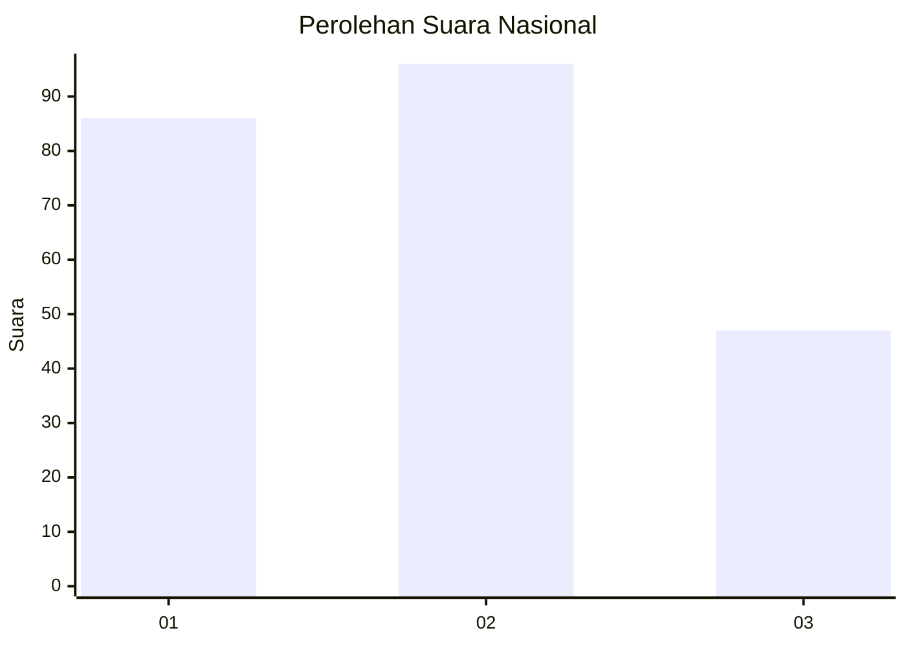
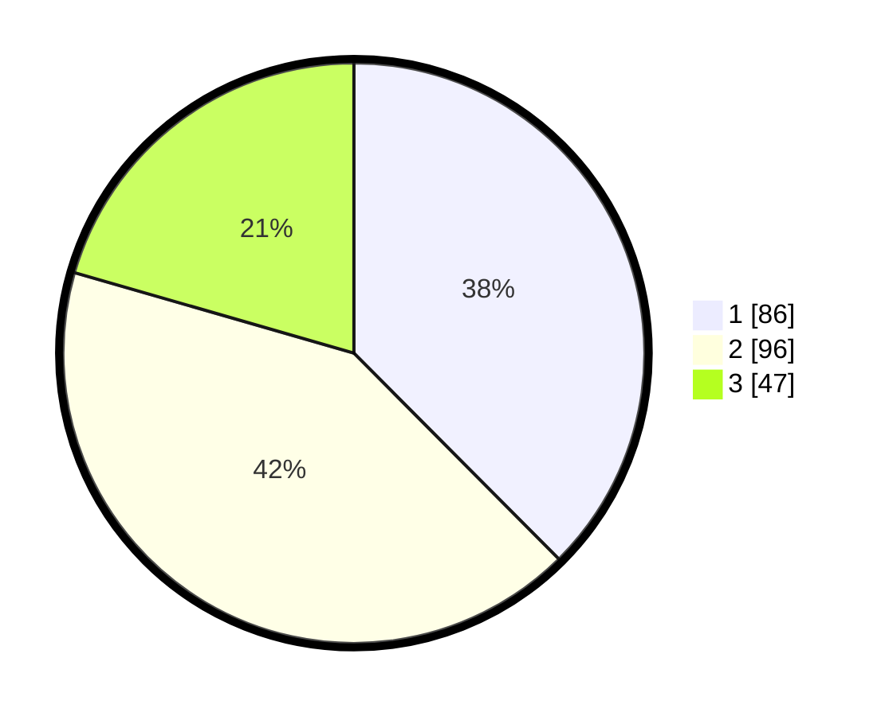

# Hasil

## Grafik

## Tabel

| No. | Nama Paslon    | Suara | Suara (raw) | Persentase |
|:--- |:-------------- | -----:| -----------:| ----------:|
| 1   | ANIES MUHAIMIN | 86    | [86][p-1]   | 37,55      |
| 2   | PRABOWO GIBRAN | 96    | [96][p-2]   | 41,92      |
| 3   | GANJAR MAHFUD  | 47    | [47][p-3]   | 20,52      |

[p-1]: https://github.com/gigit-pemilu/pemilu-2024/blob/main/pilpres/hitung-suara/sub/34-di-yogyakarta/sub/71-kota-yogyakarta/sub/04-danurejan/sub/1003-bausasran/sub/011-tps/sub/paslon-1.txt
[p-2]: https://github.com/gigit-pemilu/pemilu-2024/blob/main/pilpres/hitung-suara/sub/34-di-yogyakarta/sub/71-kota-yogyakarta/sub/04-danurejan/sub/1003-bausasran/sub/011-tps/sub/paslon-2.txt
[p-3]: https://github.com/gigit-pemilu/pemilu-2024/blob/main/pilpres/hitung-suara/sub/34-di-yogyakarta/sub/71-kota-yogyakarta/sub/04-danurejan/sub/1003-bausasran/sub/011-tps/sub/paslon-3.txt

## Foto C Plano

https://sirekap-obj-formc.kpu.go.id/d076/pemilu/ppwp/34/71/04/10/03/3471041003011-20240214-185712--8a0a92cf-2394-430b-9364-74cf90fd6f57.jpg

https://sirekap-obj-formc.kpu.go.id/d076/pemilu/ppwp/34/71/04/10/03/3471041003011-20240214-200100--0c7c6dfe-6d36-475d-820e-e51ef0a03334.jpg

https://sirekap-obj-formc.kpu.go.id/d076/pemilu/ppwp/34/71/04/10/03/3471041003011-20240214-191703--8221e5ca-c30f-4d84-9bb1-02a31423dab8.jpg

## Metadata

| Key        | Value               |
| ---------- | ------------------- |
| Time Stamp | 2024-02-15 12:00:28 |

## DATA PEMILIH TETAP

Jumlah pemilih dalam DPT: **281**.
 * L: **138**.
 * P: **143**.

## DATA PENGGUNA HAK PILIH

Jumlah pengguna hak pilih dalam DPT: **210**.
 * L: **97**.
 * P: **113**.

Jumlah pengguna hak pilih dalam DPTb: **20**.
 * L: **11**.
 * P: **9**.

Jumlah pengguna hak pilih dalam DPK: **5**.
 * L: **3**.
 * P: **2**.

Jumlah pengguna hak pilih: **235**.
 * L: **111**.
 * P: **124**.

## JUMLAH SUARA SAH DAN TIDAK SAH

JUMLAH SELURUH SUARA SAH: **229**.

JUMLAH SUARA TIDAK SAH: **6**.

JUMLAH SELURUH SUARA SAH DAN SUARA TIDAK SAH: **235**.

