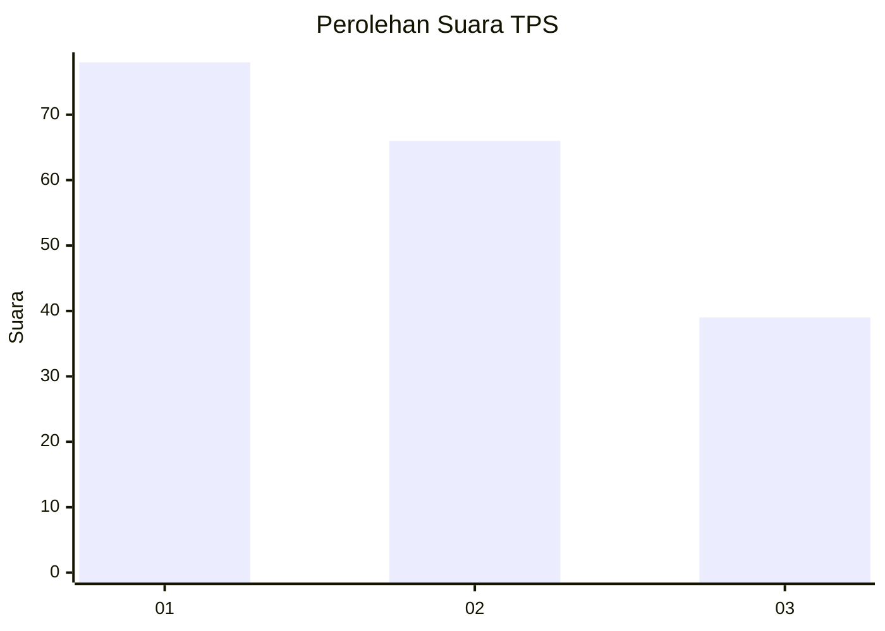
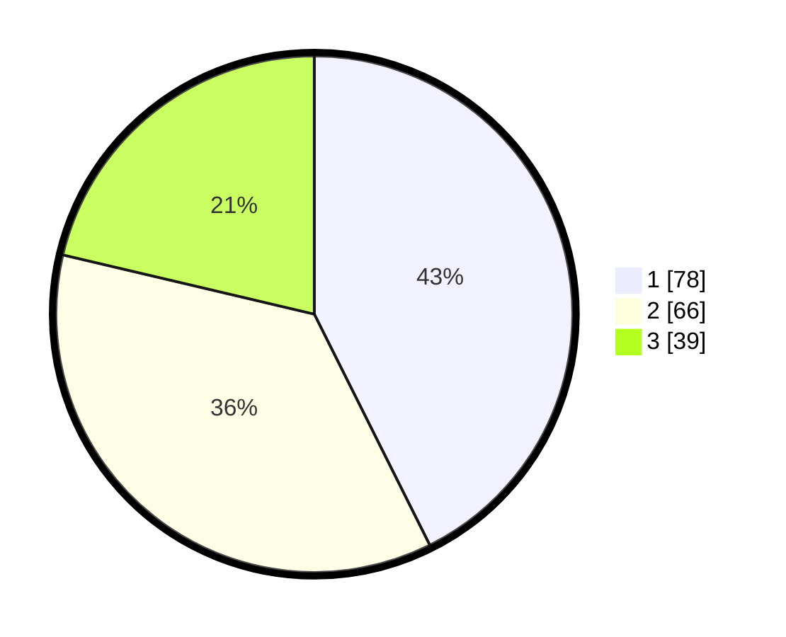

# Hasil

## Grafik

## Tabel

| No. | Nama Paslon    | Suara | Suara (raw) | Persentase |
|:--- |:-------------- | -----:| -----------:| ----------:|
| 1   | ANIES MUHAIMIN | 78    | [78][p-1]   | 42,62      |
| 2   | PRABOWO GIBRAN | 66    | [66][p-2]   | 36,07      |
| 3   | GANJAR MAHFUD  | 39    | [39][p-3]   | 21,31      |

[p-1]: https://github.com/gigit-pemilu/pemilu-2024-34-di-yogyakarta/blob/main/pilpres/hitung-suara/sub/34-di-yogyakarta/sub/71-kota-yogyakarta/sub/04-danurejan/sub/1003-bausasran/sub/012-tps/sub/paslon-1.txt
[p-2]: https://github.com/gigit-pemilu/pemilu-2024-34-di-yogyakarta/blob/main/pilpres/hitung-suara/sub/34-di-yogyakarta/sub/71-kota-yogyakarta/sub/04-danurejan/sub/1003-bausasran/sub/012-tps/sub/paslon-2.txt
[p-3]: https://github.com/gigit-pemilu/pemilu-2024-34-di-yogyakarta/blob/main/pilpres/hitung-suara/sub/34-di-yogyakarta/sub/71-kota-yogyakarta/sub/04-danurejan/sub/1003-bausasran/sub/012-tps/sub/paslon-3.txt

## Foto C Plano

https://sirekap-obj-formc.kpu.go.id/bf3c/pemilu/ppwp/34/71/04/10/03/3471041003012-20240214-221532--408cdf8b-f2f8-47e3-b81f-7662869382c2.jpg

https://sirekap-obj-formc.kpu.go.id/bf3c/pemilu/ppwp/34/71/04/10/03/3471041003012-20240214-221631--2bf8e603-4b5c-4094-9f71-16e01ae1815e.jpg

https://sirekap-obj-formc.kpu.go.id/bf3c/pemilu/ppwp/34/71/04/10/03/3471041003012-20240214-221657--f24f1adf-1d62-4be9-bc55-942513415873.jpg

## Metadata

| Key        | Value               |
| ---------- | ------------------- |
| Time Stamp | 2024-02-25 16:00:00 |

