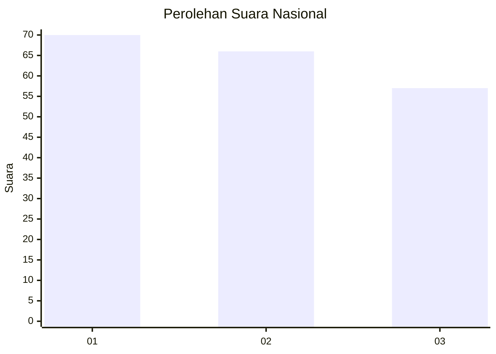
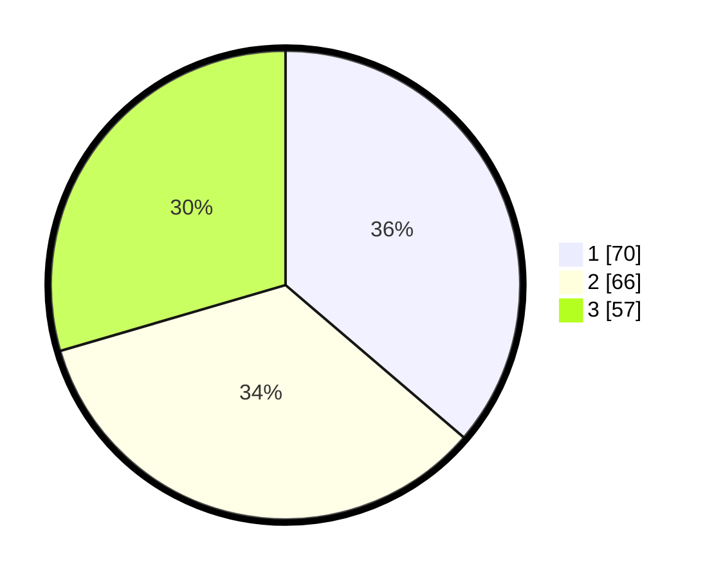

# Hasil

## Grafik

## Tabel

| No. | Nama Paslon    | Suara | Suara (raw) | Persentase |
|:--- |:-------------- | -----:| -----------:| ----------:|
| 1   | ANIES MUHAIMIN | 70    | [70][p-1]   | 36,27      |
| 2   | PRABOWO GIBRAN | 66    | [66][p-2]   | 34,20      |
| 3   | GANJAR MAHFUD  | 57    | [57][p-3]   | 29,53      |

[p-1]: https://github.com/gigit-pemilu/pemilu-2024/blob/main/pilpres/hitung-suara/sub/34-di-yogyakarta/sub/71-kota-yogyakarta/sub/04-danurejan/sub/1003-bausasran/sub/013-tps/sub/paslon-1.txt
[p-2]: https://github.com/gigit-pemilu/pemilu-2024/blob/main/pilpres/hitung-suara/sub/34-di-yogyakarta/sub/71-kota-yogyakarta/sub/04-danurejan/sub/1003-bausasran/sub/013-tps/sub/paslon-2.txt
[p-3]: https://github.com/gigit-pemilu/pemilu-2024/blob/main/pilpres/hitung-suara/sub/34-di-yogyakarta/sub/71-kota-yogyakarta/sub/04-danurejan/sub/1003-bausasran/sub/013-tps/sub/paslon-3.txt

## Foto C Plano

https://sirekap-obj-formc.kpu.go.id/a5c8/pemilu/ppwp/34/71/04/10/03/3471041003013-20240214-235437--24f4ce3f-4bd5-4eae-a995-d8f6754912a6.jpg

https://sirekap-obj-formc.kpu.go.id/a5c8/pemilu/ppwp/34/71/04/10/03/3471041003013-20240214-235625--10e45d69-d9de-47b5-b117-2a81548775f1.jpg

https://sirekap-obj-formc.kpu.go.id/a5c8/pemilu/ppwp/34/71/04/10/03/3471041003013-20240215-180511--4c4cf7e3-6c2e-49ec-867c-5836d71ad4a6.jpg

## Metadata

| Key        | Value               |
| ---------- | ------------------- |
| Time Stamp | 2024-02-16 12:51:22 |

## DATA PEMILIH TETAP

Jumlah pemilih dalam DPT: **229**.
 * L: **107**.
 * P: **122**.

## DATA PENGGUNA HAK PILIH

Jumlah pengguna hak pilih dalam DPT: **182**.
 * L: **81**.
 * P: **101**.

Jumlah pengguna hak pilih dalam DPTb: **15**.
 * L: **7**.
 * P: **8**.

Jumlah pengguna hak pilih dalam DPK: **2**.
 * L: **1**.
 * P: **1**.

Jumlah pengguna hak pilih: **199**.
 * L: **89**.
 * P: **110**.

## JUMLAH SUARA SAH DAN TIDAK SAH

JUMLAH SELURUH SUARA SAH: **193**.

JUMLAH SUARA TIDAK SAH: **6**.

JUMLAH SELURUH SUARA SAH DAN SUARA TIDAK SAH: **199**.

