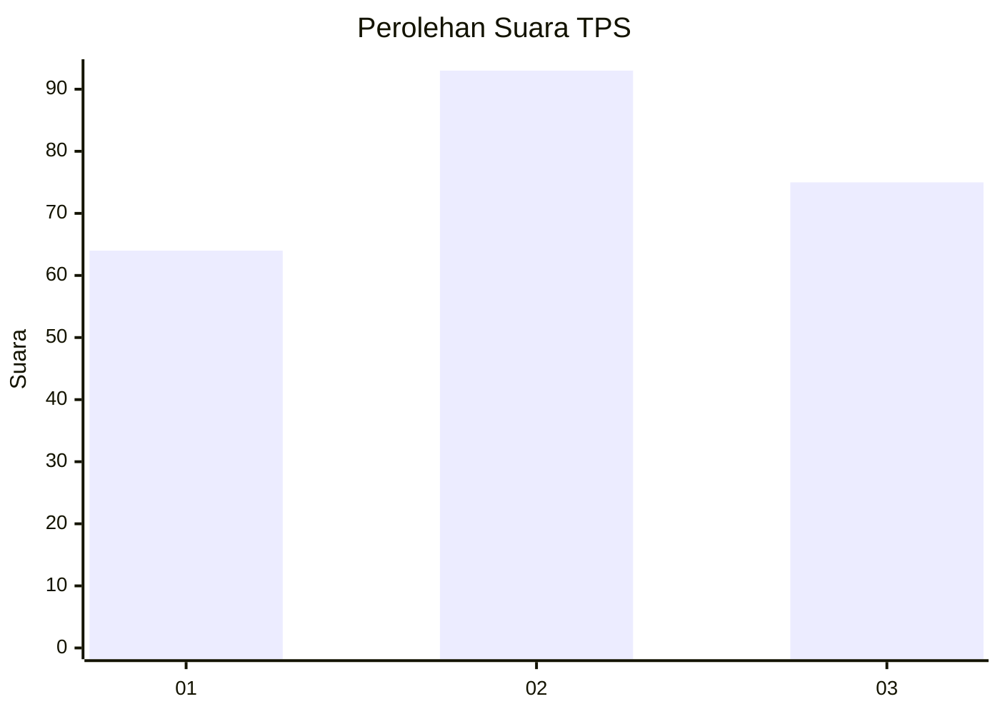
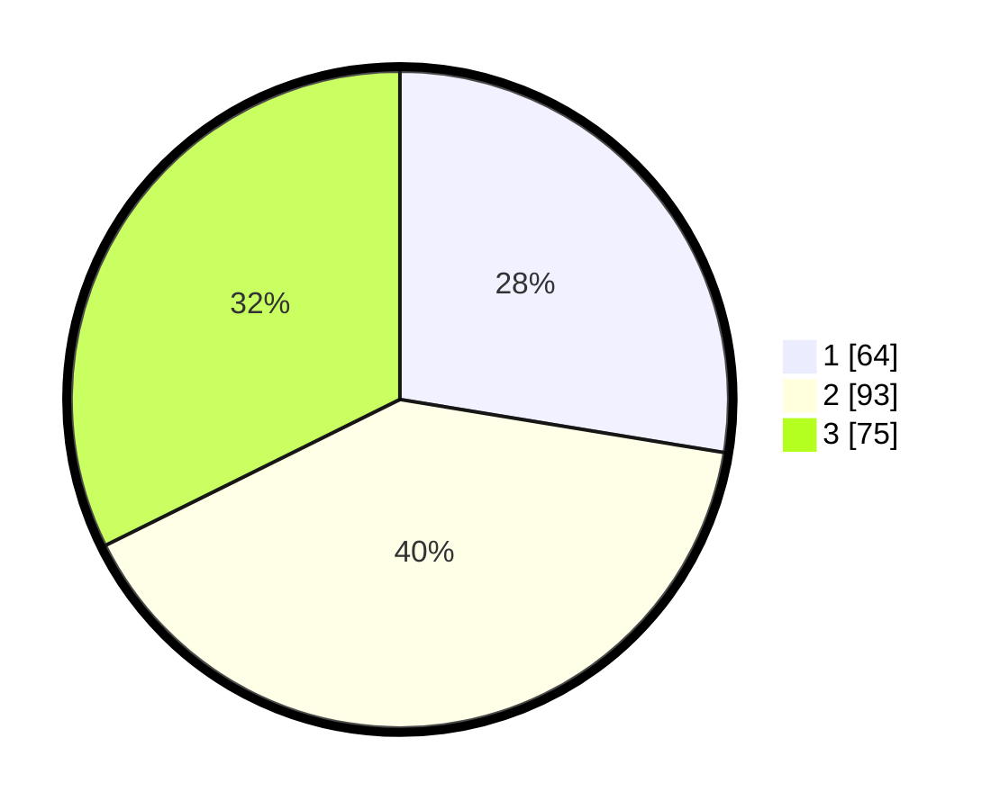

# Hasil

## Grafik

## Tabel

| No. | Nama Paslon    | Suara | Suara (raw) | Persentase |
|:--- |:-------------- | -----:| -----------:| ----------:|
| 1   | ANIES MUHAIMIN | 64    | [64][p-1]   | 27,59      |
| 2   | PRABOWO GIBRAN | 93    | [93][p-2]   | 40,09      |
| 3   | GANJAR MAHFUD  | 75    | [75][p-3]   | 32,33      |

[p-1]: https://github.com/gigit-pemilu/pemilu-2024-34-di-yogyakarta/blob/main/pilpres/hitung-suara/sub/34-di-yogyakarta/sub/71-kota-yogyakarta/sub/04-danurejan/sub/1003-bausasran/sub/016-tps/sub/paslon-1.txt
[p-2]: https://github.com/gigit-pemilu/pemilu-2024-34-di-yogyakarta/blob/main/pilpres/hitung-suara/sub/34-di-yogyakarta/sub/71-kota-yogyakarta/sub/04-danurejan/sub/1003-bausasran/sub/016-tps/sub/paslon-2.txt
[p-3]: https://github.com/gigit-pemilu/pemilu-2024-34-di-yogyakarta/blob/main/pilpres/hitung-suara/sub/34-di-yogyakarta/sub/71-kota-yogyakarta/sub/04-danurejan/sub/1003-bausasran/sub/016-tps/sub/paslon-3.txt

## Foto C Plano

https://sirekap-obj-formc.kpu.go.id/6215/pemilu/ppwp/34/71/04/10/03/3471041003016-20240214-194328--7f0ad4f0-832f-42fd-b3d2-e210e302c7e6.jpg

https://sirekap-obj-formc.kpu.go.id/6215/pemilu/ppwp/34/71/04/10/03/3471041003016-20240214-194449--b028f44e-c31b-4b33-a999-2b2a9d36517d.jpg

https://sirekap-obj-formc.kpu.go.id/6215/pemilu/ppwp/34/71/04/10/03/3471041003016-20240214-191740--f51ddb5f-6a42-4f84-b584-fd0f798f6025.jpg

## Metadata

| Key        | Value               |
| ---------- | ------------------- |
| Time Stamp | 2024-02-15 12:00:28 |

## DATA PEMILIH TETAP

Jumlah pemilih dalam DPT: **272**.
 * L: **129**.
 * P: **143**.

## DATA PENGGUNA HAK PILIH

Jumlah pengguna hak pilih dalam DPT: **220**.
 * L: **101**.
 * P: **119**.

Jumlah pengguna hak pilih dalam DPTb: **14**.
 * L: **4**.
 * P: **10**.

Jumlah pengguna hak pilih dalam DPK: **3**.
 * L: **1**.
 * P: **2**.

Jumlah pengguna hak pilih: **237**.
 * L: **106**.
 * P: **131**.

## JUMLAH SUARA SAH DAN TIDAK SAH

JUMLAH SELURUH SUARA SAH: **232**.

JUMLAH SUARA TIDAK SAH: **5**.

JUMLAH SELURUH SUARA SAH DAN SUARA TIDAK SAH: **237**.

