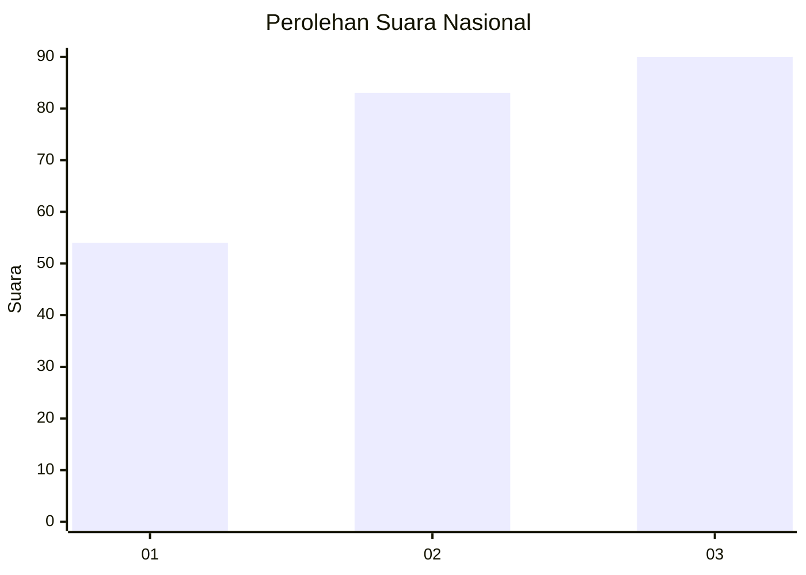
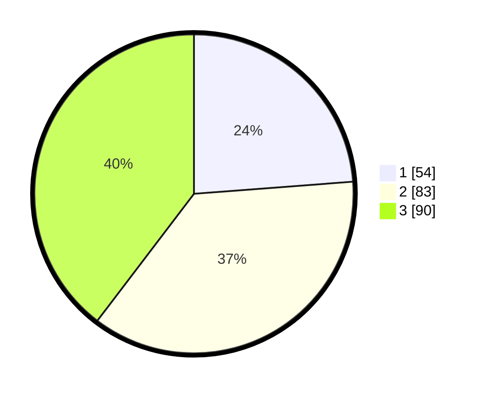

# Hasil

## Grafik

## Tabel

| No. | Nama Paslon    | Suara | Suara (raw) | Persentase |
|:--- |:-------------- | -----:| -----------:| ----------:|
| 1   | ANIES MUHAIMIN | 54    | [54][p-1]   | 23,79      |
| 2   | PRABOWO GIBRAN | 83    | [83][p-2]   | 36,56      |
| 3   | GANJAR MAHFUD  | 90    | [90][p-3]   | 39,65      |

[p-1]: https://github.com/gigit-pemilu/pemilu-2024/blob/main/pilpres/hitung-suara/sub/34-di-yogyakarta/sub/71-kota-yogyakarta/sub/04-danurejan/sub/1003-bausasran/sub/019-tps/sub/paslon-1.txt
[p-2]: https://github.com/gigit-pemilu/pemilu-2024/blob/main/pilpres/hitung-suara/sub/34-di-yogyakarta/sub/71-kota-yogyakarta/sub/04-danurejan/sub/1003-bausasran/sub/019-tps/sub/paslon-2.txt
[p-3]: https://github.com/gigit-pemilu/pemilu-2024/blob/main/pilpres/hitung-suara/sub/34-di-yogyakarta/sub/71-kota-yogyakarta/sub/04-danurejan/sub/1003-bausasran/sub/019-tps/sub/paslon-3.txt

## Foto C Plano

https://sirekap-obj-formc.kpu.go.id/d173/pemilu/ppwp/34/71/04/10/03/3471041003019-20240216-204918--8298f7dd-05eb-4c22-8ffa-30b1830ac7c7.jpg

https://sirekap-obj-formc.kpu.go.id/d173/pemilu/ppwp/34/71/04/10/03/3471041003019-20240214-230149--20e5ec6c-fb2a-45f1-afa4-acc9fe549e22.jpg

https://sirekap-obj-formc.kpu.go.id/d173/pemilu/ppwp/34/71/04/10/03/3471041003019-20240214-232645--e6e13df2-6690-4c79-8f8b-9428ffedfad9.jpg

## Metadata

| Key        | Value               |
| ---------- | ------------------- |
| Time Stamp | 2024-02-25 12:00:00 |

