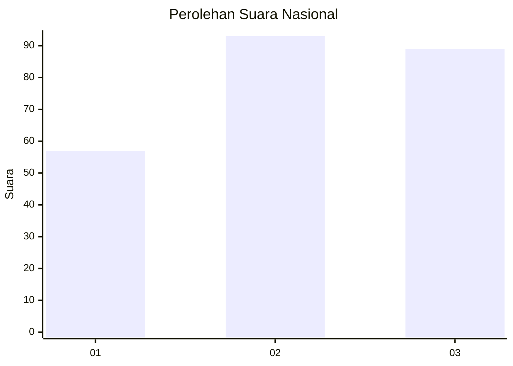
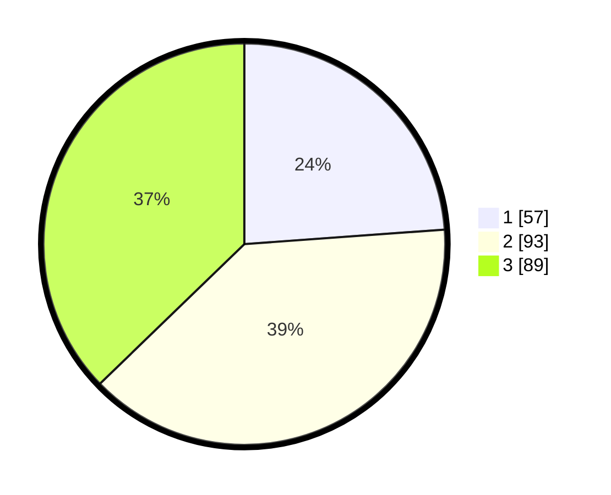

# Hasil

## Grafik

## Tabel

| No. | Nama Paslon    | Suara | Suara (raw) | Persentase |
|:--- |:-------------- | -----:| -----------:| ----------:|
| 1   | ANIES MUHAIMIN | 57    | [57][p-1]   | 23,85      |
| 2   | PRABOWO GIBRAN | 93    | [93][p-2]   | 38,91      |
| 3   | GANJAR MAHFUD  | 89    | [89][p-3]   | 37,24      |

[p-1]: https://github.com/gigit-pemilu/pemilu-2024/blob/main/pilpres/hitung-suara/sub/34-di-yogyakarta/sub/71-kota-yogyakarta/sub/04-danurejan/sub/1003-bausasran/sub/021-tps/sub/paslon-1.txt
[p-2]: https://github.com/gigit-pemilu/pemilu-2024/blob/main/pilpres/hitung-suara/sub/34-di-yogyakarta/sub/71-kota-yogyakarta/sub/04-danurejan/sub/1003-bausasran/sub/021-tps/sub/paslon-2.txt
[p-3]: https://github.com/gigit-pemilu/pemilu-2024/blob/main/pilpres/hitung-suara/sub/34-di-yogyakarta/sub/71-kota-yogyakarta/sub/04-danurejan/sub/1003-bausasran/sub/021-tps/sub/paslon-3.txt

## Foto C Plano

https://sirekap-obj-formc.kpu.go.id/71f5/pemilu/ppwp/34/71/04/10/03/3471041003021-20240214-235903--03ed7b1e-106a-48d8-959d-a93e3263bec4.jpg

https://sirekap-obj-formc.kpu.go.id/71f5/pemilu/ppwp/34/71/04/10/03/3471041003021-20240214-195445--adf08e45-b84d-489b-9009-904325ddf63f.jpg

https://sirekap-obj-formc.kpu.go.id/71f5/pemilu/ppwp/34/71/04/10/03/3471041003021-20240214-201138--f45bd3ae-28c6-4254-ac2d-0c9b7562a724.jpg

## Metadata

| Key        | Value               |
| ---------- | ------------------- |
| Time Stamp | 2024-02-15 12:00:28 |

