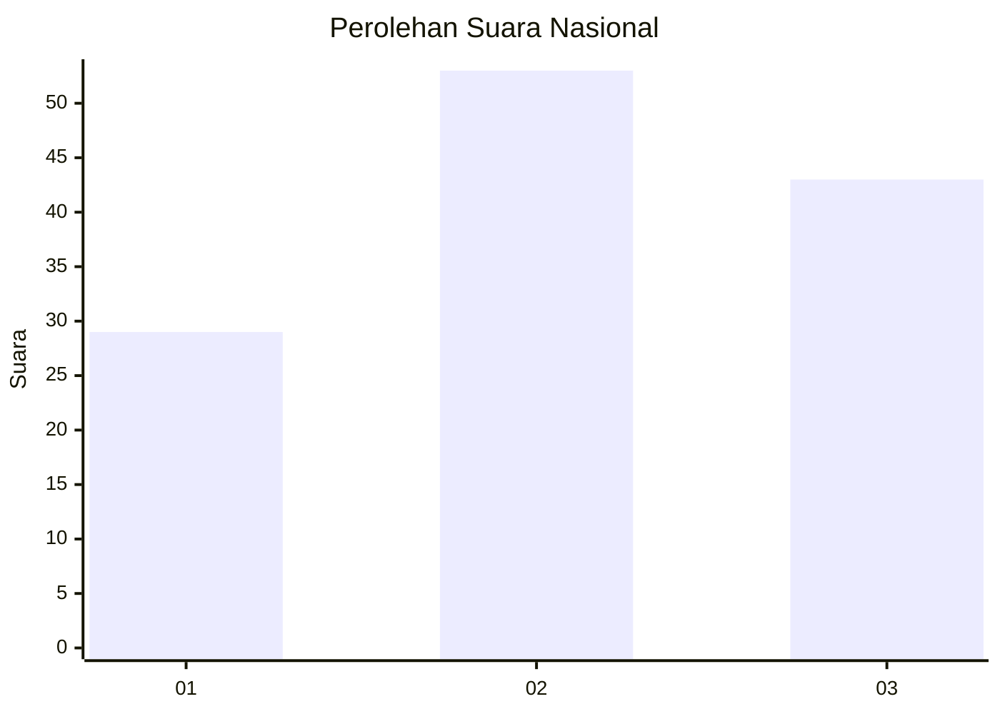
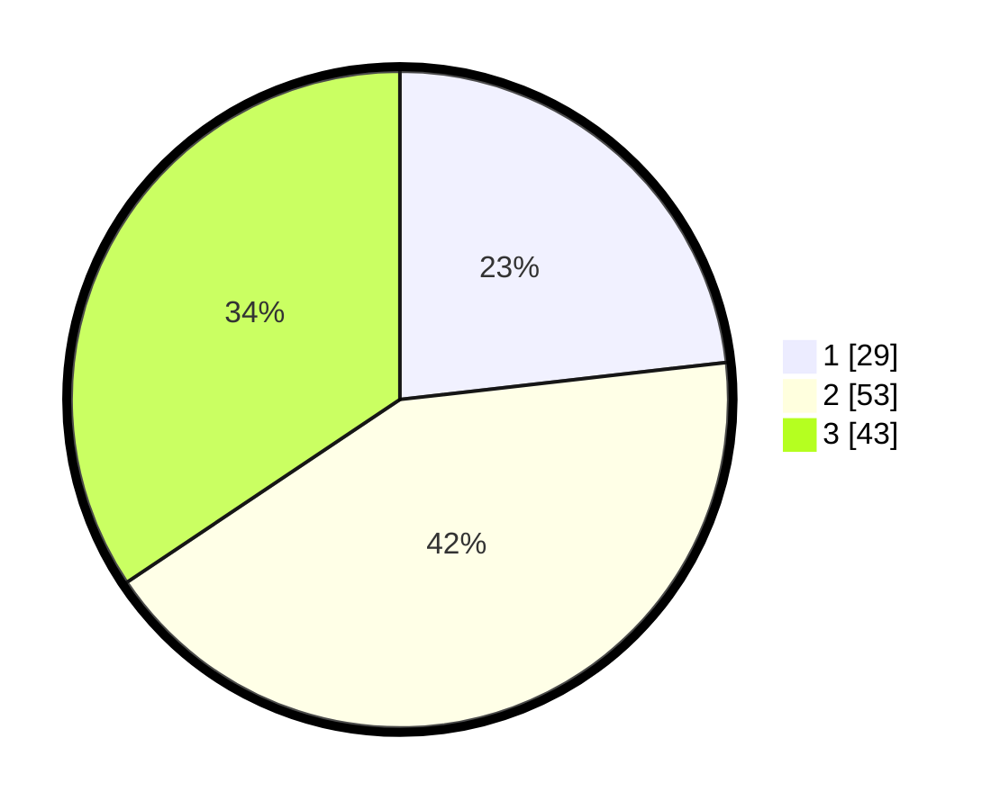

# Hasil

## Grafik

## Tabel

| No. | Nama Paslon    | Suara | Suara (raw) | Persentase |
|:--- |:-------------- | -----:| -----------:| ----------:|
| 1   | ANIES MUHAIMIN | 29    | [29][p-1]   | 23,20      |
| 2   | PRABOWO GIBRAN | 53    | [53][p-2]   | 42,40      |
| 3   | GANJAR MAHFUD  | 43    | [43][p-3]   | 34,40      |

[p-1]: https://github.com/gigit-pemilu/pemilu-2024/blob/main/pilpres/hitung-suara/sub/34-di-yogyakarta/sub/71-kota-yogyakarta/sub/04-danurejan/sub/1003-bausasran/sub/023-tps/sub/paslon-1.txt
[p-2]: https://github.com/gigit-pemilu/pemilu-2024/blob/main/pilpres/hitung-suara/sub/34-di-yogyakarta/sub/71-kota-yogyakarta/sub/04-danurejan/sub/1003-bausasran/sub/023-tps/sub/paslon-2.txt
[p-3]: https://github.com/gigit-pemilu/pemilu-2024/blob/main/pilpres/hitung-suara/sub/34-di-yogyakarta/sub/71-kota-yogyakarta/sub/04-danurejan/sub/1003-bausasran/sub/023-tps/sub/paslon-3.txt

## Foto C Plano

https://sirekap-obj-formc.kpu.go.id/500e/pemilu/ppwp/34/71/04/10/03/3471041003023-20240216-114429--4af1cefb-7a68-4f65-b52e-d4d73e2da275.jpg

https://sirekap-obj-formc.kpu.go.id/500e/pemilu/ppwp/34/71/04/10/03/3471041003023-20240216-114448--7b0142c9-989f-4e7d-8a9e-39e518989096.jpg

https://sirekap-obj-formc.kpu.go.id/500e/pemilu/ppwp/34/71/04/10/03/3471041003023-20240216-114521--15ac1555-7bc0-4dbc-810a-fdf549b66da6.jpg

## Metadata

| Key        | Value               |
| ---------- | ------------------- |
| Time Stamp | 2024-02-24 22:31:28 |

