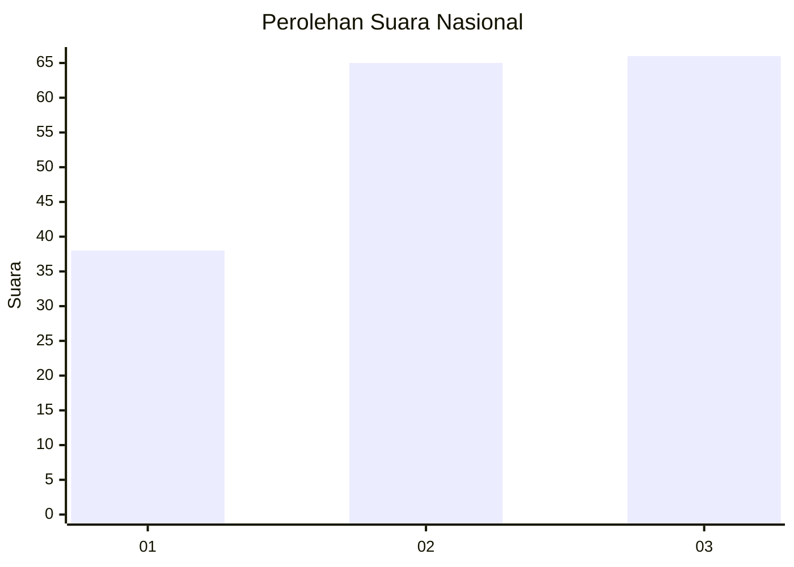
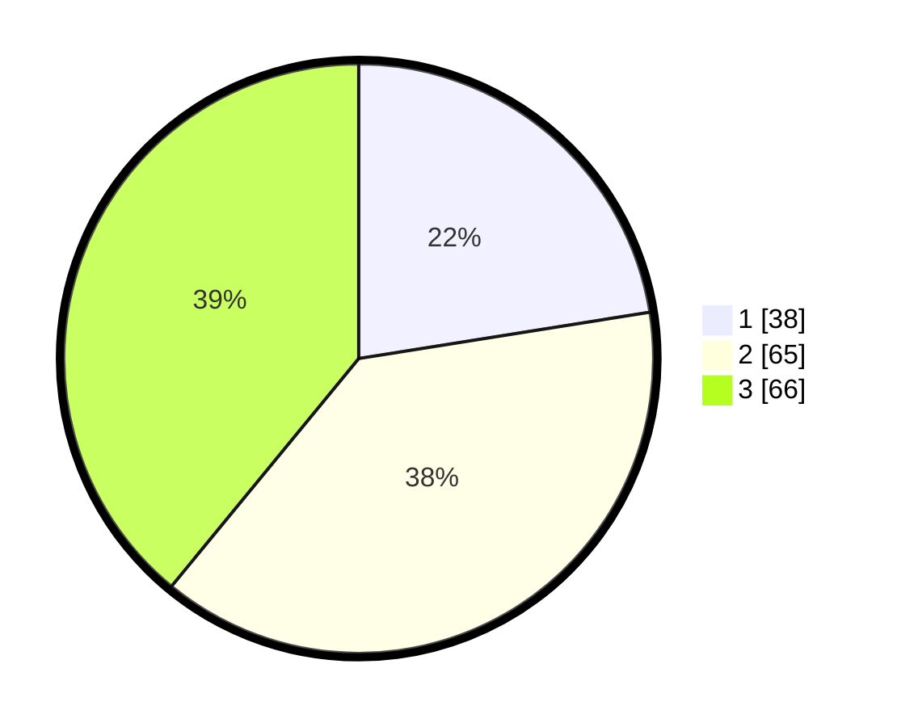

# Hasil

## Grafik

## Tabel

| No. | Nama Paslon    | Suara | Suara (raw) | Persentase |
|:--- |:-------------- | -----:| -----------:| ----------:|
| 1   | ANIES MUHAIMIN | 38    | [38][p-1]   | 22,49      |
| 2   | PRABOWO GIBRAN | 65    | [65][p-2]   | 38,46      |
| 3   | GANJAR MAHFUD  | 66    | [66][p-3]   | 39,05      |

[p-1]: https://github.com/gigit-pemilu/pemilu-2024/blob/main/pilpres/hitung-suara/sub/34-di-yogyakarta/sub/71-kota-yogyakarta/sub/05-gedongtengen/sub/1001-sosromenduran/sub/001-tps/sub/paslon-1.txt
[p-2]: https://github.com/gigit-pemilu/pemilu-2024/blob/main/pilpres/hitung-suara/sub/34-di-yogyakarta/sub/71-kota-yogyakarta/sub/05-gedongtengen/sub/1001-sosromenduran/sub/001-tps/sub/paslon-2.txt
[p-3]: https://github.com/gigit-pemilu/pemilu-2024/blob/main/pilpres/hitung-suara/sub/34-di-yogyakarta/sub/71-kota-yogyakarta/sub/05-gedongtengen/sub/1001-sosromenduran/sub/001-tps/sub/paslon-3.txt

## Foto C Plano

https://sirekap-obj-formc.kpu.go.id/6d88/pemilu/ppwp/34/71/05/10/01/3471051001001-20240214-155823--3f8d2d37-a12d-4303-a738-ab32a4dbbe70.jpg

https://sirekap-obj-formc.kpu.go.id/6d88/pemilu/ppwp/34/71/05/10/01/3471051001001-20240214-202957--c2a2e791-b313-45b9-a7e1-419ac0cda939.jpg

https://sirekap-obj-formc.kpu.go.id/6d88/pemilu/ppwp/34/71/05/10/01/3471051001001-20240214-203212--01afe7cc-3c6a-4bce-82f3-4451b64c686d.jpg

## Metadata

| Key        | Value               |
| ---------- | ------------------- |
| Time Stamp | 2024-02-15 00:41:44 |

## DATA PEMILIH TETAP

Jumlah pemilih dalam DPT: **199**.
 * L: **93**.
 * P: **106**.

## DATA PENGGUNA HAK PILIH

Jumlah pengguna hak pilih dalam DPT: **167**.
 * L: **78**.
 * P: **89**.

Jumlah pengguna hak pilih dalam DPTb: **7**.
 * L: **2**.
 * P: **5**.

Jumlah pengguna hak pilih dalam DPK: **0**.
 * L: **0**.
 * P: **0**.

Jumlah pengguna hak pilih: **174**.
 * L: **80**.
 * P: **94**.

## JUMLAH SUARA SAH DAN TIDAK SAH

JUMLAH SELURUH SUARA SAH: **169**.

JUMLAH SUARA TIDAK SAH: **5**.

JUMLAH SELURUH SUARA SAH DAN SUARA TIDAK SAH: **174**.

