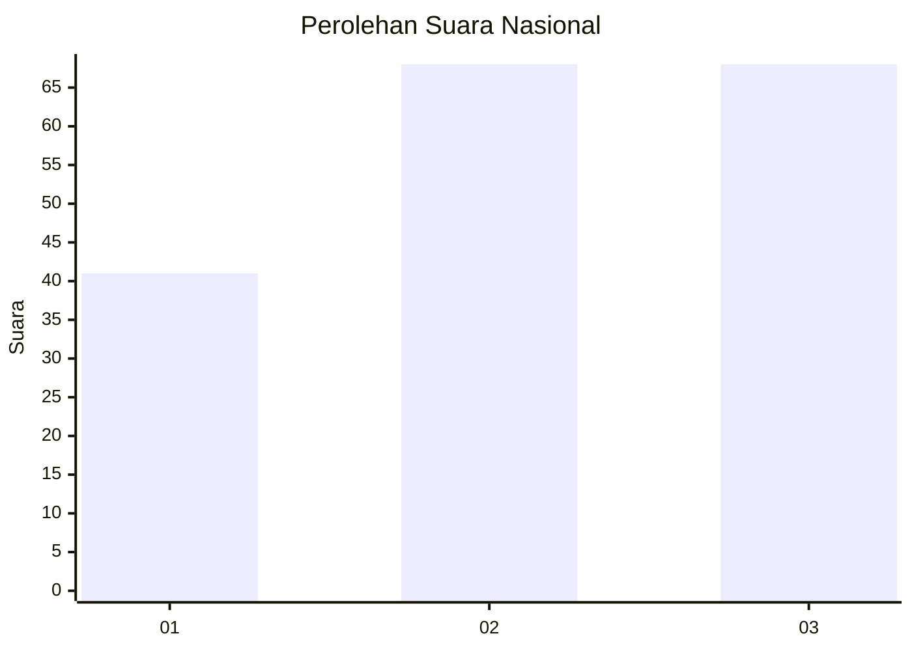
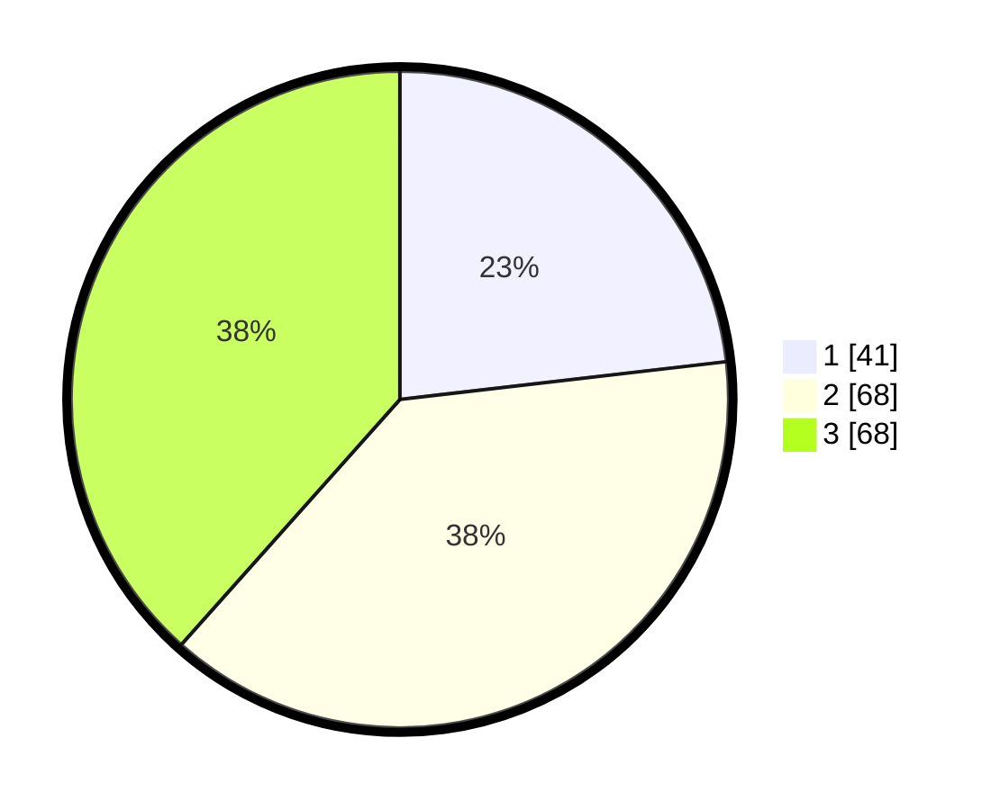

# Hasil

## Grafik

## Tabel

| No. | Nama Paslon    | Suara | Suara (raw) | Persentase |
|:--- |:-------------- | -----:| -----------:| ----------:|
| 1   | ANIES MUHAIMIN | 41    | [41][p-1]   | 23,16      |
| 2   | PRABOWO GIBRAN | 68    | [68][p-2]   | 38,42      |
| 3   | GANJAR MAHFUD  | 68    | [68][p-3]   | 38,42      |

[p-1]: https://github.com/gigit-pemilu/pemilu-2024/blob/main/pilpres/hitung-suara/sub/34-di-yogyakarta/sub/71-kota-yogyakarta/sub/05-gedongtengen/sub/1001-sosromenduran/sub/002-tps/sub/paslon-1.txt
[p-2]: https://github.com/gigit-pemilu/pemilu-2024/blob/main/pilpres/hitung-suara/sub/34-di-yogyakarta/sub/71-kota-yogyakarta/sub/05-gedongtengen/sub/1001-sosromenduran/sub/002-tps/sub/paslon-2.txt
[p-3]: https://github.com/gigit-pemilu/pemilu-2024/blob/main/pilpres/hitung-suara/sub/34-di-yogyakarta/sub/71-kota-yogyakarta/sub/05-gedongtengen/sub/1001-sosromenduran/sub/002-tps/sub/paslon-3.txt

## Foto C Plano

https://sirekap-obj-formc.kpu.go.id/d5c4/pemilu/ppwp/34/71/05/10/01/3471051001002-20240215-202817--52b5fd51-068e-4ca7-9c29-771702018e38.jpg

https://sirekap-obj-formc.kpu.go.id/d5c4/pemilu/ppwp/34/71/05/10/01/3471051001002-20240215-202828--859602a5-538c-478a-9e88-adf11a70f7f9.jpg

https://sirekap-obj-formc.kpu.go.id/d5c4/pemilu/ppwp/34/71/05/10/01/3471051001002-20240215-202823--6a1752c3-8ccb-4d6c-b655-3cc3142f9177.jpg

## Metadata

| Key        | Value               |
| ---------- | ------------------- |
| Time Stamp | 2024-02-16 00:30:27 |

## DATA PEMILIH TETAP

Jumlah pemilih dalam DPT: **210**.
 * L: **97**.
 * P: **113**.

## DATA PENGGUNA HAK PILIH

Jumlah pengguna hak pilih dalam DPT: **171**.
 * L: **80**.
 * P: **91**.

Jumlah pengguna hak pilih dalam DPTb: **9**.
 * L: **4**.
 * P: **5**.

Jumlah pengguna hak pilih dalam DPK: **1**.
 * L: **0**.
 * P: **1**.

Jumlah pengguna hak pilih: **181**.
 * L: **84**.
 * P: **97**.

## JUMLAH SUARA SAH DAN TIDAK SAH

JUMLAH SELURUH SUARA SAH: **177**.

JUMLAH SUARA TIDAK SAH: **4**.

JUMLAH SELURUH SUARA SAH DAN SUARA TIDAK SAH: **181**.

