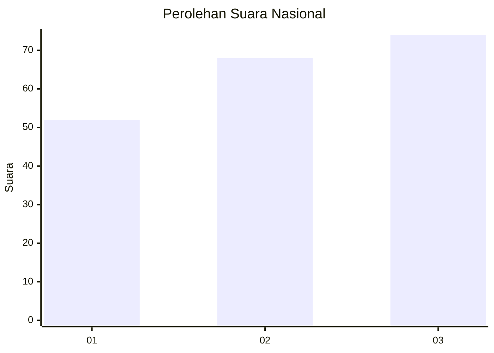
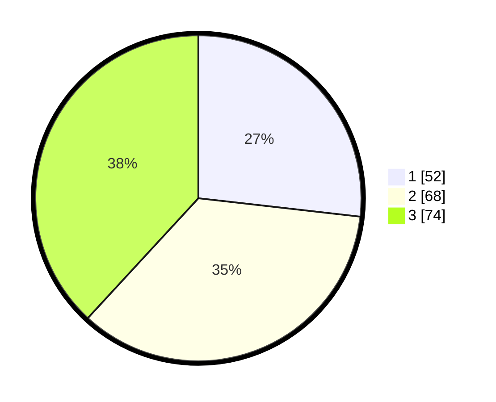

# Hasil

## Grafik

## Tabel

| No. | Nama Paslon    | Suara | Suara (raw) | Persentase |
|:--- |:-------------- | -----:| -----------:| ----------:|
| 1   | ANIES MUHAIMIN | 52    | [52][p-1]   | 26,80      |
| 2   | PRABOWO GIBRAN | 68    | [68][p-2]   | 35,05      |
| 3   | GANJAR MAHFUD  | 74    | [74][p-3]   | 38,14      |

[p-1]: https://github.com/gigit-pemilu/pemilu-2024/blob/main/pilpres/hitung-suara/sub/34-di-yogyakarta/sub/71-kota-yogyakarta/sub/05-gedongtengen/sub/1001-sosromenduran/sub/003-tps/sub/paslon-1.txt
[p-2]: https://github.com/gigit-pemilu/pemilu-2024/blob/main/pilpres/hitung-suara/sub/34-di-yogyakarta/sub/71-kota-yogyakarta/sub/05-gedongtengen/sub/1001-sosromenduran/sub/003-tps/sub/paslon-2.txt
[p-3]: https://github.com/gigit-pemilu/pemilu-2024/blob/main/pilpres/hitung-suara/sub/34-di-yogyakarta/sub/71-kota-yogyakarta/sub/05-gedongtengen/sub/1001-sosromenduran/sub/003-tps/sub/paslon-3.txt

## Foto C Plano

https://sirekap-obj-formc.kpu.go.id/c43f/pemilu/ppwp/34/71/05/10/01/3471051001003-20240216-132321--be387075-e86b-4ba6-b5ef-b35f2a272a6a.jpg

https://sirekap-obj-formc.kpu.go.id/c43f/pemilu/ppwp/34/71/05/10/01/3471051001003-20240216-132323--3b4ae224-f385-4141-a258-2d67847358bb.jpg

https://sirekap-obj-formc.kpu.go.id/c43f/pemilu/ppwp/34/71/05/10/01/3471051001003-20240216-132322--9f33155b-b38b-4a97-ad67-c9234a95fc4c.jpg

## Metadata

| Key        | Value               |
| ---------- | ------------------- |
| Time Stamp | 2024-02-16 22:30:00 |

## DATA PEMILIH TETAP

Jumlah pemilih dalam DPT: **225**.
 * L: **100**.
 * P: **125**.

## DATA PENGGUNA HAK PILIH

Jumlah pengguna hak pilih dalam DPT: **188**.
 * L: **79**.
 * P: **109**.

Jumlah pengguna hak pilih dalam DPTb: **8**.
 * L: **5**.
 * P: **3**.

Jumlah pengguna hak pilih dalam DPK: **0**.
 * L: **0**.
 * P: **0**.

Jumlah pengguna hak pilih: **196**.
 * L: **84**.
 * P: **112**.

## JUMLAH SUARA SAH DAN TIDAK SAH

JUMLAH SELURUH SUARA SAH: **194**.

JUMLAH SUARA TIDAK SAH: **2**.

JUMLAH SELURUH SUARA SAH DAN SUARA TIDAK SAH: **196**.

